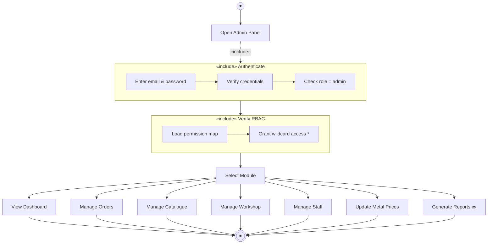
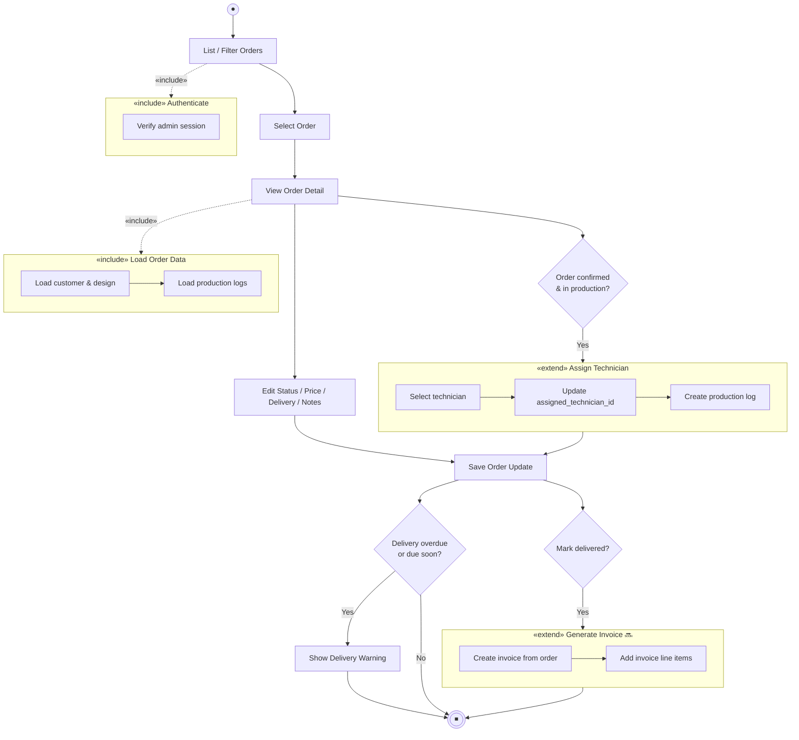
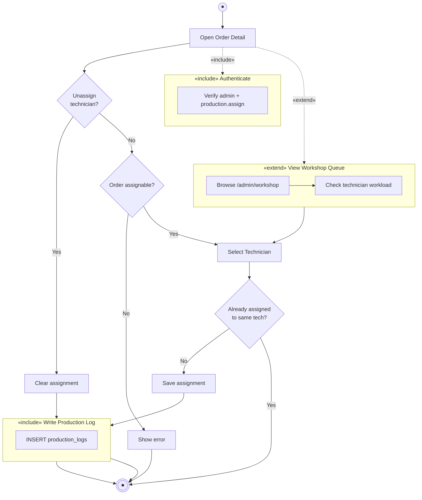
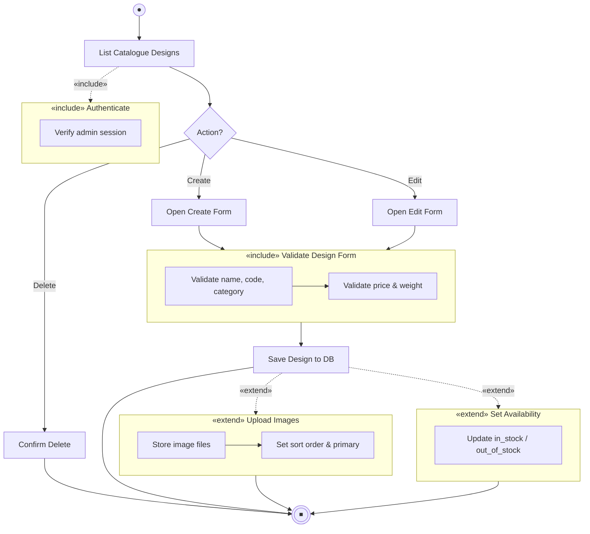
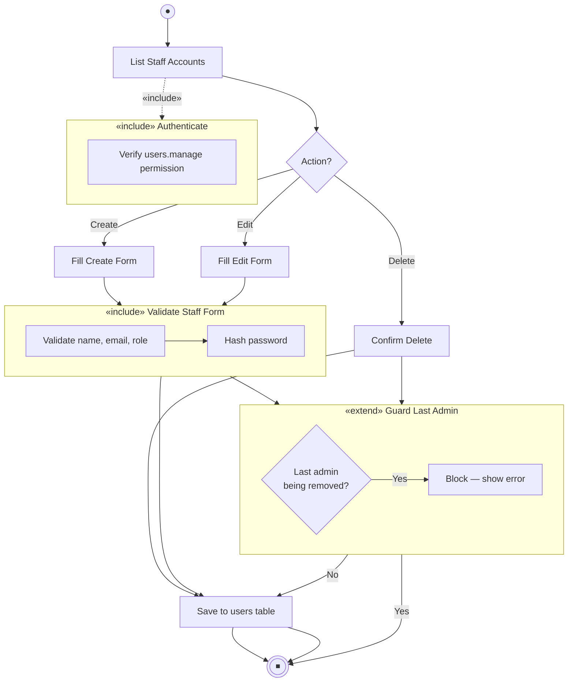
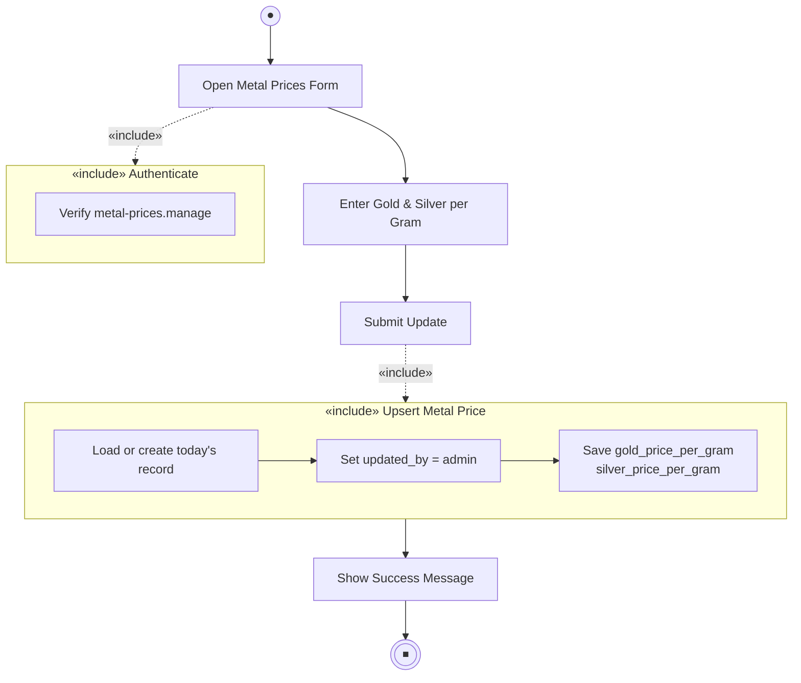
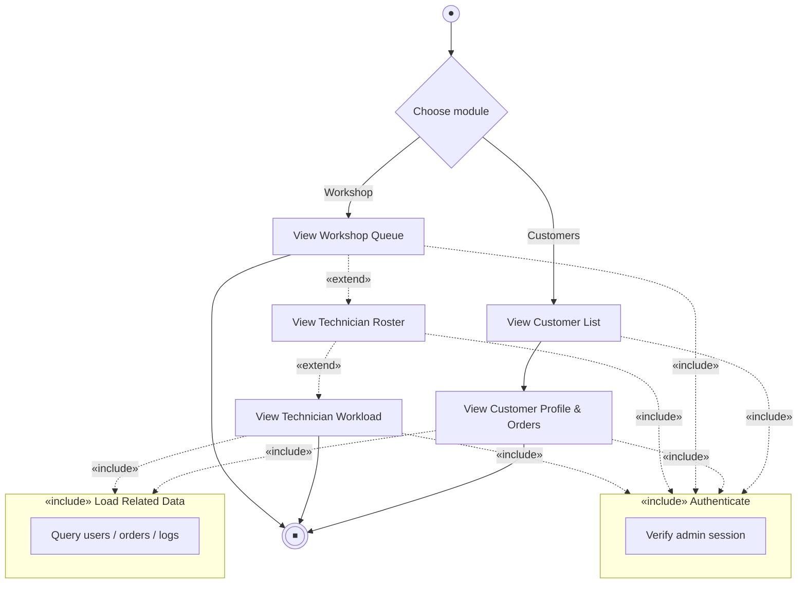

# Activity Diagram — Administrator (Include & Extend)

**Rajabharana Jewellery Management System**

| Resource | File |
|----------|------|
| **Visual (browser / PDF)** | [`ACTIVITY_DIAGRAM_ADMIN.html`](ACTIVITY_DIAGRAM_ADMIN.html) |
| **Admin tasks reference** | [`USER_ROLES_FUNCTIONS.md`](USER_ROLES_FUNCTIONS.md) |
| **Use cases** | [`USE_CASE_DIAGRAM.md`](USE_CASE_DIAGRAM.md) |

**Actor:** Administrator (`role = admin`, permission `*`)  
**Panel:** `/admin/*`

**Legend:** ✅ Implemented · 🔜 Planned

**UML on activity diagrams:**
- **«include»** — mandatory sub-activity always executed by the base activity
- **«extend»** — optional sub-activity executed only when a **condition** is true at an extension point

---

## Figure 1 — Admin session overview

---

## Figure 2 — Manage order (main workflow)

**Route:** `/admin/orders` · `/admin/orders/{id}` · PATCH update

| Relationship | When |
|--------------|------|
| **«include» Authenticate** | Every admin order action |
| **«include» Load Order Data** | Always when viewing order detail |
| **«extend» Assign Technician** | Order is confirmed and in active production |
| **«extend» Generate Invoice** 🔜 | Order status = Delivered |
| **«extend» Delivery Warning** | Expected date passed or due within window |

---

## Figure 3 — Assign technician to order

**Route:** PATCH `/admin/orders/{id}/assign-technician`

---

## Figure 4 — Manage catalogue design

**Route:** `/admin/catalog/*`

---

## Figure 5 — Manage staff account

**Route:** `/admin/users/*`

---

## Figure 6 — Update metal prices

**Route:** `/admin/metal-prices`

---

## Figure 7 — View customers & workshop (read flows)

---

## Include & extend summary

| Base activity | «include» (mandatory) | «extend» (conditional) |
|---------------|----------------------|-------------------------|
| **Admin session** | Authenticate, Verify RBAC | — |
| **Manage order** | Authenticate, Load order data | Assign technician, Generate invoice 🔜, Delivery warning |
| **Assign technician** | Authenticate, Write production log | View workshop queue first |
| **Manage catalogue** | Authenticate, Validate form | Upload images, Set availability |
| **Manage staff** | Authenticate, Validate form | Guard last admin |
| **Update metal prices** | Authenticate, Upsert price record | — |
| **View customers/workshop** | Authenticate, Load related data | Technician roster → workload |

---

## Viva one-liner

> **Admin activity flows always «include» Authenticate and validation sub-activities; Assign Technician, Upload Images, and Generate Invoice «extend» the base flow only when their preconditions are met.**

---

*Open [`ACTIVITY_DIAGRAM_ADMIN.html`](ACTIVITY_DIAGRAM_ADMIN.html) · Print → PDF*
