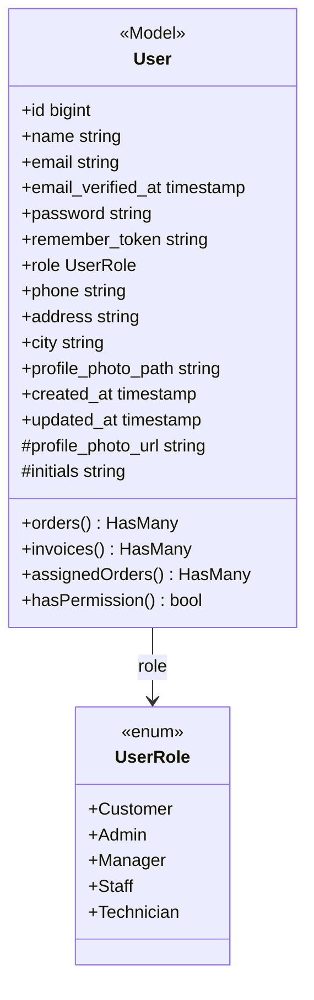
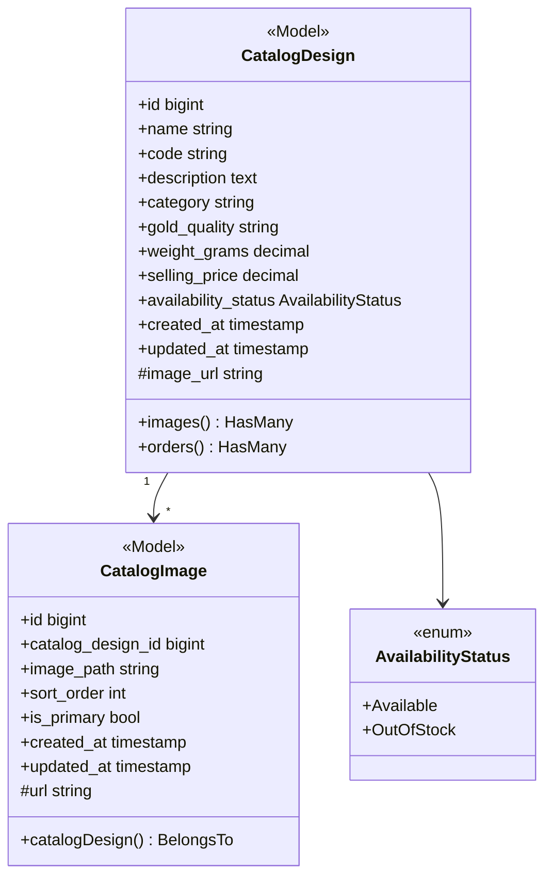
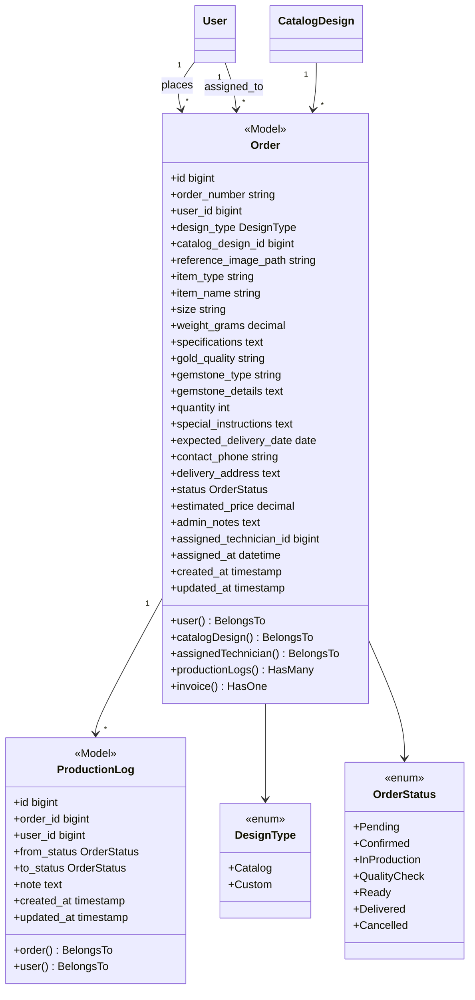
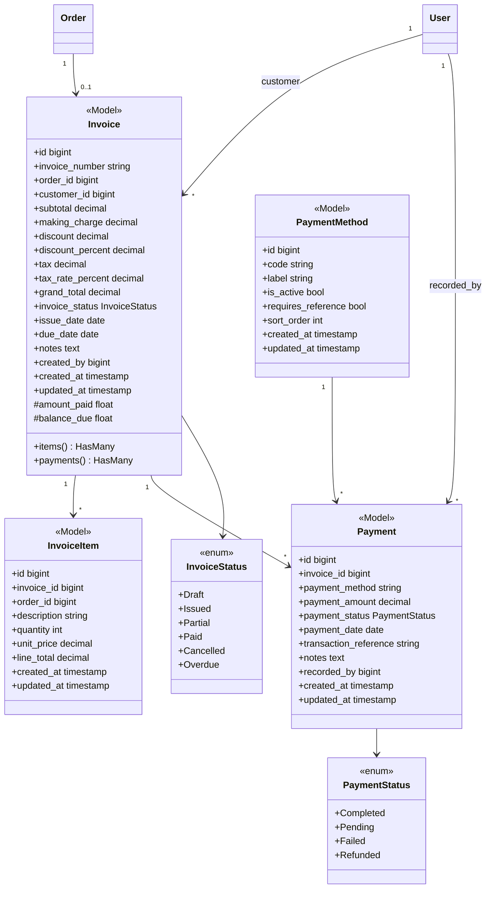
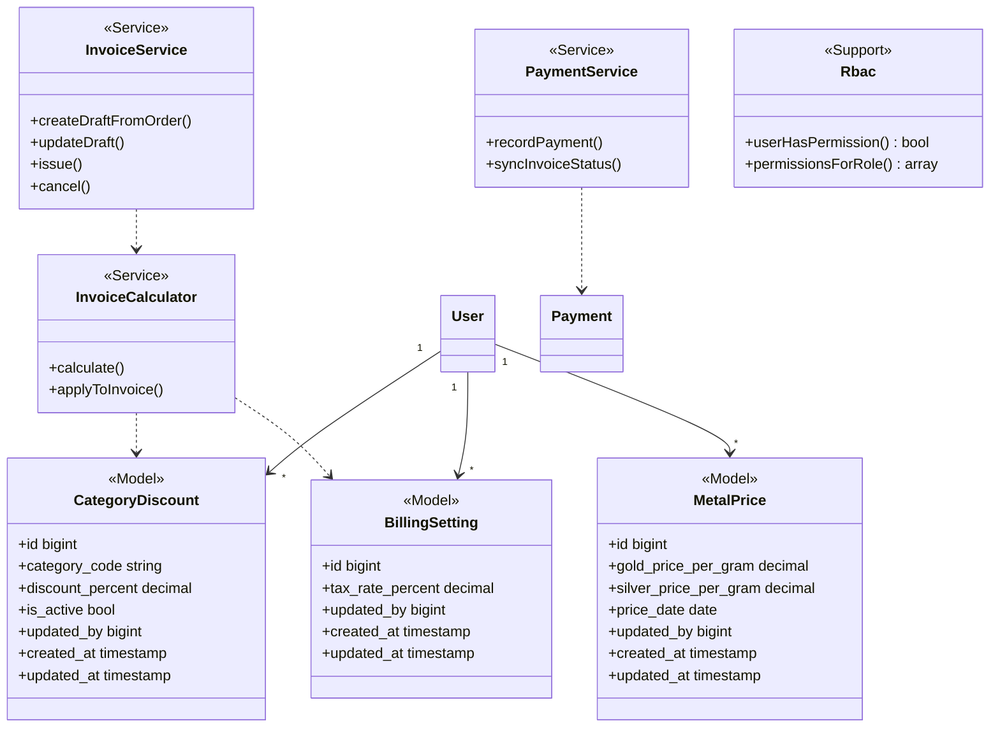
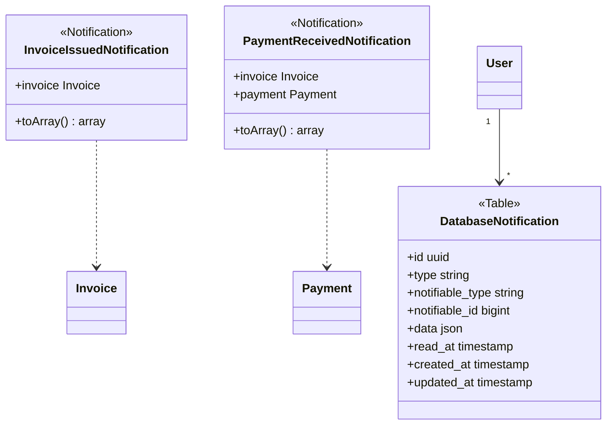
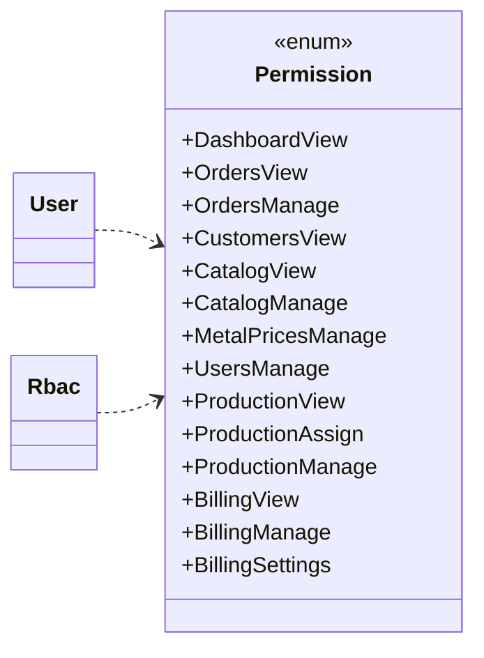
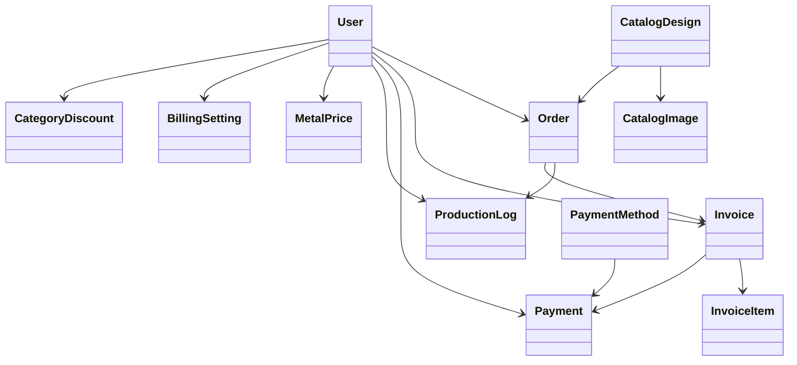

# Whole System Class Diagram — Rajabharana Jewellery System

**Stack:** Laravel 12 · Eloquent ORM · Blade · MySQL  
**Mermaid:** 10.9.8 compatible syntax

| Resource | File |
|----------|------|
| **Visual (browser)** | [`CLASS_DIAGRAM.html`](CLASS_DIAGRAM.html) |
| **Architecture overview** | [`SYSTEM_ARCHITECTURE.md`](SYSTEM_ARCHITECTURE.md) |

**Legend:** `#field` = computed accessor (not stored in DB)

---

## Figure 1 — User and Authentication

---

## Figure 2 — Catalog and Inventory

---

## Figure 3 — Order and Production

---

## Figure 4 — Billing and Payment

---

## Figure 5 — Settings and Services

---

## Figure 6 — Notifications

---

## Figure 7 — RBAC Permission Enum

---

## Figure 8 — Domain Overview

---

## Entity attribute summary (all tables)

| Entity | Attributes |
|--------|------------|
| **users** | id, name, email, email_verified_at, password, remember_token, role, phone, address, city, profile_photo_path, created_at, updated_at |
| **catalog_designs** | id, name, code, description, category, gold_quality, weight_grams, selling_price, availability_status, created_at, updated_at |
| **catalog_images** | id, catalog_design_id, image_path, sort_order, is_primary, created_at, updated_at |
| **orders** | id, order_number, user_id, design_type, catalog_design_id, reference_image_path, item_type, item_name, size, weight_grams, specifications, gold_quality, gemstone_type, gemstone_details, quantity, special_instructions, expected_delivery_date, contact_phone, delivery_address, status, estimated_price, admin_notes, assigned_technician_id, assigned_at, created_at, updated_at |
| **production_logs** | id, order_id, user_id, from_status, to_status, note, created_at, updated_at |
| **metal_prices** | id, gold_price_per_gram, silver_price_per_gram, price_date, updated_by, created_at, updated_at |
| **invoices** | id, invoice_number, order_id, customer_id, subtotal, making_charge, discount, discount_percent, tax, tax_rate_percent, grand_total, invoice_status, issue_date, due_date, notes, created_by, created_at, updated_at |
| **invoice_items** | id, invoice_id, order_id, description, quantity, unit_price, line_total, created_at, updated_at |
| **payments** | id, invoice_id, payment_method, payment_amount, payment_status, payment_date, transaction_reference, notes, recorded_by, created_at, updated_at |
| **payment_methods** | id, code, label, is_active, requires_reference, sort_order, created_at, updated_at |
| **billing_settings** | id, tax_rate_percent, updated_by, created_at, updated_at |
| **category_discounts** | id, category_code, discount_percent, is_active, updated_by, created_at, updated_at |
| **notifications** | id, type, notifiable_type, notifiable_id, data, read_at, created_at, updated_at |

---

*Open [`CLASS_DIAGRAM.html`](CLASS_DIAGRAM.html) for printable browser view.*
