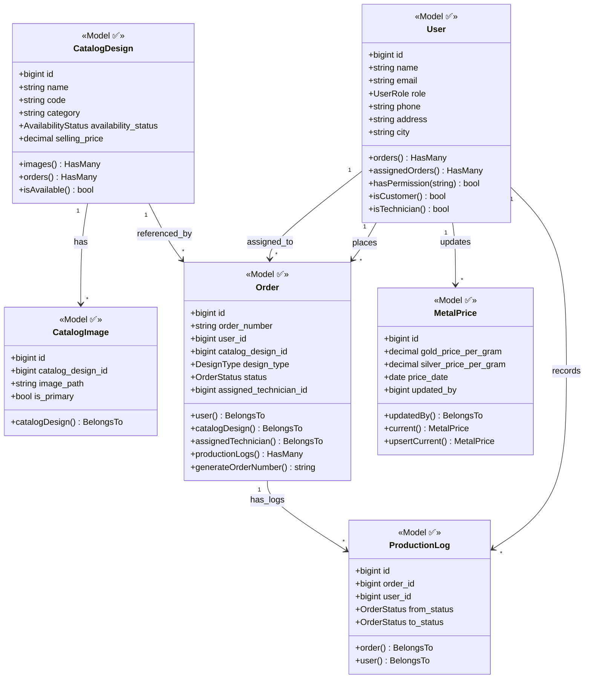
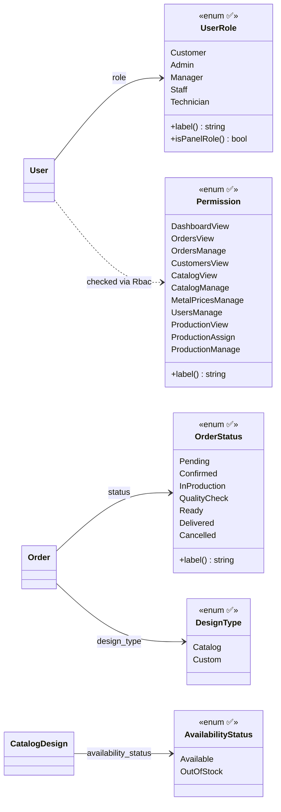
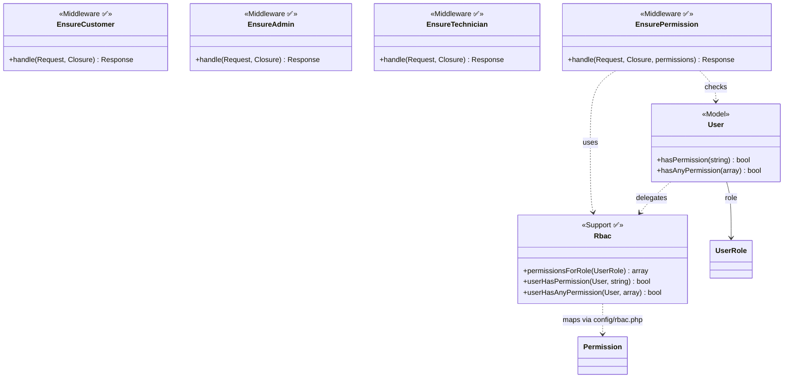
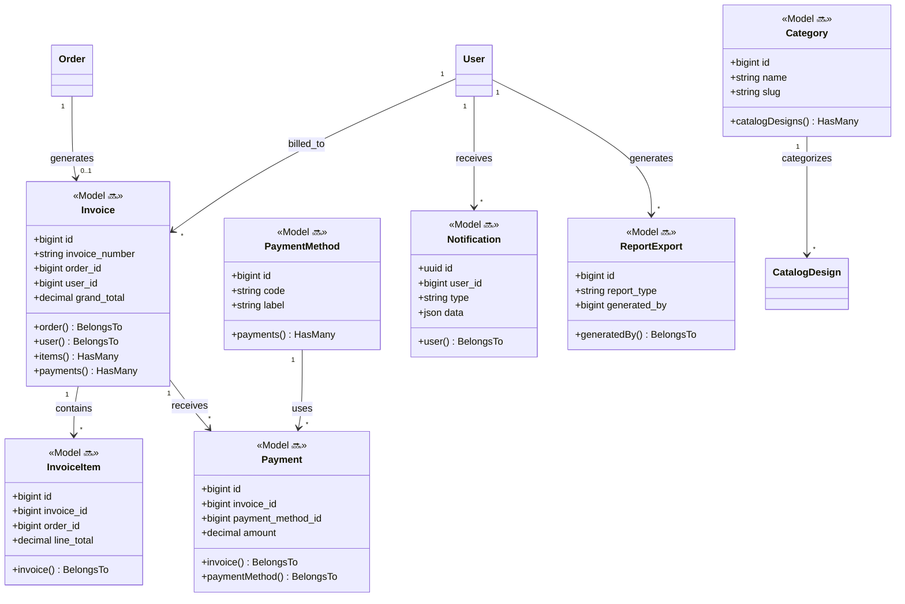

# Whole System Class Diagram — Rajabharana Jewellery System

**Stack:** Laravel 12 · Eloquent ORM · Blade

| Resource | File |
|----------|------|
| **Visual (browser)** | [`CLASS_DIAGRAM.html`](CLASS_DIAGRAM.html) |
| **Architecture overview** | [`SYSTEM_ARCHITECTURE.md`](SYSTEM_ARCHITECTURE.md) |

**Legend:** ✅ Implemented · 🔜 Planned (Sprint 9–10)

---

## Layer overview

```
┌─────────────────────────────────────────────────────────────┐
│  Presentation — Controllers + Form Requests + Middleware    │
├─────────────────────────────────────────────────────────────┤
│  Domain — Eloquent Models + Enums                           │
├─────────────────────────────────────────────────────────────┤
│  Support — Rbac, ValidationRules, Rules                     │
├─────────────────────────────────────────────────────────────┤
│  Database — MySQL tables (8 implemented, 7 planned)         │
└─────────────────────────────────────────────────────────────┘
```

---

## Figure 1 — Domain model (Models + relationships) ✅



---

## Figure 2 — Enums ✅



---

## Figure 3 — Controllers by module ✅

```mermaid
classDiagram
    direction TB

    class Controller {
        <<abstract>>
    }

    class AuthenticatedSessionController {
        <<Auth ✅>>
        +create() View
        +store() RedirectResponse
        +destroy() RedirectResponse
    }

    class RegisteredUserController {
        <<Auth ✅>>
        +create() View
        +store() RedirectResponse
    }

    class CatalogController {
        <<Public ✅>>
        +index() View
        +show() View
        +purchase() View
    }

    class OrderController {
        <<Customer ✅>>
        +index() View
        +create() View
        +store() RedirectResponse
        +show() View
        +cancel() RedirectResponse
    }

    class DashboardController {
        <<Customer ✅>>
        +__invoke() View
    }

    class AdminDashboardController {
        <<Admin ✅>>
        +__invoke() View
    }

    class AdminOrderController {
        <<Admin ✅>>
        +index() View
        +show() View
        +update() RedirectResponse
    }

    class OrderAssignmentController {
        <<Admin ✅>>
        +update() RedirectResponse
    }

    class CatalogDesignController {
        <<Admin ✅>>
        +index() create() store()
        +edit() update() destroy()
    }

    class CustomerController {
        <<Admin ✅>>
        +index() View
        +show() View
    }

    class WorkshopController {
        <<Admin ✅>>
        +index() View
        +technicians() View
    }

    class MetalPriceController {
        <<Admin ✅>>
        +edit() View
        +update() RedirectResponse
    }

    class StaffUserController {
        <<Admin ✅>>
        +index() create() store()
        +edit() update() destroy()
    }

    class TechnicianDashboardController {
        <<Technician ✅>>
        +__invoke() View
    }

    class TechnicianJobController {
        <<Technician ✅>>
        +show() View
        +update() RedirectResponse
    }

    class ProfileController {
        <<Shared ✅>>
        +edit() update() destroy()
    }

    Controller <|-- AuthenticatedSessionController
    Controller <|-- RegisteredUserController
    Controller <|-- CatalogController
    Controller <|-- OrderController
    Controller <|-- DashboardController
    Controller <|-- AdminDashboardController
    Controller <|-- AdminOrderController
    Controller <|-- OrderAssignmentController
    Controller <|-- CatalogDesignController
    Controller <|-- CustomerController
    Controller <|-- WorkshopController
    Controller <|-- MetalPriceController
    Controller <|-- StaffUserController
    Controller <|-- TechnicianDashboardController
    Controller <|-- TechnicianJobController
    Controller <|-- ProfileController

    OrderController ..> Order : uses
    OrderController ..> CatalogDesign : uses
    AdminOrderController ..> Order : uses
    OrderAssignmentController ..> Order : uses
    OrderAssignmentController ..> ProductionLog : creates
    TechnicianJobController ..> Order : uses
    TechnicianJobController ..> ProductionLog : creates
    CatalogDesignController ..> CatalogDesign : uses
    CatalogDesignController ..> CatalogImage : uses
    MetalPriceController ..> MetalPrice : uses
    StaffUserController ..> User : uses
```



---

## Figure 4 — Security & RBAC ✅



---

## Figure 5 — Planned domain classes 🔜



---

## Module → classes map

| Module | Models ✅ | Controllers ✅ | Planned 🔜 |
|--------|-----------|----------------|------------|
| M1 Auth | User | Auth/*, ProfileController | — |
| M2 Customer | User, Order | Customer/* | — |
| M3 Catalogue | CatalogDesign, CatalogImage | CatalogController, Admin\CatalogDesignController | Category |
| M4 Orders | Order | Customer\OrderController, Admin\OrderController | — |
| M5 Workshop | Order, ProductionLog | WorkshopController, OrderAssignmentController, Technician/* | — |
| M6 Inventory | CatalogDesign | CatalogDesignController | Category |
| M7 Metal Price | MetalPrice | MetalPriceController | — |
| M8 Billing | — | — | Invoice, InvoiceItem |
| M9 Payment | — | — | Payment, PaymentMethod |
| M10 Notification | — | — | Notification |
| M11 RBAC | User + Rbac + Enums | Middleware | — |
| M12 Reports | — | — | ReportExport, ReportService |

---

## Form Request classes (validation layer) ✅

| Request | Used by |
|---------|---------|
| `LoginRequest`, `RegisterRequest` | Auth |
| `StoreOrderRequest` | Customer orders |
| `UpdateOrderRequest`, `AssignTechnicianRequest` | Admin orders |
| `StoreCatalogDesignRequest`, `UpdateCatalogDesignRequest` | Admin catalog |
| `UpdateMetalPriceRequest` | Metal prices |
| `StoreStaffUserRequest`, `UpdateStaffUserRequest` | Staff users |
| `UpdateProductionJobRequest` | Technician jobs |
| `ProfileUpdateRequest`, `DeleteAccountRequest` | Profile |

---

## Viva one-liner

> **The system uses a layered Laravel architecture: Controllers call Form Requests for validation, Eloquent Models represent 6 implemented domain entities (User, Order, CatalogDesign, CatalogImage, ProductionLog, MetalPrice), Enums define statuses and roles, and Rbac + Middleware enforce permissions. Billing, Payment, Notification, and Reports classes are planned but not yet coded.**

---

*Open [`CLASS_DIAGRAM.html`](CLASS_DIAGRAM.html) for printable diagrams.*
