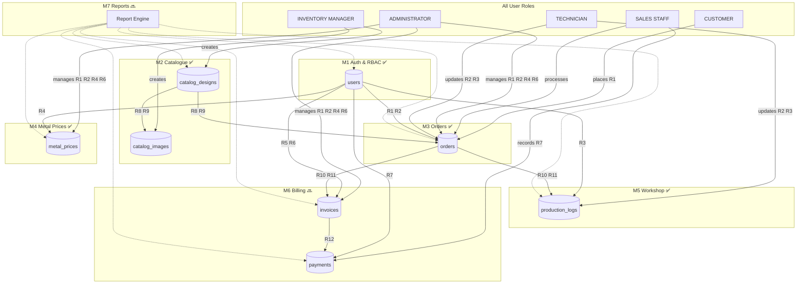
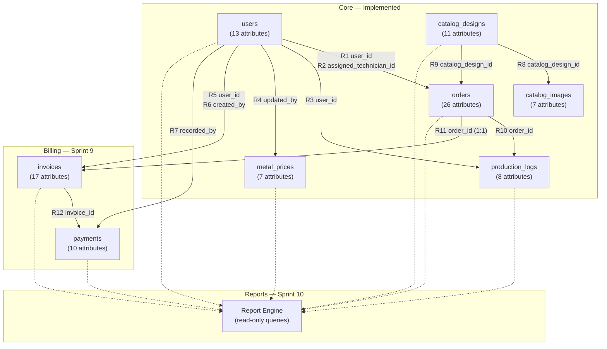
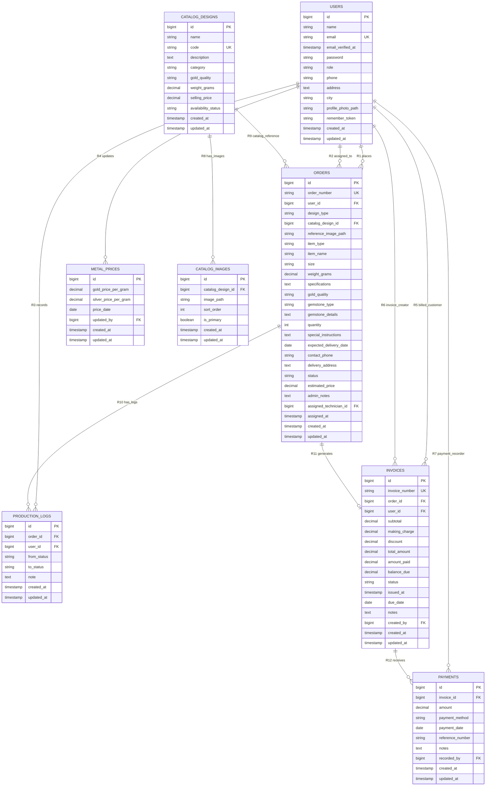

# Database ER Diagram — Rajabharana Jewellery Management System (Whole System)

**Legend:** ✅ Implemented · 🔜 Planned (Sprint 9 Billing) · Reports (Sprint 10) reads all tables — no new table

**Complete ER (all modules in one diagram):** [`COMPLETE_ER_DIAGRAM.md`](COMPLETE_ER_DIAGRAM.md) · [`COMPLETE_ER_DIAGRAM.html`](COMPLETE_ER_DIAGRAM.html)

**Module ER diagrams (11 modules):** [`docs/MODULE_ER_DIAGRAMS/`](MODULE_ER_DIAGRAMS/README.md) — separate ER doc per module with Chen + Crow's Foot.

**Visual diagrams with attributes (open in browser):**

| File | Contents |
|------|----------|
| [`ER_DIAGRAM_RELATIONSHIPS.html`](ER_DIAGRAM_RELATIONSHIPS.html) | **Relationships with attributes** — FK, cardinality, constraints on diagram |
| [`ER_DIAGRAM_WITH_ATTRIBUTES.html`](ER_DIAGRAM_WITH_ATTRIBUTES.html) | All entities + all attributes in entity boxes |
| [`WHOLE_SYSTEM_ER_DIAGRAM.html`](WHOLE_SYSTEM_ER_DIAGRAM.html) | All users + all modules + relationships |
| [`ER_DIAGRAM.html`](ER_DIAGRAM.html) | Mermaid ER with full attribute blocks |
| [`CHEN_ER_DIAGRAM.html`](CHEN_ER_DIAGRAM.html) | Chen notation — users as separate entities |

Export Mermaid diagrams from [mermaid.live](https://mermaid.live) for Word.

---

## 0. Whole System ER — All Users + All Modules + All Relationships



### Module → Entity → Relationship map

| Module | Status | Entities | Relationships |
|--------|--------|----------|---------------|
| **M1 Auth & RBAC** | ✅ | users | Parent of R1–R7 |
| **M2 Catalogue** | ✅ | catalog_designs, catalog_images | R8, R9 |
| **M3 Customer Orders** | ✅ | users, orders, catalog_designs | R1, R9 |
| **M4 Metal Prices** | ✅ | metal_prices, users | R4 |
| **M5 Workshop** | ✅ | orders, production_logs, users | R2, R3, R10 |
| **M6 Billing** | 🔜 Sprint 9 | invoices, payments, orders, users | R5, R6, R7, R11, R12 |
| **M7 Reports** | 🔜 Sprint 10 | reads all tables | uses R1–R12 (no new table) |

---

## 0b. Whole System ER — Overview (Entity Count)



### Whole system — entity list

| # | Entity | Module | Status | Attributes | Relationships |
|---|--------|--------|--------|:----------:|:-------------:|
| 1 | users | Auth / RBAC | ✅ | 13 | 7 outgoing |
| 2 | orders | Orders | ✅ | 26 | 6 incoming, 2 outgoing |
| 3 | catalog_designs | Inventory | ✅ | 11 | 2 outgoing |
| 4 | catalog_images | Inventory | ✅ | 7 | 1 incoming |
| 5 | metal_prices | Metal rates | ✅ | 7 | 1 incoming |
| 6 | production_logs | Workshop | ✅ | 8 | 2 incoming |
| 7 | invoices | Billing | 🔜 | 17 | 3 incoming, 1 outgoing |
| 8 | payments | Billing | 🔜 | 10 | 2 incoming |
| — | reports | Reports | Sprint 10 | — | reads all above |

**Total business tables:** 8 · **Total relationships:** 12

---

## 1. Whole System ER — Full Detail (Entities + Attributes + Relationships)



---

## 2. Relationship Attributes (Full Detail)

| Rel ID | Parent Entity | Child Entity | Cardinality | FK Column (Child) | Nullable | On Delete | Relationship Meaning |
|--------|---------------|--------------|-------------|-------------------|----------|-----------|----------------------|
| **R1** | users | orders | 1 : N | user_id | No | CASCADE | One customer places many orders |
| **R2** | users | orders | 1 : N | assigned_technician_id | Yes | SET NULL | One technician assigned to many orders |
| **R3** | users | production_logs | 1 : N | user_id | No | CASCADE | One staff member records many production logs |
| **R4** | users | metal_prices | 1 : N | updated_by | Yes | SET NULL | One admin updates many metal price records |
| **R5** | users | invoices | 1 : N | user_id | No | CASCADE | One customer has many invoices |
| **R6** | users | invoices | 1 : N | created_by | Yes | SET NULL | One staff member creates many invoices |
| **R7** | users | payments | 1 : N | recorded_by | No | CASCADE | One staff member records many payments |
| **R8** | catalog_designs | catalog_images | 1 : N | catalog_design_id | No | CASCADE | One catalogue design has many images |
| **R9** | catalog_designs | orders | 1 : N | catalog_design_id | Yes | SET NULL | One catalogue design referenced by many orders |
| **R10** | orders | production_logs | 1 : N | order_id | No | CASCADE | One order has many production log entries |
| **R11** | orders | invoices | 1 : 1 | order_id | No | CASCADE | One order generates one invoice |
| **R12** | invoices | payments | 1 : N | invoice_id | No | CASCADE | One invoice receives many payments |

### Cardinality notation

| Symbol | Meaning |
|--------|---------|
| 1 : 1 | One parent record links to exactly one child record |
| 1 : N | One parent record links to many child records |
| FK | Foreign key column in the child table |
| UK | Unique key — no duplicate values |
| PK | Primary key |

---

## 3. Entity Attributes

### 3.1 users ✅

| # | Attribute | Data Type | Key | Null | Description |
|---|-----------|-----------|-----|------|-------------|
| 1 | id | BIGINT UNSIGNED | PK | No | Auto-increment user ID |
| 2 | name | VARCHAR(255) | | No | Full name |
| 3 | email | VARCHAR(255) | UK | No | Login email |
| 4 | email_verified_at | TIMESTAMP | | Yes | Email verification datetime |
| 5 | password | VARCHAR(255) | | No | Bcrypt hashed password |
| 6 | role | VARCHAR(255) | | No | customer / admin / manager / staff / technician |
| 7 | phone | VARCHAR(25) | | No | Contact phone number |
| 8 | address | TEXT | | No | Street address |
| 9 | city | VARCHAR(100) | | No | City |
| 10 | profile_photo_path | VARCHAR(255) | | Yes | Profile image file path |
| 11 | remember_token | VARCHAR(100) | | Yes | Stay-logged-in token |
| 12 | created_at | TIMESTAMP | | Yes | Created datetime |
| 13 | updated_at | TIMESTAMP | | Yes | Updated datetime |

---

### 3.2 orders ✅

| # | Attribute | Data Type | Key | Null | Description |
|---|-----------|-----------|-----|------|-------------|
| 1 | id | BIGINT UNSIGNED | PK | No | Auto-increment order ID |
| 2 | order_number | VARCHAR(255) | UK | No | RJ-YYYYMMDD-XXXX |
| 3 | user_id | BIGINT UNSIGNED | FK → users.id | No | Customer (R1) |
| 4 | design_type | VARCHAR(255) | | No | catalog / custom |
| 5 | catalog_design_id | BIGINT UNSIGNED | FK → catalog_designs.id | Yes | Catalogue item (R9) |
| 6 | reference_image_path | VARCHAR(255) | | Yes | Custom design image |
| 7 | item_type | VARCHAR(255) | | No | ring, necklace, etc. |
| 8 | item_name | VARCHAR(255) | | Yes | Custom piece name |
| 9 | size | VARCHAR(255) | | Yes | Ring/bracelet size |
| 10 | weight_grams | DECIMAL(8,2) | | Yes | Weight in grams |
| 11 | specifications | TEXT | | Yes | Detailed specifications |
| 12 | gold_quality | VARCHAR(255) | | No | 22k, 18k, etc. |
| 13 | gemstone_type | VARCHAR(255) | | Yes | Gemstone name |
| 14 | gemstone_details | TEXT | | Yes | Gemstone description |
| 15 | quantity | SMALLINT UNSIGNED | | No | Quantity (default 1) |
| 16 | special_instructions | TEXT | | Yes | Customer instructions |
| 17 | expected_delivery_date | DATE | | No | Promised delivery date |
| 18 | contact_phone | VARCHAR(20) | | No | Order contact phone |
| 19 | delivery_address | TEXT | | Yes | Delivery address |
| 20 | status | VARCHAR(255) | | No | Order workflow status |
| 21 | estimated_price | DECIMAL(12,2) | | Yes | Quoted price (LKR) |
| 22 | admin_notes | TEXT | | Yes | Internal staff notes |
| 23 | assigned_technician_id | BIGINT UNSIGNED | FK → users.id | Yes | Technician (R2) |
| 24 | assigned_at | TIMESTAMP | | Yes | Assignment datetime |
| 25 | created_at | TIMESTAMP | | Yes | Order placed datetime |
| 26 | updated_at | TIMESTAMP | | Yes | Last updated datetime |

---

### 3.3 catalog_designs ✅

| # | Attribute | Data Type | Key | Null | Description |
|---|-----------|-----------|-----|------|-------------|
| 1 | id | BIGINT UNSIGNED | PK | No | Design ID |
| 2 | name | VARCHAR(255) | | No | Design display name |
| 3 | code | VARCHAR(255) | UK | No | Unique design code |
| 4 | description | TEXT | | Yes | Design description |
| 5 | category | VARCHAR(255) | | No | ring, necklace, etc. |
| 6 | gold_quality | VARCHAR(255) | | No | 22k, 18k, etc. |
| 7 | weight_grams | DECIMAL(8,2) | | Yes | Approximate weight |
| 8 | selling_price | DECIMAL(12,2) | | Yes | Price in LKR |
| 9 | availability_status | VARCHAR(255) | | No | available / out_of_stock |
| 10 | created_at | TIMESTAMP | | Yes | Created datetime |
| 11 | updated_at | TIMESTAMP | | Yes | Updated datetime |

---

### 3.4 catalog_images ✅

| # | Attribute | Data Type | Key | Null | Description |
|---|-----------|-----------|-----|------|-------------|
| 1 | id | BIGINT UNSIGNED | PK | No | Image ID |
| 2 | catalog_design_id | BIGINT UNSIGNED | FK → catalog_designs.id | No | Parent design (R8) |
| 3 | image_path | VARCHAR(255) | | No | Stored file path |
| 4 | sort_order | SMALLINT UNSIGNED | | No | Display order |
| 5 | is_primary | BOOLEAN | | No | Primary thumbnail flag |
| 6 | created_at | TIMESTAMP | | Yes | Created datetime |
| 7 | updated_at | TIMESTAMP | | Yes | Updated datetime |

---

### 3.5 metal_prices ✅

| # | Attribute | Data Type | Key | Null | Description |
|---|-----------|-----------|-----|------|-------------|
| 1 | id | BIGINT UNSIGNED | PK | No | Record ID |
| 2 | gold_price_per_gram | DECIMAL(12,2) | | No | Gold rate LKR/gram |
| 3 | silver_price_per_gram | DECIMAL(12,2) | | No | Silver rate LKR/gram |
| 4 | price_date | DATE | | No | Effective date |
| 5 | updated_by | BIGINT UNSIGNED | FK → users.id | Yes | Updated by admin (R4) |
| 6 | created_at | TIMESTAMP | | Yes | Created datetime |
| 7 | updated_at | TIMESTAMP | | Yes | Updated datetime |

---

### 3.6 production_logs ✅

| # | Attribute | Data Type | Key | Null | Description |
|---|-----------|-----------|-----|------|-------------|
| 1 | id | BIGINT UNSIGNED | PK | No | Log entry ID |
| 2 | order_id | BIGINT UNSIGNED | FK → orders.id | No | Related order (R10) |
| 3 | user_id | BIGINT UNSIGNED | FK → users.id | No | Recorded by (R3) |
| 4 | from_status | VARCHAR(255) | | Yes | Previous status |
| 5 | to_status | VARCHAR(255) | | Yes | New status |
| 6 | note | TEXT | | Yes | Workshop/assignment note |
| 7 | created_at | TIMESTAMP | | Yes | Log datetime |
| 8 | updated_at | TIMESTAMP | | Yes | Updated datetime |

---

### 3.7 invoices 🔜 Sprint 9

| # | Attribute | Data Type | Key | Null | Description |
|---|-----------|-----------|-----|------|-------------|
| 1 | id | BIGINT UNSIGNED | PK | No | Invoice ID |
| 2 | invoice_number | VARCHAR(255) | UK | No | INV-YYYYMMDD-XXXX |
| 3 | order_id | BIGINT UNSIGNED | FK → orders.id | No | Source order (R11) |
| 4 | user_id | BIGINT UNSIGNED | FK → users.id | No | Customer (R5) |
| 5 | subtotal | DECIMAL(12,2) | | No | Base amount |
| 6 | making_charge | DECIMAL(12,2) | | No | Making/labour charge |
| 7 | discount | DECIMAL(12,2) | | No | Discount (default 0) |
| 8 | total_amount | DECIMAL(12,2) | | No | Final bill total |
| 9 | amount_paid | DECIMAL(12,2) | | No | Total paid so far |
| 10 | balance_due | DECIMAL(12,2) | | No | Remaining balance |
| 11 | status | VARCHAR(255) | | No | unpaid / partial / paid |
| 12 | issued_at | TIMESTAMP | | No | Invoice issue datetime |
| 13 | due_date | DATE | | Yes | Payment due date |
| 14 | notes | TEXT | | Yes | Billing notes |
| 15 | created_by | BIGINT UNSIGNED | FK → users.id | Yes | Created by staff (R6) |
| 16 | created_at | TIMESTAMP | | Yes | Created datetime |
| 17 | updated_at | TIMESTAMP | | Yes | Updated datetime |

---

### 3.8 payments 🔜 Sprint 9

| # | Attribute | Data Type | Key | Null | Description |
|---|-----------|-----------|-----|------|-------------|
| 1 | id | BIGINT UNSIGNED | PK | No | Payment ID |
| 2 | invoice_id | BIGINT UNSIGNED | FK → invoices.id | No | Related invoice (R12) |
| 3 | amount | DECIMAL(12,2) | | No | Payment amount LKR |
| 4 | payment_method | VARCHAR(255) | | No | cash / card / bank_transfer |
| 5 | payment_date | DATE | | No | Date received |
| 6 | reference_number | VARCHAR(255) | | Yes | Bank/cheque reference |
| 7 | notes | TEXT | | Yes | Payment notes |
| 8 | recorded_by | BIGINT UNSIGNED | FK → users.id | No | Recorded by staff (R7) |
| 9 | created_at | TIMESTAMP | | Yes | Created datetime |
| 10 | updated_at | TIMESTAMP | | Yes | Updated datetime |

---

## 4. Visual Relationship Map (Text)

```
users (PK: id)
 ├──[R1 user_id]──────────────► orders (N)
 ├──[R2 assigned_technician_id]► orders (N)
 ├──[R3 user_id]──────────────► production_logs (N)
 ├──[R4 updated_by]───────────► metal_prices (N)
 ├──[R5 user_id]──────────────► invoices (N)
 ├──[R6 created_by]───────────► invoices (N)
 └──[R7 recorded_by]──────────► payments (N)

catalog_designs (PK: id)
 ├──[R8 catalog_design_id]─────► catalog_images (N)
 └──[R9 catalog_design_id]─────► orders (N)

orders (PK: id)
 ├──[R10 order_id]────────────► production_logs (N)
 └──[R11 order_id]────────────► invoices (1)

invoices (PK: id)
 └──[R12 invoice_id]──────────► payments (N)
```

---

## 5. Reports Module Note

The **Reports module (Sprint 10)** does not add new tables. It queries existing tables through relationships R1–R12 to generate reports.
