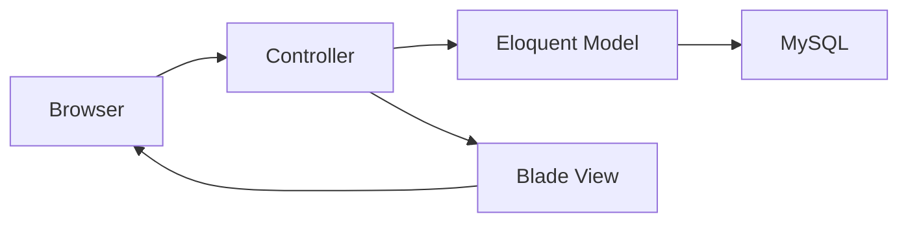
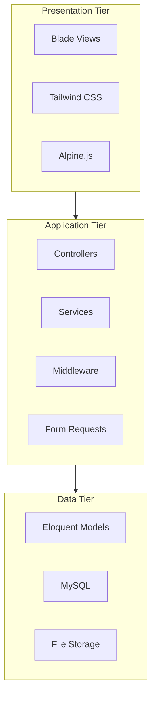
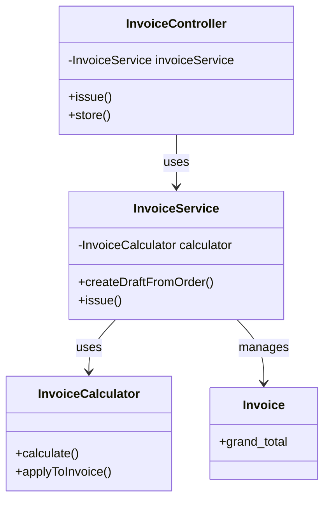
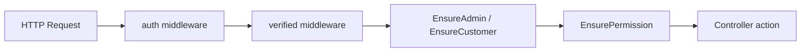
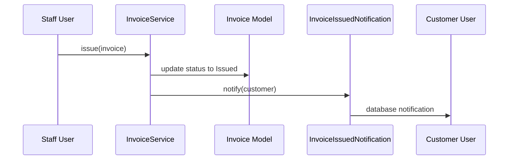
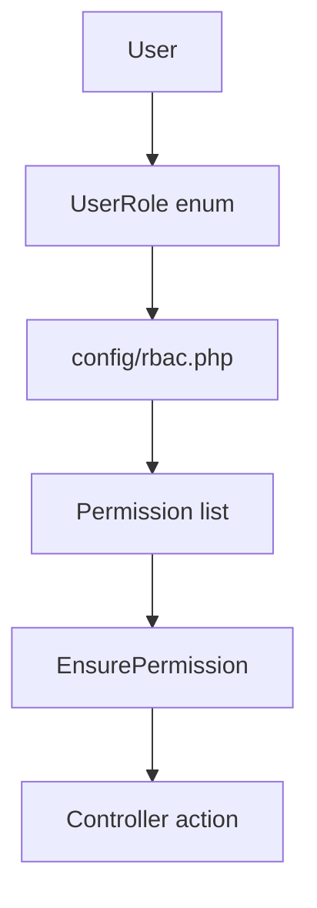
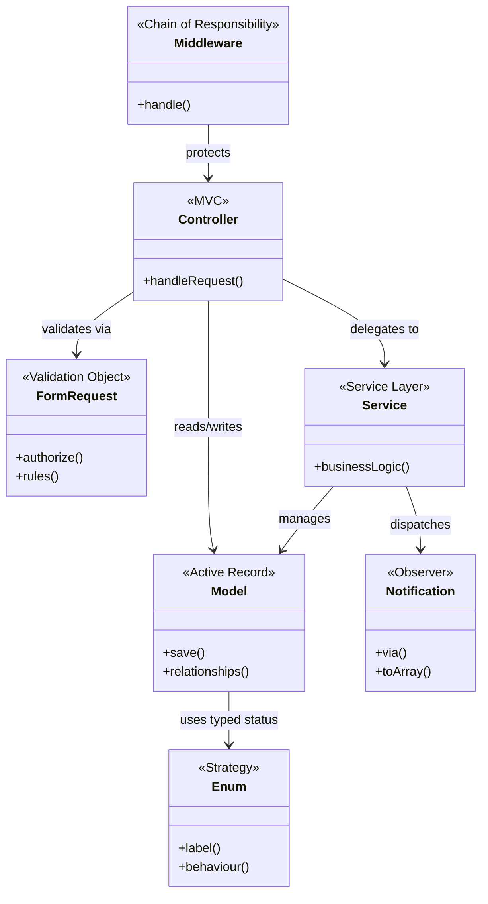

# Design Patterns — Rajabharana Jewellery Management System

**Project:** Rajabharana Jewellery Management System  
**Purpose:** Academic report — Chapter on System Design / Design Patterns  
**Architecture base:** 3-Tier · MVC · Laravel 12

| Resource | File |
|----------|------|
| **Printable view** | [`DESIGN_PATTERNS.html`](DESIGN_PATTERNS.html) |
| **Technology stack** | [`TECHNOLOGY_STACK.md`](TECHNOLOGY_STACK.md) |
| **Class diagram** | [`CLASS_DIAGRAM.md`](CLASS_DIAGRAM.md) |

---

## 1. Overview

Design patterns are reusable solutions to common software design problems. The Rajabharana system applies **architectural patterns** (how the system is structured) and **object-oriented design patterns** (how classes interact) to keep the codebase maintainable, secure, and easy to extend.

| # | Pattern | Category | Used in project |
|---|---------|----------|-----------------|
| 1 | Model–View–Controller (MVC) | Architectural | Whole application |
| 2 | Layered (3-Tier) Architecture | Architectural | Client · Application · Data |
| 3 | Service Layer | Architectural | Billing, payments |
| 4 | Active Record | Data access | Eloquent models |
| 5 | Front Controller | Architectural | Laravel routing |
| 6 | Dependency Injection | Structural | Controllers, services |
| 7 | Form Request (Validation Object) | Behavioral | All form submissions |
| 8 | Middleware (Chain of Responsibility) | Behavioral | Auth and RBAC |
| 9 | Strategy (via Enums) | Behavioral | Order/invoice status logic |
| 10 | Factory Method | Creational | Order/invoice number generation |
| 11 | Singleton (application-level) | Creational | BillingSetting::current() |
| 12 | View Component (Composite) | Structural | Blade layout components |
| 13 | Observer (Notification) | Behavioral | Invoice/payment alerts |
| 14 | Role-Based Access Control (RBAC) | Security pattern | Admin/staff permissions |

---

## 2. Architectural patterns

### 2.1 Model–View–Controller (MVC)

**Purpose:** Separates user interface, business data, and application logic.

| Layer | Responsibility | Project examples |
|-------|----------------|------------------|
| **Model** | Data and domain rules | `User`, `Order`, `Invoice`, `Payment` |
| **View** | Presentation to user | `resources/views/admin/invoices/show.blade.php` |
| **Controller** | Handles HTTP requests | `Admin\InvoiceController`, `Customer\OrderController` |



**Example flow — issue invoice:**
1. Admin clicks *Issue Invoice* → `InvoiceController@issue`
2. Controller calls `InvoiceService::issue()`
3. Service updates `Invoice` model and sends notification
4. Controller redirects with flash message → Blade view

---

### 2.2 Layered (3-Tier) Architecture

**Purpose:** Organizes the system into independent tiers that can evolve separately.



---

### 2.3 Service Layer Pattern

**Purpose:** Moves complex business logic out of controllers into dedicated service classes.

| Service | Responsibility |
|---------|----------------|
| `InvoiceService` | Create, update, issue, cancel invoices |
| `InvoiceCalculator` | Auto-calculate tax and category discount |
| `PaymentService` | Record partial/full payments, sync invoice status |

**Why used:** Controllers stay thin; billing rules are reusable and testable.



**Code example:**

```php
// Controller delegates to service (Dependency Injection)
public function __construct(private InvoiceService $invoiceService) {}

public function issue(Invoice $invoice): RedirectResponse
{
    $this->invoiceService->issue($invoice);
    return redirect()->route('admin.invoices.show', $invoice);
}
```

---

### 2.4 Front Controller Pattern

**Purpose:** All HTTP requests pass through a single entry point (`public/index.php`) and are dispatched by Laravel's router to the correct controller action.

**Project example:** Routes in `routes/web.php` map URLs such as `/admin/invoices` → `InvoiceController@index`.

---

## 3. Creational patterns

### 3.1 Factory Method

**Purpose:** Delegates object creation to a dedicated method instead of scattering creation logic.

| Class | Factory method | Creates |
|-------|----------------|---------|
| `Order` | `generateOrderNumber()` | Unique order ID e.g. `RJ-20260809-ABCD` |
| `Invoice` | `generateInvoiceNumber()` | Unique invoice ID e.g. `INV-20260809-0001` |
| `CatalogDesign` | `generateItemCode()` | Unique catalog code |

**Also used in:** Model `booted()` hook auto-calls factory method on `creating` event.

```php
// Order.php — Factory Method on model creation
static::creating(function (Order $order) {
    if (empty($order->order_number)) {
        $order->order_number = self::generateOrderNumber();
    }
});
```

---

### 3.2 Singleton (application-level)

**Purpose:** Ensures only one active configuration instance is used application-wide.

**Example:** `BillingSetting::current()` returns the latest tax rate settings row, creating a default if none exists.

```php
public static function current(): self
{
    return static::query()->latest('updated_at')->first()
        ?? static::create(['tax_rate_percent' => 0]);
}
```

---

## 4. Structural patterns

### 4.1 Dependency Injection

**Purpose:** Classes receive dependencies through the constructor rather than creating them internally — improves testability and loose coupling.

**Examples:**
- `InvoiceController` receives `InvoiceService`
- `PaymentController` receives `PaymentService`
- Laravel container resolves dependencies automatically

---

### 4.2 View Component (Composite)

**Purpose:** Reusable UI wrappers that compose smaller Blade partials into consistent layouts.

| Component | Layout |
|-----------|--------|
| `AdminLayout` | Admin panel sidebar + header |
| `AppLayout` | Customer portal layout |
| `TechnicianLayout` | Workshop panel layout |
| `GuestLayout` | Login/register pages |

**Usage in views:**

```blade
<x-admin-layout>
    <x-slot name="header">...</x-slot>
    {{-- page content --}}
</x-admin-layout>
```

---

### 4.3 Active Record

**Purpose:** Each database table is represented by a model class that wraps a row and provides CRUD + relationship methods.

**Examples:** `Order::with('invoice')`, `$invoice->payments()`, `$user->orders()`

Eloquent implements Active Record — the model object carries both data and persistence behaviour.

---

## 5. Behavioral patterns

### 5.1 Form Request (Validation Object)

**Purpose:** Encapsulates input validation and authorization rules in a dedicated class, separate from the controller.

| Request class | Validates |
|---------------|-----------|
| `StoreOrderRequest` | Customer order placement |
| `StorePaymentRequest` | Payment recording |
| `UpdateBillingSettingsRequest` | Tax rate and category discounts |
| `UpdateInvoiceRequest` | Draft invoice editing |

**Structure:**

```php
class StorePaymentRequest extends FormRequest
{
    public function authorize(): bool { /* permission check */ }
    public function rules(): array { /* validation rules */ }
}
```

---

### 5.2 Middleware (Chain of Responsibility)

**Purpose:** HTTP requests pass through a chain of middleware classes; each can allow, modify, or block the request.



| Middleware | Role |
|------------|------|
| `EnsureCustomer` | Customer-only routes |
| `EnsureAdmin` | Admin panel access |
| `EnsureTechnician` | Workshop panel access |
| `EnsurePermission` | Fine-grained RBAC check |

---

### 5.3 Strategy Pattern (via PHP Enums)

**Purpose:** Encapsulates interchangeable algorithms/behaviours behind a common type.

Enums define status-specific behaviour without long if/else chains:

```php
// InvoiceStatus.php
public function isEditable(): bool
{
    return $this === self::Draft;
}

public function badgeClass(): string
{
    return match ($this) {
        self::Draft => 'bg-slate-100 text-slate-600',
        self::Paid => 'bg-emerald-50 text-emerald-700/90',
        // ...
    };
}
```

**Used in:** `OrderStatus`, `InvoiceStatus`, `PaymentStatus`, `UserRole`, `DesignType`

---

### 5.4 Observer Pattern (Laravel Notifications)

**Purpose:** When an event occurs (invoice issued, payment recorded), dependent objects (customer notification) are notified automatically.



**Classes:**
- `InvoiceIssuedNotification` — sent when invoice is issued
- `PaymentReceivedNotification` — sent when payment is recorded

---

## 6. Security design pattern

### 6.1 Role-Based Access Control (RBAC)

**Purpose:** Access is granted based on user role and permission, not hard-coded in every controller.



| Role | Example permissions |
|------|---------------------|
| Administrator | Full access (`*`) |
| Sales Staff | orders.manage, billing.manage, billing.view |
| Inventory Manager | catalog.manage |
| Workshop Technician | production.manage |
| Customer | Own orders and invoices only |

**Support class:** `App\Support\Rbac`  
**Gate definition:** `AppServiceProvider` registers `Gate::define('permission', ...)`

---

## 7. Pattern summary diagram



---

## 8. Report paragraph (copy-paste)

> The Rajabharana Jewellery Management System applies several established design patterns to achieve a maintainable and scalable architecture. The overall structure follows the **Model–View–Controller (MVC)** pattern and a **3-tier layered architecture**, separating presentation (Blade views), application logic (controllers and services), and data persistence (Eloquent models and MySQL). Complex business operations such as invoicing and payment processing are handled through a dedicated **Service Layer** (`InvoiceService`, `PaymentService`, `InvoiceCalculator`), keeping controllers thin and logic reusable. **Form Request** classes implement the validation object pattern for secure input handling. **Middleware** classes form a **Chain of Responsibility** for authentication and **Role-Based Access Control (RBAC)**. Domain statuses are modelled using PHP **Enums** with encapsulated behaviour, applying a **Strategy**-like approach. **Factory Method** functions generate unique order and invoice numbers. Customer alerts use Laravel's **Observer-based Notification** system. **Dependency Injection** is used throughout controllers for loose coupling. These patterns together support modular development, security, and future extension of the system.

---

## 9. Related documentation

| Document | Content |
|----------|---------|
| [`TECHNOLOGY_STACK.md`](TECHNOLOGY_STACK.md) | Technologies used |
| [`SYSTEM_ARCHITECTURE.md`](SYSTEM_ARCHITECTURE.md) | Architecture diagrams |
| [`CLASS_DIAGRAM.md`](CLASS_DIAGRAM.md) | Class diagrams |
| [`docs/MODULE_ER_DIAGRAMS/`](../MODULE_ER_DIAGRAMS/) | Module-level ER diagrams |

---

*Rajabharana Jewellery Management System · Design Patterns · For academic project report*
