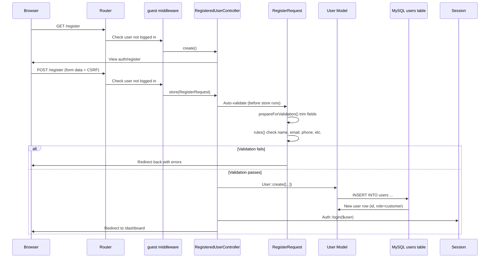
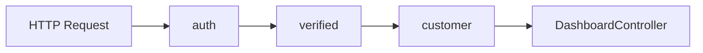

# Registration (Sign Up) Module — Implementation Details

**Section:** 6.3 Implementation · Module M1 (Authentication)  
**Purpose:** Academic report documentation — MVC flow, Form Request, Middleware, RBAC, Database

| Resource | File |
|----------|------|
| **Printable view** | [`IMPLEMENTATION_REGISTER.html`](IMPLEMENTATION_REGISTER.html) |
| **All modules** | [`IMPLEMENTATION.md`](IMPLEMENTATION.md) |

---

## 1. Overview

Customer registration allows a **guest** (unauthenticated visitor) to create an account. The system uses Laravel's **MVC pattern**:

| Layer | Responsibility in Registration |
|-------|-------------------------------|
| **View** | Registration form (`auth/register.blade.php`) |
| **Controller** | `RegisteredUserController` — show form & save user |
| **Model** | `User` — Eloquent ORM mapped to `users` table |
| **Form Request** | `RegisterRequest` — validates input before controller runs |
| **Middleware** | `guest` — blocks already-logged-in users from registering |

After successful registration, the user is assigned role **`customer`**, logged in, and redirected to the customer dashboard. Later requests to customer routes pass through **`auth` → `verified` → `customer`** middleware.

---

## 2. Complete Request Flow (Step by Step)



### Step-by-step explanation

1. **User opens** `GET /register` in the browser.
2. **Laravel Router** matches the route in `routes/auth.php`.
3. **`guest` middleware** runs — if user is already logged in, redirect away (cannot register twice while logged in).
4. **Controller `create()`** returns the Blade view — this is the **View** in MVC.
5. **User submits** the form via `POST /register` with `@csrf` token.
6. **Laravel resolves** `RegisterRequest` automatically because `store(RegisterRequest $request)` type-hints it.
7. **Form Request runs first** (before controller body):
   - `authorize()` → returns `true` (any guest may register)
   - `prepareForValidation()` → trims whitespace from inputs
   - `rules()` → validates all fields; queries DB for unique email
8. If validation **fails** → redirect back to form with error messages (controller never runs).
9. If validation **passes** → controller receives `$request->validated()` clean data.
10. **Controller** calls `User::create()` — **Model** builds SQL INSERT via Eloquent.
11. **MySQL** stores row in `users` table with `role = 'customer'`.
12. **`event(new Registered($user))`** — Laravel can send verification email.
13. **`Auth::login($user)`** — creates session in `sessions` table.
14. **Redirect** to customer dashboard (`/dashboard`).

---

## 3. Routes

**File:** `routes/auth.php`

```php
Route::middleware('guest')->group(function () {
    Route::get('register', [RegisteredUserController::class, 'create'])
        ->name('register');

    Route::post('register', [RegisteredUserController::class, 'store']);
});
```

**Included from** `routes/web.php`:

```php
require __DIR__.'/auth.php';
```

| Route | Method | Middleware | Controller Method | Purpose |
|-------|--------|------------|-------------------|---------|
| `/register` | GET | `guest` | `create()` | Show registration form |
| `/register` | POST | `guest` | `store()` | Process registration |

### What `guest` middleware does

- Laravel built-in middleware (alias for `RedirectIfAuthenticated`)
- **Allows** request only if user is **NOT** logged in
- If logged in → redirects to home/dashboard (prevents staff from accessing register page)

---

## 4. View (Presentation Layer)

**File:** `resources/views/auth/register.blade.php`

The form collects all required customer fields and posts to the named route `register`:

```blade
<form method="POST" action="{{ route('register') }}" class="space-y-5">
    @csrf

    <input id="name" type="text" name="name" value="{{ old('name') }}" required ... />
    <input id="email" type="email" name="email" value="{{ old('email') }}" required ... />
    <input id="phone" type="tel" name="phone" value="{{ old('phone') }}" required ... />
    <textarea id="address" name="address" required ...>{{ old('address') }}</textarea>
    <input id="city" type="text" name="city" value="{{ old('city') }}" required ... />
    <input id="password" type="password" name="password" required ... />
    <input id="password_confirmation" type="password" name="password_confirmation" required ... />

    <button type="submit">Create Account</button>
</form>
```

| Feature | Implementation |
|---------|----------------|
| CSRF protection | `@csrf` generates hidden token verified by Laravel |
| Old input on error | `old('name')` repopulates fields after validation failure |
| Error display | `<x-input-error :messages="$errors->get('name')" />` |
| Layout | `<x-guest-layout>` — public auth layout |

---

## 5. Form Request (Validation Layer)

**File:** `app/Http/Requests/Auth/RegisterRequest.php`

```php
<?php

namespace App\Http\Requests\Auth;

use App\Http\Requests\Concerns\SanitizesInput;
use App\Support\ValidationRules;
use Illuminate\Foundation\Http\FormRequest;

class RegisterRequest extends FormRequest
{
    use SanitizesInput;

    public function authorize(): bool
    {
        return true;  // Any guest can register
    }

    protected function prepareForValidation(): void
    {
        $this->trimStrings(['name', 'email', 'phone', 'address', 'city'], ['address', 'city']);
    }

    public function rules(): array
    {
        return [
            'name' => ValidationRules::personName(),
            'email' => ValidationRules::uniqueEmail(),
            'phone' => ValidationRules::phone(required: true),
            'address' => ValidationRules::address(required: true),
            'city' => ValidationRules::city(required: true),
            'password' => ValidationRules::password(),
        ];
    }
}
```

### How Form Request works in Laravel

When the controller method signature is `store(RegisterRequest $request)`:

1. Laravel **instantiates** `RegisterRequest` before calling `store()`.
2. Runs **`authorize()`** — if `false`, returns 403 Forbidden.
3. Runs **`prepareForValidation()`** — sanitizes input (trim strings).
4. Runs **`rules()`** — validates every field.
5. **Only if all pass** → calls `RegisteredUserController@store`.
6. If any rule fails → **automatic redirect** back with `$errors` (controller never executes).

This separates **validation logic** from **business logic** (Single Responsibility Principle).

### Validation rules used

**File:** `app/Support/ValidationRules.php`

| Field | Rules |
|-------|-------|
| `name` | required, string, min:2, max:255, letters/spaces/hyphens only, no HTML |
| `email` | required, lowercase, valid email, max:255, **unique in users table** |
| `phone` | required, custom `ValidPhone` rule (7–15 digits) |
| `address` | required, min:5, max:500, address-safe characters |
| `city` | required, min:2, max:100, letters/spaces/hyphens only |
| `password` | required, min 8 chars, mixed case + numbers, confirmed |

**Custom phone rule** — `app/Rules/ValidPhone.php`:

```php
public function validate(string $attribute, mixed $value, Closure $fail): void
{
    // Format check: optional +, digits, spaces, hyphens
    if (! preg_match('/^[\+]?[0-9\s\-().]{7,25}$/', $value)) {
        $fail('The :attribute format is invalid.');
        return;
    }
    // Must contain 7–15 actual digits
    $digits = preg_replace('/\D/', '', $value);
    if (strlen($digits) < 7 || strlen($digits) > 15) {
        $fail('The :attribute must contain 7 to 15 digits.');
    }
}
```

**Unique email check** queries the database:

```php
Rule::unique(User::class)  // SELECT COUNT(*) FROM users WHERE email = ?
```

---

## 6. Controller (Application Layer)

**File:** `app/Http/Controllers/Auth/RegisteredUserController.php`

```php
<?php

namespace App\Http\Controllers\Auth;

use App\Http\Requests\Auth\RegisterRequest;
use App\Http\Controllers\Controller;
use App\Models\User;
use Illuminate\Auth\Events\Registered;
use Illuminate\Support\Facades\Auth;
use Illuminate\Support\Facades\Hash;

class RegisteredUserController extends Controller
{
    public function create(): View
    {
        return view('auth.register');  // VIEW
    }

    public function store(RegisterRequest $request): RedirectResponse
    {
        $validated = $request->validated();  // Only validated data

        $user = User::create([              // MODEL → DATABASE
            'name' => $validated['name'],
            'email' => $validated['email'],
            'phone' => $validated['phone'],
            'address' => $validated['address'],
            'city' => $validated['city'],
            'password' => Hash::make($validated['password']),
            'role' => 'customer',           // RBAC: assign Customer role
        ]);

        event(new Registered($user));       // Email verification event
        Auth::login($user);                 // Create session

        return redirect()->intended(route('dashboard'));
    }
}
```

| Line | Purpose |
|------|---------|
| `RegisterRequest $request` | Triggers automatic validation |
| `$request->validated()` | Returns only fields that passed rules |
| `Hash::make()` | Bcrypt password hashing (never store plain text) |
| `'role' => 'customer'` | **RBAC role assignment** at registration |
| `event(new Registered($user))` | Laravel sends verification email (if configured) |
| `Auth::login($user)` | Stores user ID in session |
| `redirect()->intended()` | Go to dashboard (or originally requested URL) |

---

## 7. Model (Data Layer — Eloquent ORM)

**File:** `app/Models/User.php`

```php
class User extends Authenticatable
{
    use HasFactory, Notifiable;

    protected $fillable = [
        'name', 'email', 'password', 'role',
        'phone', 'address', 'city', 'profile_photo_path',
    ];

    protected $hidden = ['password', 'remember_token'];

    protected function casts(): array
    {
        return [
            'email_verified_at' => 'datetime',
            'password' => 'hashed',        // Auto-hash on set
            'role' => UserRole::class,       // String → Enum
        ];
    }

    public function hasPermission(string $permission): bool
    {
        return Rbac::userHasPermission($this, $permission);
    }

    public function isCustomer(): bool
    {
        return $this->role === UserRole::Customer;
    }
}
```

### What happens on `User::create()`

Eloquent generates and executes SQL equivalent to:

```sql
INSERT INTO users (name, email, phone, address, city, password, role, created_at, updated_at)
VALUES ('John Doe', 'john@example.com', '0771234567', '123 Main St', 'Colombo',
        '$2y$12$...hashed...', 'customer', NOW(), NOW());
```

- **`$fillable`** — only these columns can be mass-assigned (security against mass assignment attacks)
- **`password` cast `'hashed'`** — Laravel auto-hashes even if Hash::make already applied
- **`role` cast `UserRole::class`** — DB string `'customer'` becomes enum `UserRole::Customer`

---

## 8. Database Tables

### `users` table structure

Built across migrations:

**Base table** — `0001_01_01_000000_create_users_table.php`:

```php
Schema::create('users', function (Blueprint $table) {
    $table->id();
    $table->string('name');
    $table->string('email')->unique();
    $table->timestamp('email_verified_at')->nullable();
    $table->string('password');
    $table->rememberToken();
    $table->timestamps();
});
```

**Customer fields + role** — `2025_06_07_000001_add_customer_fields_to_users_table.php`:

```php
$table->string('role')->default('customer')->after('email');
$table->string('phone', 20)->nullable()->after('role');
$table->text('address')->nullable()->after('phone');
$table->string('city', 100)->nullable()->after('address');
```

**Required fields** — `2025_06_10_000001_require_phone_and_address_on_users_table.php`:

```php
$table->string('phone', 25)->nullable(false)->change();
$table->text('address')->nullable(false)->change();
$table->string('city', 100)->nullable(false)->change();
```

### Final `users` columns used in registration

| Column | Type | Set at Registration |
|--------|------|---------------------|
| `id` | BIGINT AUTO_INCREMENT | Auto |
| `name` | VARCHAR(255) | From form |
| `email` | VARCHAR(255) UNIQUE | From form |
| `email_verified_at` | TIMESTAMP NULL | NULL until verified |
| `password` | VARCHAR(255) | Hashed from form |
| `role` | VARCHAR | `'customer'` (hardcoded) |
| `phone` | VARCHAR(25) | From form |
| `address` | TEXT | From form |
| `city` | VARCHAR(100) | From form |
| `created_at` / `updated_at` | TIMESTAMP | Auto |

### `sessions` table (after login)

When `Auth::login($user)` runs, Laravel inserts a session row:

```sql
INSERT INTO sessions (id, user_id, ip_address, user_agent, payload, last_activity)
VALUES ('...', 5, '127.0.0.1', 'Mozilla/5.0...', '...serialized...', 1740000000);
```

The browser receives a session cookie; future requests include `user_id` for authentication.

---

## 9. RBAC — How Access Control Works

### 9.1 Role assignment at registration

Registration **always** sets `role = 'customer'`. Staff, admin, manager, and technician accounts are **not** created via public registration — they are created by an administrator via `StaffUserController`.

```php
// RegisteredUserController.php
'role' => 'customer',
```

### 9.2 UserRole enum

**File:** `app/Enums/UserRole.php`

```php
enum UserRole: string
{
    case Customer = 'customer';
    case Admin = 'admin';
    case Manager = 'manager';
    case Staff = 'staff';
    case Technician = 'technician';
}
```

### 9.3 Two levels of RBAC in this system

| Level | Used for | Mechanism |
|-------|----------|-----------|
| **Role middleware** | Route access by panel | `EnsureCustomer`, `EnsureAdmin`, `EnsureTechnician` |
| **Permission middleware** | Fine-grained admin actions | `EnsurePermission` + `config/rbac.php` |

**Customers do NOT use the permission map** — they are controlled by the `customer` middleware only.

### 9.4 Permission config (staff/admin only)

**File:** `config/rbac.php`

```php
'roles' => [
    UserRole::Admin->value => ['*'],
    UserRole::Manager->value => [Permission::CatalogView->value, Permission::CatalogManage->value],
    UserRole::Staff->value => [Permission::OrdersView->value, Permission::BillingManage->value, ...],
    UserRole::Technician->value => [Permission::ProductionManage->value],
],
// Customer role is NOT listed — customers use route middleware instead
```

**File:** `app/Support/Rbac.php`

```php
public static function userHasPermission(?User $user, string $permission): bool
{
    if (! $user || ! $user->role instanceof UserRole) {
        return false;
    }
    if ($user->role === UserRole::Admin) {
        return true;  // Admin has all permissions
    }
    return self::roleHasPermission($user->role, $permission);
}
```

### 9.5 Middleware after registration (accessing dashboard)

**File:** `routes/web.php`

```php
Route::middleware(['auth', 'verified', 'customer'])->group(function () {
    Route::get('/dashboard', DashboardController::class)->name('dashboard');
    // ... orders, notifications, etc.
});
```

**Middleware chain when customer visits `/dashboard`:**



| Middleware | File | Check |
|------------|------|-------|
| `auth` | Laravel built-in | User must be logged in; else redirect to `/login` |
| `verified` | Laravel built-in | Email must be verified (if model implements MustVerifyEmail) |
| `customer` | `EnsureCustomer.php` | `$user->role === UserRole::Customer` |

**EnsureCustomer middleware** — `app/Http/Middleware/EnsureCustomer.php`:

```php
public function handle(Request $request, Closure $next): Response
{
    $user = $request->user();

    if (! $user || $user->role !== UserRole::Customer) {
        if ($user?->role === UserRole::Technician) {
            return redirect()->route('technician.dashboard');
        }
        if ($user?->isStaffMember()) {
            return redirect()->route('admin.dashboard');
        }
        return redirect('/');
    }

    return $next($request);  // Allow customer through
}
```

If a **staff member** accidentally hits `/dashboard`, they are redirected to the admin panel — not blocked with 403.

### 9.6 Middleware aliases

**File:** `bootstrap/app.php`

```php
$middleware->alias([
    'admin' => \App\Http\Middleware\EnsureAdmin::class,
    'customer' => \App\Http\Middleware\EnsureCustomer::class,
    'permission' => \App\Http\Middleware\EnsurePermission::class,
    'technician' => \App\Http\Middleware\EnsureTechnician::class,
]);
```

---

## 10. MVC Summary for Registration

```
┌─────────────────────────────────────────────────────────────────┐
│                         REGISTRATION MVC                         │
├─────────────────────────────────────────────────────────────────┤
│  VIEW          auth/register.blade.php                          │
│                HTML form → POST /register                        │
├─────────────────────────────────────────────────────────────────┤
│  FORM REQUEST  RegisterRequest.php                              │
│                Validates BEFORE controller runs                    │
│                Queries users table for unique email               │
├─────────────────────────────────────────────────────────────────┤
│  CONTROLLER    RegisteredUserController.php                     │
│                create() → return view                           │
│                store() → User::create() → Auth::login()         │
├─────────────────────────────────────────────────────────────────┤
│  MODEL         User.php (Eloquent)                              │
│                User::create() → INSERT INTO users               │
├─────────────────────────────────────────────────────────────────┤
│  DATABASE      MySQL: users, sessions tables                    │
└─────────────────────────────────────────────────────────────────┘
```

---

## 11. Post-Registration Flow (Dashboard Access)

After registration redirect to `/dashboard`:

1. **`auth`** — session cookie identifies logged-in user
2. **`verified`** — if email not verified, redirect to verification notice
3. **`customer`** — confirms role is Customer
4. **`DashboardController`** — loads customer's orders from DB:

```php
$user = $request->user();
$orders = $user->orders()->with('catalogDesign')->latest()->limit(5)->get();
// Eloquent: SELECT * FROM orders WHERE user_id = ? ORDER BY created_at DESC LIMIT 5
```

5. Returns **`customer.dashboard`** view with stats and orders

---

## 12. Security Measures in Registration

| Measure | Implementation |
|---------|----------------|
| CSRF | `@csrf` in form; Laravel verifies token on POST |
| Password hashing | Bcrypt via `Hash::make()` and model `'hashed'` cast |
| Mass assignment protection | `$fillable` whitelist on User model |
| Guest-only registration | `guest` middleware on register routes |
| Input sanitization | `SanitizesInput` trait trims strings |
| XSS prevention | `not_regex:/<[^>]+>/` blocks HTML in text fields |
| Unique email | DB-level unique index + validation rule |
| Role locked to customer | Public users cannot choose admin/staff role |

---

## 13. Report Paragraph (Copy-Paste)

> The customer registration module was implemented using Laravel MVC architecture. The **View** layer (`auth/register.blade.php`) presents a form collecting name, email, phone, address, city, and password with CSRF protection. On submission, the **Form Request** class (`RegisterRequest`) validates input before the controller executes — checking field formats, password strength, and email uniqueness against the `users` table. The **Controller** (`RegisteredUserController`) creates a new `User` record via Eloquent ORM, assigns the **Customer** role, hashes the password, fires a registration event, and logs the user in. Data is persisted in the MySQL **`users`** table with a unique email constraint and default role `customer`. After login, the session is stored in the **`sessions`** table. Subsequent access to the customer dashboard passes through three middleware layers: **`auth`** (authenticated), **`verified`** (email verified), and **`customer`** (role check via `EnsureCustomer` middleware). Role-Based Access Control ensures public registration cannot create staff accounts; administrator and staff roles are managed separately. This separation of View, Form Request, Controller, Model, and Database follows MVC principles and maintains clear separation of concerns.

---

*Registration Module · Rajabharana Jewellery Management System · Section 6.3*
