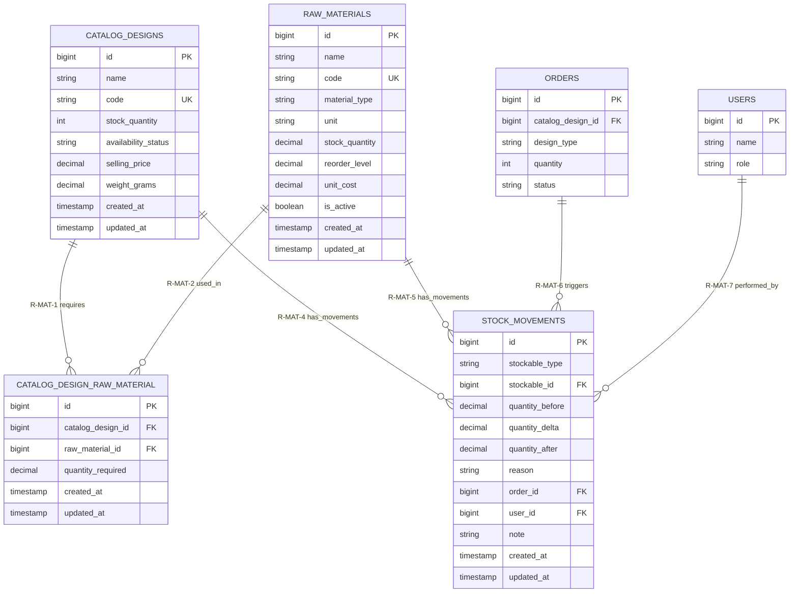
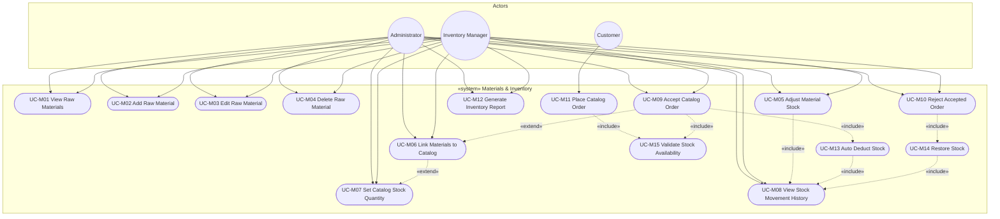
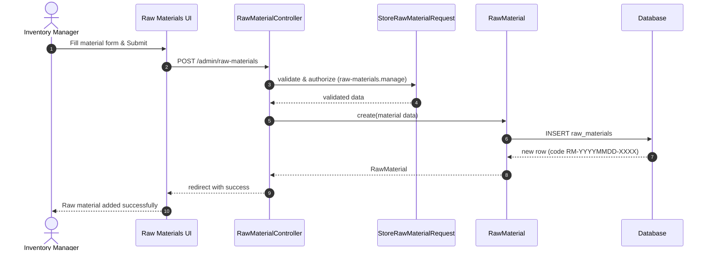
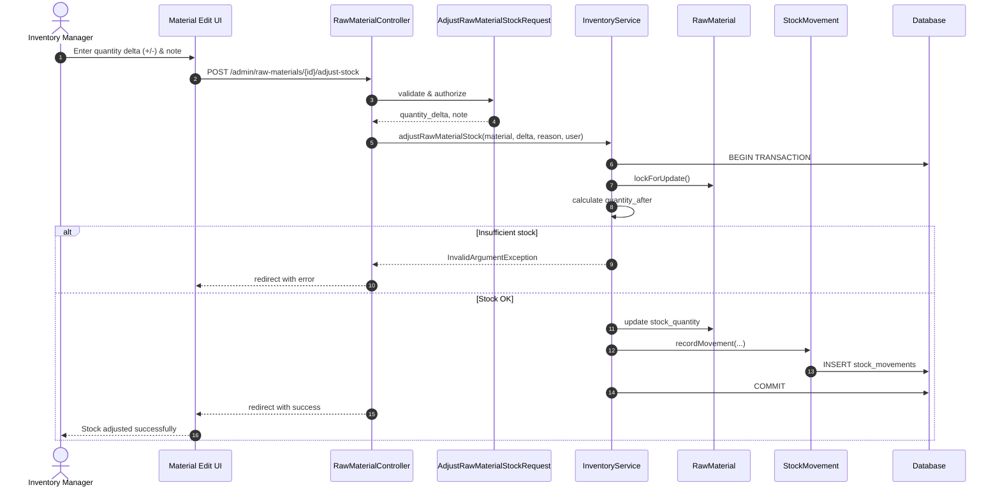
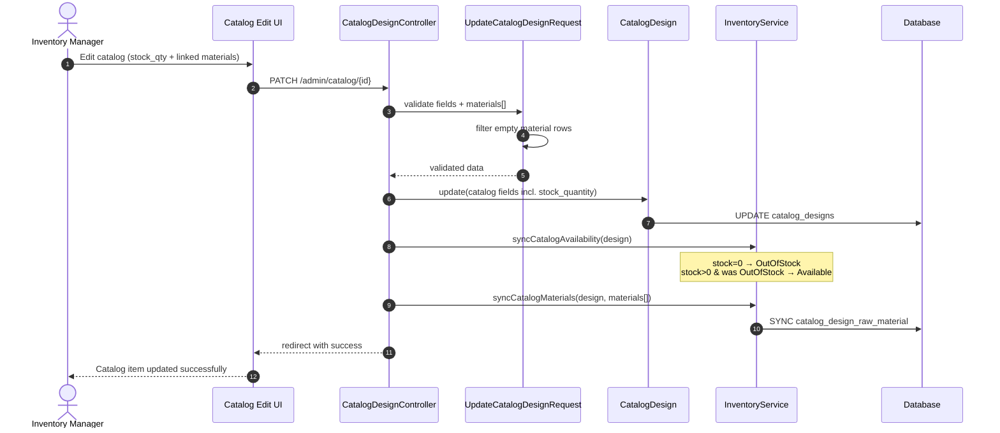
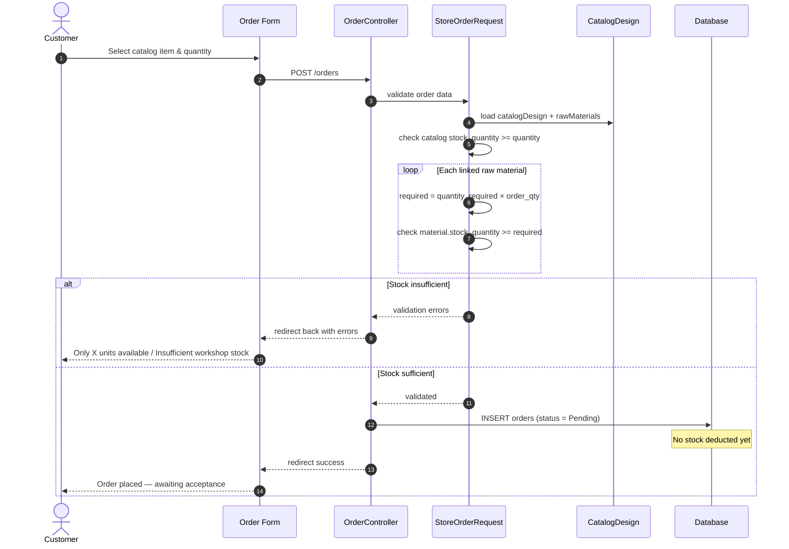
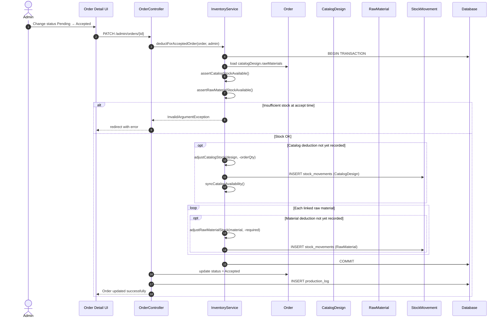
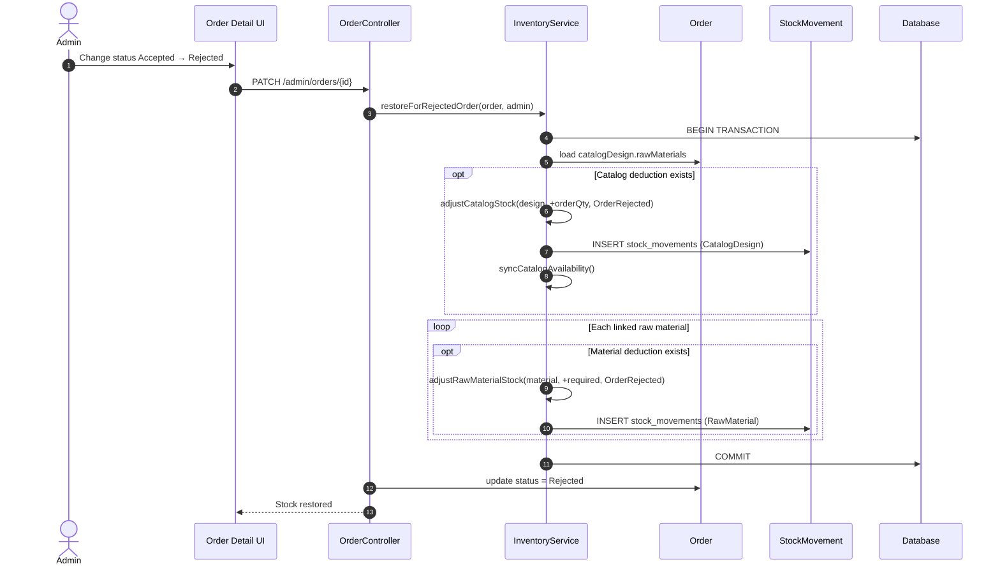
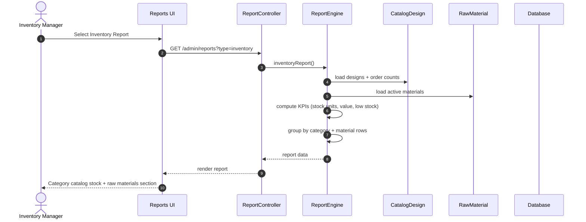
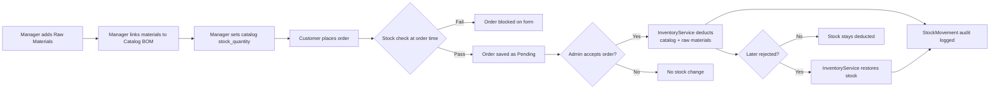

# Materials & Inventory — Diagram Document

**System:** Rajabharana Jewellery Management System  
**Module:** Raw Materials · Stock Management · Bill of Materials · Stock Audit  
**Status:** ✅ Implemented  
**Stack:** Laravel 12 · Blade · MySQL · `InventoryService`

| Resource | File |
|----------|------|
| **Markdown (full doc)** | [`MATERIALS_INVENTORY_DIAGRAMS.md`](MATERIALS_INVENTORY_DIAGRAMS.md) |
| **Sequence diagrams (HTML)** | [`MATERIALS_SEQUENCE_DIAGRAM.html`](MATERIALS_SEQUENCE_DIAGRAM.html) |
| **Sequence diagrams (PDF)** | [`MATERIALS_SEQUENCE_DIAGRAM.pdf`](MATERIALS_SEQUENCE_DIAGRAM.pdf) |
| **Module ER (short)** | [`MODULE_ER_DIAGRAMS/12-raw-materials-inventory.md`](MODULE_ER_DIAGRAMS/12-raw-materials-inventory.md) |

---

## §1 Module Overview

The **Materials & Inventory** module extends catalogue management with:

1. **Raw materials** — workshop stock (gold, stones, findings, etc.)
2. **Bill of Materials (BOM)** — links each catalog item to required raw materials per unit
3. **Catalog stock quantity** — finished-item units on `catalog_designs`
4. **Stock movements** — audit log for every catalog or material stock change
5. **Automatic deduction** — on admin **order accept**; restoration on **reject after accept**
6. **Inventory report** — category-wise catalog stock + raw materials summary

**Tables:** `raw_materials`, `catalog_design_raw_material`, `stock_movements`, `catalog_designs.stock_quantity` *(column)*

**Key service:** `App\Services\InventoryService`

**Actors:**

| Actor | Role | Access |
|-------|------|--------|
| **Administrator** | Full access | All material use cases |
| **Inventory Manager** | Workshop stock manager | Raw materials CRUD, catalog linking, reports, order accept/reject |
| **Customer** | Places catalog orders | Stock validated at order time only (no material management) |
| **System** | `InventoryService` | Auto deduct / restore / audit logging |

---

## §2 ER Diagram

### 2.1 Entities

#### raw_materials ✅

| Property | Value |
|----------|-------|
| **Entity Name** | raw_materials |
| **Description** | Workshop raw material stock item |
| **Primary Key (PK)** | id |
| **Foreign Keys (FK)** | — |
| **Attributes** | id, name, code, material_type, unit, stock_quantity, reorder_level, unit_cost, notes, is_active, created_at, updated_at |
| **Required** | name, code, material_type, unit |
| **Optional** | reorder_level, unit_cost, notes |
| **Unique** | code |
| **Derived** | is_low_stock *(stock_quantity ≤ reorder_level)* |

#### catalog_designs *(updated)* ✅

| Property | Value |
|----------|-------|
| **Entity Name** | catalog_designs |
| **Description** | Catalogue product with finished-item stock |
| **New attribute** | stock_quantity *(integer, default 0)* |
| **Business rule** | stock_quantity = 0 → availability_status = out_of_stock |

#### catalog_design_raw_material ✅ *(associative / bridge)*

| Property | Value |
|----------|-------|
| **Entity Name** | catalog_design_raw_material |
| **Description** | Bill of Materials — material required per 1 catalog unit |
| **Primary Key (PK)** | id |
| **Foreign Keys (FK)** | catalog_design_id → catalog_designs.id, raw_material_id → raw_materials.id |
| **Attributes** | id, catalog_design_id, raw_material_id, quantity_required, created_at, updated_at |
| **Required** | catalog_design_id, raw_material_id, quantity_required |
| **Unique** | (catalog_design_id, raw_material_id) |

#### stock_movements ✅

| Property | Value |
|----------|-------|
| **Entity Name** | stock_movements |
| **Description** | Audit log for catalog or raw material stock changes |
| **Primary Key (PK)** | id |
| **Foreign Keys (FK)** | order_id → orders.id *(nullable)*, user_id → users.id *(nullable)* |
| **Polymorphic FK** | stockable_type + stockable_id → CatalogDesign **or** RawMaterial |
| **Attributes** | id, stockable_type, stockable_id, quantity_before, quantity_delta, quantity_after, reason, order_id, user_id, note, created_at, updated_at |
| **Required** | stockable_type, stockable_id, quantity_before, quantity_delta, quantity_after, reason |

**Reason domain (`reason`):**

| Value | Meaning |
|-------|---------|
| manual_adjustment | Manual stock correction |
| catalog_restock | Catalog item restocked |
| order_accepted | Stock deducted on order accept |
| order_rejected | Stock restored after reject |
| order_cancelled | Stock restored on cancel |
| workshop_usage | Material consumed in workshop |
| material_received | Material received / restocked |

---

### 2.2 Attributes Table

#### raw_materials

| Name | Data Type | PK | FK | Nullable | Unique | Default |
|------|-----------|:--:|:--:|:--------:|:------:|---------|
| id | BIGINT UNSIGNED | ✓ | | No | Yes | AUTO_INCREMENT |
| name | VARCHAR(255) | | | No | No | — |
| code | VARCHAR(255) | | | No | Yes | — |
| material_type | VARCHAR(255) | | | No | No | — |
| unit | VARCHAR(255) | | | No | No | — |
| stock_quantity | DECIMAL(12,3) | | | No | No | 0 |
| reorder_level | DECIMAL(12,3) | | | Yes | No | NULL |
| unit_cost | DECIMAL(12,2) | | | Yes | No | NULL |
| notes | TEXT | | | Yes | No | NULL |
| is_active | BOOLEAN | | | No | No | true |
| created_at | TIMESTAMP | | | Yes | No | NULL |
| updated_at | TIMESTAMP | | | Yes | No | NULL |

#### catalog_design_raw_material

| Name | Data Type | PK | FK | Nullable | Unique | Default |
|------|-----------|:--:|:--:|:--------:|:------:|---------|
| id | BIGINT UNSIGNED | ✓ | | No | Yes | AUTO_INCREMENT |
| catalog_design_id | BIGINT UNSIGNED | | → catalog_designs.id | No | No* | — |
| raw_material_id | BIGINT UNSIGNED | | → raw_materials.id | No | No* | — |
| quantity_required | DECIMAL(12,3) | | | No | No | — |
| created_at | TIMESTAMP | | | Yes | No | NULL |
| updated_at | TIMESTAMP | | | Yes | No | NULL |

\* Composite unique: (catalog_design_id, raw_material_id)

#### stock_movements

| Name | Data Type | PK | FK | Nullable | Unique | Default |
|------|-----------|:--:|:--:|:--------:|:------:|---------|
| id | BIGINT UNSIGNED | ✓ | | No | Yes | AUTO_INCREMENT |
| stockable_type | VARCHAR(255) | | | No | No | — |
| stockable_id | BIGINT UNSIGNED | | polymorphic | No | No | — |
| quantity_before | DECIMAL(12,3) | | | No | No | — |
| quantity_delta | DECIMAL(12,3) | | | No | No | — |
| quantity_after | DECIMAL(12,3) | | | No | No | — |
| reason | VARCHAR(255) | | | No | No | — |
| order_id | BIGINT UNSIGNED | | → orders.id | Yes | No | NULL |
| user_id | BIGINT UNSIGNED | | → users.id | Yes | No | NULL |
| note | VARCHAR(255) | | | Yes | No | NULL |
| created_at | TIMESTAMP | | | Yes | No | NULL |
| updated_at | TIMESTAMP | | | Yes | No | NULL |

#### catalog_designs *(added column)*

| Name | Data Type | PK | FK | Nullable | Unique | Default |
|------|-----------|:--:|:--:|:--------:|:------:|---------|
| stock_quantity | INT UNSIGNED | | | No | No | 0 |

---

### 2.3 Relationships

| Parent | Child | ID | Description | Business Rule |
|--------|-------|-----|-------------|---------------|
| catalog_designs | catalog_design_raw_material | **R-MAT-1** | requires | Catalog item has BOM entries |
| raw_materials | catalog_design_raw_material | **R-MAT-2** | used_in | Material used in catalog items |
| catalog_designs | raw_materials | **R-MAT-3** | requires_materials | M:N via bridge table |
| catalog_designs | stock_movements | **R-MAT-4** | has_movements | Polymorphic audit (CatalogDesign) |
| raw_materials | stock_movements | **R-MAT-5** | has_movements | Polymorphic audit (RawMaterial) |
| orders | stock_movements | **R-MAT-6** | triggers | Order accept/reject creates movements |
| users | stock_movements | **R-MAT-7** | performed_by | User who made the adjustment |

---

### 2.4 Cardinality (Crow's Foot)

| Relationship | Parent | Child | Crow's Foot | Meaning |
|--------------|--------|-------|-------------|---------|
| R-MAT-1 | catalog_designs | catalog_design_raw_material | **1 ——< N** | One catalog item, zero or many BOM rows |
| R-MAT-2 | raw_materials | catalog_design_raw_material | **1 ——< N** | One material, zero or many BOM links |
| R-MAT-3 | catalog_designs | raw_materials | **M ——< M** | Many-to-many via bridge table |
| R-MAT-4 | catalog_designs | stock_movements | **1 ——< N** | One catalog item, many movement records |
| R-MAT-5 | raw_materials | stock_movements | **1 ——< N** | One material, many movement records |
| R-MAT-6 | orders | stock_movements | **1 ——o< N** | One order, zero or many movements |
| R-MAT-7 | users | stock_movements | **1 ——o< N** | One user, zero or many movements |

---

### 2.5 Participation (Total / Partial)

| Entity | Relationship | Participation | Explanation |
|--------|--------------|---------------|-------------|
| catalog_designs | R-MAT-3 → raw_materials | **Partial** | Catalog item may have no linked materials |
| raw_materials | R-MAT-3 → catalog_designs | **Partial** | Material may not be linked to any catalog item |
| catalog_design_raw_material | R-MAT-1, R-MAT-2 | **Total** | Every BOM row requires both FKs |
| stock_movements | R-MAT-4, R-MAT-5 | **Total** | Every movement has exactly one stockable target |
| orders | R-MAT-6 → stock_movements | **Partial** | Not all orders trigger stock changes (custom orders) |
| users | R-MAT-7 → stock_movements | **Partial** | user_id nullable |

---

### 2.6 Mermaid ER Diagram



---

### 2.7 Chen Notation (ASCII)

```
                    ┌──────────────────────────────────────────────────────────┐
                    │         MATERIALS & INVENTORY MODULE                      │
                    │   ✅ raw_materials + catalog_design_raw_material          │
                    │   ✅ stock_movements + catalog_designs.stock_quantity     │
                    └──────────────────────────────────────────────────────────┘

   CATALOG_DESIGNS              CATALOG_DESIGN_RAW_MATERIAL           RAW_MATERIALS
 ┌─────────────────────┐       ┌───────────────────────────┐       ┌─────────────────┐
 │ * id                │       │ * id                      │       │ * id            │
 │   name              │       │   catalog_design_id (FK)  │       │   name          │
 │   code (UK)         │──requires──►│   raw_material_id (FK)  │◄──used_in──│   code (UK)     │
 │   stock_quantity    │  (1,N)  │   quantity_required       │  (1,N)  │   material_type │
 │   availability_stat │       └───────────────────────────┘       │   unit          │
 └──────────┬──────────┘                                           │   stock_quantity│
            │                                                       │   reorder_level │
            │ has_movements (1,N)                                   │   is_active     │
            ▼                                                       └────────┬────────┘
 ┌─────────────────────┐                                                    │
 │   STOCK_MOVEMENTS     │◄──────────────── has_movements (1,N) ──────────────┘
 │ * id                │
 │   stockable_type    │──────► CatalogDesign OR RawMaterial (polymorphic)
 │   stockable_id (FK) │
 │   quantity_before   │
 │   quantity_delta    │
 │   quantity_after    │
 │   reason            │
 │   order_id (FK)     │◄─────── ORDERS (0,N)
 │   user_id (FK)      │◄─────── USERS (0,N)
 └─────────────────────┘

BOM rule:  quantity_required = amount of raw material needed to produce 1 catalog unit
Stock rule: On order accept → catalog stock − order_qty; each material − (qty_required × order_qty)
```

---

## §3 Use Case Diagram

**Legend:** ✅ Implemented · `- -▷` «include» · `- -▷` «extend»

### Figure 1 — Materials module use cases



### Use case descriptions

| ID | Use Case | Actor | Description |
|----|----------|-------|-------------|
| **UC-M01** | View Raw Materials | Admin, Manager | List, search, filter by type; view low-stock count |
| **UC-M02** | Add Raw Material | Admin, Manager | Create material with auto-generated code `RM-YYYYMMDD-XXXX` |
| **UC-M03** | Edit Raw Material | Admin, Manager | Update name, type, unit, reorder level, unit cost, notes |
| **UC-M04** | Delete Raw Material | Admin, Manager | Delete only if no stock movement history exists |
| **UC-M05** | Adjust Material Stock | Admin, Manager | Manual +/− adjustment; logs `material_received` or `workshop_usage` |
| **UC-M06** | Link Materials to Catalog | Admin, Manager | Define BOM: `quantity_required` per material per 1 catalog unit |
| **UC-M07** | Set Catalog Stock Quantity | Admin, Manager | Set finished-item units on catalog create/edit |
| **UC-M08** | View Stock Movement History | Admin, Manager | Audit: before / delta / after / reason / user / order |
| **UC-M09** | Accept Catalog Order | Admin, Manager | Change order status Pending → Accepted |
| **UC-M10** | Reject Accepted Order | Admin, Manager | Change order status Accepted → Rejected; restore stock |
| **UC-M11** | Place Catalog Order | Customer | Submit catalog order; stock validated before save |
| **UC-M12** | Generate Inventory Report | Admin, Manager | Category catalog stock + raw materials KPIs and tables |
| **UC-M13** | Auto Deduct Stock | System | Deduct catalog stock + linked materials on order accept |
| **UC-M14** | Restore Stock | System | Reverse deduction when accepted order is rejected |
| **UC-M15** | Validate Stock Availability | System | Check catalog stock and material stock before order/accept |

---

## §4 Sequence Diagrams

### Figure 2 — Add raw material (UC-M02) ✅



---

### Figure 3 — Adjust raw material stock (UC-M05) ✅



---

### Figure 4 — Link materials to catalog item (UC-M06 + UC-M07) ✅



---

### Figure 5 — Customer places catalog order (UC-M11) ✅



---

### Figure 6 — Accept catalog order — auto deduct stock (UC-M09) ✅



---

### Figure 7 — Reject accepted order — restore stock (UC-M10) ✅



---

### Figure 8 — Generate inventory report (UC-M12) ✅



---

## §5 Process Flow Summary



---

## §6 Business Rules & Implementation Reference

### Business rules

| # | Rule |
|---|------|
| BR-1 | Stock is **not** deducted when customer places order — only when admin **accepts** |
| BR-2 | Customer order form validates catalog stock **and** linked material stock |
| BR-3 | Order accept re-checks stock to prevent race conditions |
| BR-4 | Every deduction/restoration creates a `stock_movements` audit row |
| BR-5 | Duplicate deductions prevented per order + stockable item |
| BR-6 | `stock_quantity = 0` auto-sets catalog `availability_status = out_of_stock` |
| BR-7 | Custom orders do **not** trigger material deduction |
| BR-8 | Raw material cannot be deleted if stock movement history exists |
| BR-9 | BOM `quantity_required` = material needed per **1 catalog unit** |
| BR-10 | Material deduction on accept = `quantity_required × order quantity` |

### Implementation files

| Layer | File |
|-------|------|
| Service | `app/Services/InventoryService.php` |
| Models | `app/Models/RawMaterial.php`, `app/Models/StockMovement.php` |
| Controllers | `app/Http/Controllers/Admin/RawMaterialController.php`, `CatalogDesignController.php`, `OrderController.php` |
| Enum | `app/Enums/StockMovementReason.php` |
| Migrations | `2025_08_18_000001` … `2025_08_18_000004` |
| Views | `resources/views/admin/raw-materials/*`, `admin/catalog/_materials.blade.php` |
| Report | `app/Services/ReportEngine::inventoryReport()` |
| Permissions | `raw-materials.view`, `raw-materials.manage` in `config/rbac.php` |

### Routes

| Method | Route | Use Case |
|--------|-------|----------|
| GET | `/admin/raw-materials` | UC-M01 |
| POST | `/admin/raw-materials` | UC-M02 |
| PATCH | `/admin/raw-materials/{id}` | UC-M03 |
| DELETE | `/admin/raw-materials/{id}` | UC-M04 |
| POST | `/admin/raw-materials/{id}/adjust-stock` | UC-M05 |
| PATCH | `/admin/catalog/{id}` | UC-M06, UC-M07 |
| PATCH | `/admin/orders/{id}` | UC-M09, UC-M10 |
| POST | `/orders` | UC-M11 |
| GET | `/admin/reports?type=inventory` | UC-M12 |

---

*Rajabharana Jewellery System — Materials & Inventory Diagram Document — ✅ Implemented*
