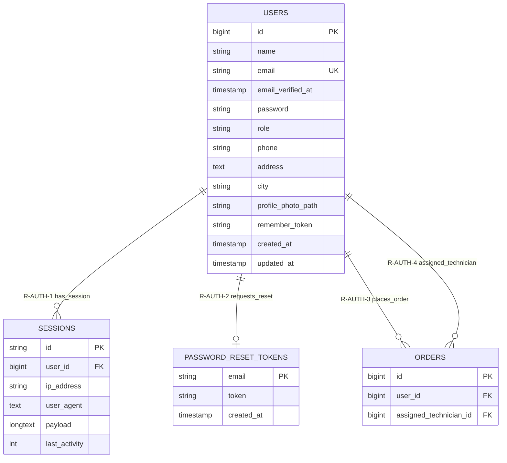

# Module 01 — Authentication & Session Management

**System:** Rajabharana Jewellery Management System  
**Module:** M1 — Authentication & Session Management  
**Status:** ✅ Implemented  
**Tables:** `users`, `password_reset_tokens`, `sessions`

---

## 1. Module Overview

This module provides identity, credential, and session management for all Rajabharana system users. Laravel Breeze/Fortify-style authentication stores registered accounts in `users`, password recovery tokens in `password_reset_tokens`, and active browser sessions in `sessions`. Role-based access (`role` column) is enforced at the application layer and links this module to every other module.

---

## 2. Entities

### 2.1 users ✅

| Property | Value |
|----------|-------|
| **Entity Name** | users |
| **Description** | Registered system account (customer, admin, manager, staff, or technician) |
| **Primary Key (PK)** | id |
| **Foreign Keys (FK)** | — |
| **Attributes** | id, name, email, email_verified_at, password, role, phone, address, city, profile_photo_path, remember_token, created_at, updated_at |
| **Required** | name, email, password, role, phone, address, city |
| **Optional** | email_verified_at, profile_photo_path, remember_token, created_at, updated_at |
| **Unique** | email |
| **Derived** | — (role label resolved via `UserRole` enum at runtime) |
| **Multivalued** | — |

### 2.2 password_reset_tokens ✅

| Property | Value |
|----------|-------|
| **Entity Name** | password_reset_tokens |
| **Description** | Single-use token issued when a user requests password reset |
| **Primary Key (PK)** | email |
| **Foreign Keys (FK)** | email → users.email (logical; not enforced as FK in Laravel default) |
| **Attributes** | email, token, created_at |
| **Required** | email, token |
| **Optional** | created_at |
| **Unique** | email (PK) |
| **Derived** | — |
| **Multivalued** | — |

### 2.3 sessions ✅

| Property | Value |
|----------|-------|
| **Entity Name** | sessions |
| **Description** | Server-side session store for authenticated and guest browser sessions |
| **Primary Key (PK)** | id |
| **Foreign Keys (FK)** | user_id → users.id (nullable, indexed) |
| **Attributes** | id, user_id, ip_address, user_agent, payload, last_activity |
| **Required** | id, payload, last_activity |
| **Optional** | user_id, ip_address, user_agent |
| **Unique** | id (PK) |
| **Derived** | — |
| **Multivalued** | — |

---

## 3. Attributes Table

### 3.1 users

| Name | Data Type | PK | FK | Nullable | Unique | Default |
|------|-----------|:--:|:--:|:--------:|:------:|---------|
| id | BIGINT UNSIGNED | ✓ | | No | Yes | AUTO_INCREMENT |
| name | VARCHAR(255) | | | No | No | — |
| email | VARCHAR(255) | | | No | Yes | — |
| email_verified_at | TIMESTAMP | | | Yes | No | NULL |
| password | VARCHAR(255) | | | No | No | — |
| role | VARCHAR(255) | | | No | No | `'customer'` |
| phone | VARCHAR(25) | | | No | No | — |
| address | TEXT | | | No | No | — |
| city | VARCHAR(100) | | | No | No | — |
| profile_photo_path | VARCHAR(255) | | | Yes | No | NULL |
| remember_token | VARCHAR(100) | | | Yes | No | NULL |
| created_at | TIMESTAMP | | | Yes | No | NULL |
| updated_at | TIMESTAMP | | | Yes | No | NULL |

### 3.2 password_reset_tokens

| Name | Data Type | PK | FK | Nullable | Unique | Default |
|------|-----------|:--:|:--:|:--------:|:------:|---------|
| email | VARCHAR(255) | ✓ | → users.email* | No | Yes | — |
| token | VARCHAR(255) | | | No | No | — |
| created_at | TIMESTAMP | | | Yes | No | NULL |

\* Logical reference only; Laravel default migration does not declare a database FK constraint.

### 3.3 sessions

| Name | Data Type | PK | FK | Nullable | Unique | Default |
|------|-----------|:--:|:--:|:--------:|:------:|---------|
| id | VARCHAR(255) | ✓ | | No | Yes | — |
| user_id | BIGINT UNSIGNED | | → users.id | Yes | No | NULL |
| ip_address | VARCHAR(45) | | | Yes | No | NULL |
| user_agent | TEXT | | | Yes | No | NULL |
| payload | LONGTEXT | | | No | No | — |
| last_activity | INT | | | No | No | — |

---

## 4. Relationships

| Parent | Child | Name | Description | Business Rule |
|--------|-------|------|-------------|---------------|
| users | sessions | **R-AUTH-1** has_session | One user may have many active sessions | Guest sessions have `user_id = NULL`; authenticated sessions store the logged-in user's id |
| users | password_reset_tokens | **R-AUTH-2** requests_reset | One user email maps to at most one active reset token | Token row is deleted or replaced on successful reset; email must match an existing user |
| users | orders | **R-AUTH-3** places_order | Customer users place orders (cross-module) | Only `role = 'customer'` should own orders via `orders.user_id` (enforced in application) |
| users | orders | **R-AUTH-4** assigned_as_technician | Technician users may be assigned to orders (cross-module) | `assigned_technician_id` references users where `role = 'technician'` |

---

## 5. Cardinality (Crow's Foot)

| Relationship | Parent | Child | Crow's Foot Notation | Meaning |
|--------------|--------|-------|----------------------|---------|
| R-AUTH-1 | users | sessions | **1 ——< N** | One user, zero or many sessions |
| R-AUTH-2 | users | password_reset_tokens | **1 ——\| 0..1** | One user email, zero or one reset token row |
| R-AUTH-3 | users | orders | **1 ——< N** | One customer, one or many orders |
| R-AUTH-4 | users | orders | **1 ——o< N** | One technician, zero or many assigned orders |

**Crow's foot legend:**

```
|——<     One-to-many (mandatory on "many" side when FK NOT NULL)
|——o<    One-to-many (optional on "many" side when FK nullable)
|——||    One-to-one
|——o|    One-to-zero-or-one
```

**Example (R-AUTH-1):**

```
    users                          sessions
  ┌─────────┐                    ┌──────────────┐
  │   id    │◄───────────────────│   user_id    │
  │  email  │  1            N    │     id       │
  └─────────┘                    └──────────────┘
       │
       │ 1
       │
       │ 0..1
       ▼
  ┌─────────────────────┐
  │ password_reset_tokens│
  │       email         │
  └─────────────────────┘
```

---

## 6. Participation (Total / Partial)

| Entity | Relationship | Participation | Explanation |
|--------|--------------|---------------|-------------|
| users | R-AUTH-1 → sessions | **Partial** | A user may exist with no active session |
| sessions | R-AUTH-1 ← users | **Partial** | Guest sessions participate without a user (`user_id` NULL) |
| users | R-AUTH-2 → password_reset_tokens | **Partial** | Reset tokens exist only during an active reset request |
| password_reset_tokens | R-AUTH-2 ← users | **Total** | Every token row must correspond to a registered email |
| users | R-AUTH-3 → orders | **Partial** | Staff/admin accounts may never place an order |
| orders | R-AUTH-3 ← users | **Total** | Every order must have a placing customer (`user_id` NOT NULL) |

---

## 7. Constraints

| Type | Table | Constraint | Detail |
|------|-------|------------|--------|
| **PK** | users | PRIMARY KEY (id) | Surrogate key |
| **PK** | password_reset_tokens | PRIMARY KEY (email) | One token per email |
| **PK** | sessions | PRIMARY KEY (id) | Session identifier string |
| **UK** | users | UNIQUE (email) | No duplicate login emails |
| **FK** | sessions | user_id → users.id | Nullable; indexed; no ON DELETE clause in default Laravel migration |
| **Composite** | — | — | No composite keys in this module |
| **Cascade** | sessions.user_id | No DB cascade | Orphan sessions cleaned by Laravel session driver / garbage collection |
| **Application** | users.role | CHECK (implicit) | Values: customer, admin, manager, staff, technician |
| **Application** | users.password | Hash required | Stored as bcrypt hash, never plain text |

---

## 8. Normalization (3NF Analysis)

| Table | 1NF | 2NF | 3NF | Notes |
|-------|:---:|:---:|:---:|-------|
| users | ✓ | ✓ | ✓ | All attributes depend solely on `id`; no transitive dependencies |
| password_reset_tokens | ✓ | ✓ | ✓ | Single-attribute PK (email); token depends on email |
| sessions | ✓ | ✓ | ✓ | Session payload is atomic blob; `user_id` is a proper FK reference |

**Design decision:** `role` is stored as a scalar string rather than a separate `roles` / `user_roles` junction table. This satisfies 3NF because role is a single-valued attribute of the user entity. A normalized RBAC extension (roles + permissions tables) is not required for the current scope.

---

## 9. Mermaid erDiagram



---

## 10. Chen Notation (ASCII)

```
                    ┌──────────────────────────────────────────────────────────┐
                    │                    AUTHENTICATION MODULE                  │
                    └──────────────────────────────────────────────────────────┘

   ┌─────────────┐         has_session          ┌─────────────┐
   │   USERS     │────────────(1,N)─────────────│  SESSIONS   │
   │             │                               │             │
   │ * id        │                               │ * id        │
   │   name      │                               │   user_id   │
   │   email     │                               │   ip_address│
   │   password  │                               │   user_agent│
   │   role      │                               │   payload   │
   │   phone     │                               │   last_act. │
   │   address   │                               └─────────────┘
   │   city      │
   │   ...       │      requests_reset
   │             │────────────(1,1)─────────────┌─────────────────────────┐
   └─────────────┘                               │ PASSWORD_RESET_TOKENS   │
         │                                       │                         │
         │ places_order (1,N)                    │ * email                 │
         │                                       │   token                 │
         ▼                                       │   created_at            │
   ┌─────────────┐                               └─────────────────────────┘
   │   ORDERS    │  (cross-module reference)
   │ * user_id   │
   │   assigned_ │
   │   technician│
   └─────────────┘

Legend:
  * = Primary Key attribute
  (1,N) = One-to-many cardinality
  (1,1) = One-to-one cardinality
  Rectangle = Entity
  Diamond   = Relationship (shown as labeled line)
```

---

*Rajabharana Jewellery System — Module ER Diagram M1 — Authentication ✅ Implemented*
