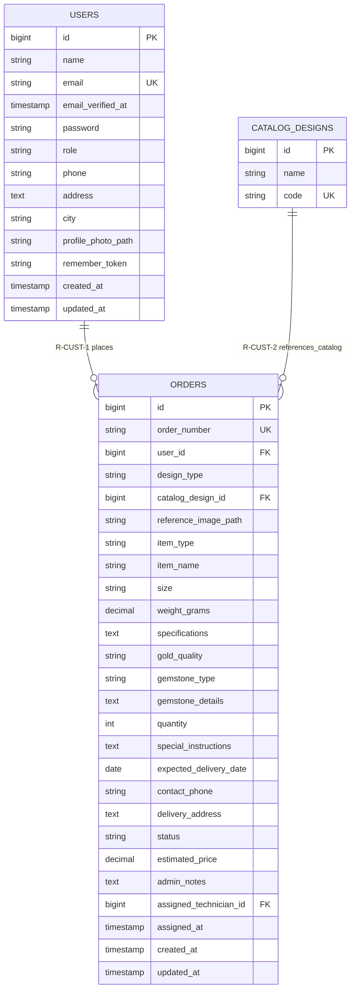

# Module 02 — Customer Management

**System:** Rajabharana Jewellery Management System  
**Module:** M2 — Customer Management  
**Status:** ✅ Implemented  
**Tables:** `users` (role = customer), `orders` (customer orders)

---

## 1. Module Overview

Customer management in Rajabharana does not use a separate `customers` table. A **conceptual Customer** entity is mapped to physical rows in `users` where `role = 'customer'`. Customer profile data (name, email, phone, address, city, profile photo) lives on the user record; order history and delivery preferences are captured on individual `orders` rows. Staff and admin users share the same `users` table but are excluded from the customer domain by role filtering.

---

## 2. Entities

### 2.1 Customer (Conceptual) ✅

| Property | Value |
|----------|-------|
| **Entity Name** | Customer *(conceptual — implemented as users subset)* |
| **Description** | Registered jewellery buyer who places and tracks custom/catalog orders |
| **Primary Key (PK)** | id *(via users.id)* |
| **Foreign Keys (FK)** | — |
| **Attributes** | id, name, email, email_verified_at, phone, address, city, profile_photo_path, created_at, updated_at |
| **Required** | name, email, password, phone, address, city |
| **Optional** | email_verified_at, profile_photo_path |
| **Unique** | email |
| **Derived** | order_count, total_spent *(computed from orders — not stored)* |
| **Multivalued** | orders *(one customer → many orders)* |

### 2.2 users ✅ *(physical implementation)*

| Property | Value |
|----------|-------|
| **Entity Name** | users |
| **Description** | Unified account table; customer rows filtered by `role = 'customer'` |
| **Primary Key (PK)** | id |
| **Foreign Keys (FK)** | — |
| **Attributes** | id, name, email, email_verified_at, password, role, phone, address, city, profile_photo_path, remember_token, created_at, updated_at |
| **Required** | name, email, password, role, phone, address, city |
| **Optional** | email_verified_at, profile_photo_path, remember_token |
| **Unique** | email |
| **Derived** | — |
| **Multivalued** | — |

### 2.3 orders ✅ *(customer-facing subset)*

| Property | Value |
|----------|-------|
| **Entity Name** | orders |
| **Description** | Jewellery order placed by a customer (catalog or custom design) |
| **Primary Key (PK)** | id |
| **Foreign Keys (FK)** | user_id → users.id, catalog_design_id → catalog_designs.id |
| **Attributes** | All 26 order attributes (see Section 3) |
| **Required** | order_number, user_id, design_type, item_type, gold_quality, quantity, expected_delivery_date, contact_phone, status |
| **Optional** | catalog_design_id, reference_image_path, item_name, size, weight_grams, specifications, gemstone_type, gemstone_details, special_instructions, delivery_address, estimated_price, admin_notes, assigned_technician_id, assigned_at |
| **Unique** | order_number |
| **Derived** | — |
| **Multivalued** | — |

---

## 3. Attributes Table

### 3.1 Customer profile (users where role = 'customer')

| Name | Data Type | PK | FK | Nullable | Unique | Default |
|------|-----------|:--:|:--:|:--------:|:------:|---------|
| id | BIGINT UNSIGNED | ✓ | | No | Yes | AUTO_INCREMENT |
| name | VARCHAR(255) | | | No | No | — |
| email | VARCHAR(255) | | | No | Yes | — |
| email_verified_at | TIMESTAMP | | | Yes | No | NULL |
| password | VARCHAR(255) | | | No | No | — |
| role | VARCHAR(255) | | | No | No | `'customer'` |
| phone | VARCHAR(25) | | | No | No | — |
| address | TEXT | | | No | No | — |
| city | VARCHAR(100) | | | No | No | — |
| profile_photo_path | VARCHAR(255) | | | Yes | No | NULL |
| remember_token | VARCHAR(100) | | | Yes | No | NULL |
| created_at | TIMESTAMP | | | Yes | No | NULL |
| updated_at | TIMESTAMP | | | Yes | No | NULL |

### 3.2 orders (customer relationship attributes highlighted)

| Name | Data Type | PK | FK | Nullable | Unique | Default |
|------|-----------|:--:|:--:|:--------:|:------:|---------|
| id | BIGINT UNSIGNED | ✓ | | No | Yes | AUTO_INCREMENT |
| order_number | VARCHAR(255) | | | No | Yes | — |
| user_id | BIGINT UNSIGNED | | → users.id | No | No | — |
| design_type | VARCHAR(255) | | | No | No | — |
| catalog_design_id | BIGINT UNSIGNED | | → catalog_designs.id | Yes | No | NULL |
| reference_image_path | VARCHAR(255) | | | Yes | No | NULL |
| item_type | VARCHAR(255) | | | No | No | — |
| item_name | VARCHAR(255) | | | Yes | No | NULL |
| size | VARCHAR(255) | | | Yes | No | NULL |
| weight_grams | DECIMAL(8,2) | | | Yes | No | NULL |
| specifications | TEXT | | | Yes | No | NULL |
| gold_quality | VARCHAR(255) | | | No | No | — |
| gemstone_type | VARCHAR(255) | | | Yes | No | NULL |
| gemstone_details | TEXT | | | Yes | No | NULL |
| quantity | SMALLINT UNSIGNED | | | No | No | 1 |
| special_instructions | TEXT | | | Yes | No | NULL |
| expected_delivery_date | DATE | | | No | No | — |
| contact_phone | VARCHAR(20) | | | No | No | — |
| delivery_address | TEXT | | | Yes | No | NULL |
| status | VARCHAR(255) | | | No | No | `'pending'` |
| estimated_price | DECIMAL(12,2) | | | Yes | No | NULL |
| admin_notes | TEXT | | | Yes | No | NULL |
| assigned_technician_id | BIGINT UNSIGNED | | → users.id | Yes | No | NULL |
| assigned_at | TIMESTAMP | | | Yes | No | NULL |
| created_at | TIMESTAMP | | | Yes | No | NULL |
| updated_at | TIMESTAMP | | | Yes | No | NULL |

---

## 4. Relationships

| Parent | Child | Name | Description | Business Rule |
|--------|-------|------|-------------|---------------|
| Customer (users) | orders | **R-CUST-1** places | A customer places one or many jewellery orders | `orders.user_id` must reference a user with `role = 'customer'` |
| catalog_designs | orders | **R-CUST-2** references_catalog | Catalog orders link to a catalogue design | Required when `design_type = 'catalog'`; optional for custom orders |
| Customer (users) | orders | **R-CUST-3** contact_override | Order may use a different delivery phone/address | `contact_phone` and `delivery_address` on order override profile defaults per order |

---

## 5. Cardinality (Crow's Foot)

| Relationship | Parent | Child | Crow's Foot | Meaning |
|--------------|--------|-------|-------------|---------|
| R-CUST-1 | users (customer) | orders | **1 ——< N** | One customer, one or many orders |
| R-CUST-2 | catalog_designs | orders | **1 ——o< N** | One design, zero or many referencing orders |
| R-CUST-3 | users | orders | *(embedded)* | Contact fields duplicated on order for delivery flexibility |

**Example (R-CUST-1):**

```
  users (role=customer)              orders
 ┌─────────────────────┐           ┌─────────────────┐
 │        id           │◄──────────│     user_id     │
 │       email         │  1    N   │  order_number   │
 │       phone         │           │     status      │
 └─────────────────────┘           └─────────────────┘
```

---

## 6. Participation (Total / Partial)

| Entity | Relationship | Participation | Explanation |
|--------|--------------|---------------|-------------|
| Customer (users) | R-CUST-1 → orders | **Partial** | New customers may register before placing their first order |
| orders | R-CUST-1 ← users | **Total** | Every order must belong to exactly one customer (`user_id` NOT NULL, CASCADE on delete) |
| catalog_designs | R-CUST-2 → orders | **Partial** | Designs may exist without any orders yet |
| orders | R-CUST-2 ← catalog_designs | **Partial** | Custom orders (`design_type = 'custom'`) have `catalog_design_id = NULL` |

---

## 7. Constraints

| Type | Table | Constraint | Detail |
|------|-------|------------|--------|
| **PK** | users | PRIMARY KEY (id) | Customer id |
| **PK** | orders | PRIMARY KEY (id) | Order id |
| **UK** | users | UNIQUE (email) | One account per email |
| **UK** | orders | UNIQUE (order_number) | Human-readable order reference |
| **FK** | orders | user_id → users.id | NOT NULL; ON DELETE CASCADE |
| **FK** | orders | catalog_design_id → catalog_designs.id | NULL allowed; ON DELETE SET NULL |
| **Composite** | — | — | None |
| **Cascade** | orders.user_id | CASCADE | Deleting a customer deletes all their orders |
| **Application** | users.role | Filter | Customer module queries restrict to `role = 'customer'` |
| **Application** | orders.design_type | Enum | Values: `catalog`, `custom` |
| **Application** | orders.status | Enum | pending → confirmed → in_production → quality_check → ready → delivered / cancelled |

---

## 8. Normalization (3NF Analysis)

| Aspect | Analysis |
|--------|----------|
| **Separate customers table?** | Not implemented. Customer is a role-specialized subset of `users`. Avoids duplicate email/password storage. |
| **1NF** | ✓ All order and profile attributes are atomic. |
| **2NF** | ✓ No partial dependencies; all non-key order attributes depend on `orders.id`. |
| **3NF** | ✓ No transitive dependencies. `contact_phone` on orders intentionally duplicates profile phone for per-order delivery (not a transitive dependency on user_id — it is an order-specific override). |
| **Improvement option** | A dedicated `customer_profiles` 1:1 extension table could isolate customer-only fields from staff accounts, but current design is 3NF-compliant via role discrimination. |

---

## 9. Mermaid erDiagram



---

## 10. Chen Notation (ASCII)

```
                    ┌──────────────────────────────────────────────────────────┐
                    │                    CUSTOMER MODULE                        │
                    │         (Customer = users WHERE role = 'customer')        │
                    └──────────────────────────────────────────────────────────┘

                              places
   ┌─────────────────┐    (1,N)     ┌─────────────────┐
   │    CUSTOMER     │─────────────│     ORDERS      │
   │  [users subset] │              │                 │
   │                 │              │ * id            │
   │ * id            │              │   order_number  │
   │   name          │              │   user_id (FK)  │
   │   email         │              │   design_type   │
   │   phone         │              │   status        │
   │   address       │              │   contact_phone │
   │   city          │              │   delivery_addr │
   │   role=customer │              │   ...           │
   └─────────────────┘              └────────┬────────┘
                                             │
                              references_catalog (0,N)
                                             │
                                             ▼
                                    ┌─────────────────┐
                                    │ CATALOG_DESIGNS │
                                    │ * id            │
                                    │   code          │
                                    └─────────────────┘

Derived attributes (not stored):
  Customer.order_count  = COUNT(orders WHERE user_id = customer.id)
  Customer.total_spent  = SUM(orders.estimated_price WHERE status = 'delivered')

Legend:
  * = Primary Key
  (1,N) = One customer to many orders
  (0,N) = Optional catalog design reference on order
```

---

*Rajabharana Jewellery System — Module ER Diagram M2 — Customer Management ✅ Implemented*
