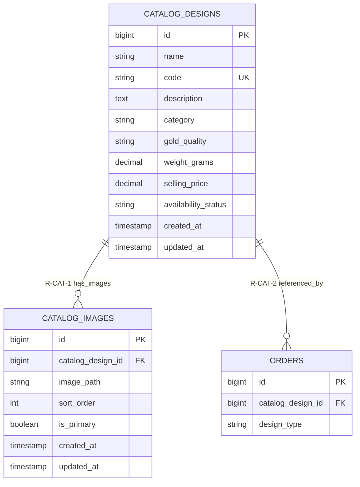

# Module 03 — Catalogue & Design Management

**System:** Rajabharana Jewellery Management System  
**Module:** M3 — Catalogue & Design Management  
**Status:** ✅ Implemented  
**Tables:** `catalog_designs`, `catalog_images`

---

## 1. Module Overview

The catalogue module stores reusable jewellery design templates that customers can order (`design_type = 'catalog'`) or staff can reference. Each design has a unique product code, pricing, gold quality, weight, availability status, and one or more gallery images stored in `catalog_images` (also referred to as design images). Inventory managers maintain catalogue records; images support sort order and a single primary flag for storefront display.

---

## 2. Entities

### 2.1 catalog_designs ✅

| Property | Value |
|----------|-------|
| **Entity Name** | catalog_designs |
| **Description** | Jewellery design template in the product catalogue |
| **Primary Key (PK)** | id |
| **Foreign Keys (FK)** | — *(category stored as string; proposed FK to categories in Module 06)* |
| **Attributes** | id, name, code, description, category, gold_quality, weight_grams, selling_price, availability_status, created_at, updated_at |
| **Required** | name, code, category, gold_quality, availability_status |
| **Optional** | description, weight_grams, selling_price, created_at, updated_at |
| **Unique** | code |
| **Derived** | is_available *(boolean from availability_status = 'available')* |
| **Multivalued** | images *(via catalog_images relationship)* |

### 2.2 catalog_images ✅ *(design_images)*

| Property | Value |
|----------|-------|
| **Entity Name** | catalog_images |
| **Description** | Gallery image file attached to a catalogue design |
| **Primary Key (PK)** | id |
| **Foreign Keys (FK)** | catalog_design_id → catalog_designs.id |
| **Attributes** | id, catalog_design_id, image_path, sort_order, is_primary, created_at, updated_at |
| **Required** | catalog_design_id, image_path |
| **Optional** | sort_order, is_primary, created_at, updated_at |
| **Unique** | — *(at most one is_primary per design — application rule)* |
| **Derived** | — |
| **Multivalued** | — |

---

## 3. Attributes Table

### 3.1 catalog_designs

| Name | Data Type | PK | FK | Nullable | Unique | Default |
|------|-----------|:--:|:--:|:--------:|:------:|---------|
| id | BIGINT UNSIGNED | ✓ | | No | Yes | AUTO_INCREMENT |
| name | VARCHAR(255) | | | No | No | — |
| code | VARCHAR(255) | | | No | Yes | — |
| description | TEXT | | | Yes | No | NULL |
| category | VARCHAR(255) | | | No | No | — |
| gold_quality | VARCHAR(255) | | | No | No | `'22k'` |
| weight_grams | DECIMAL(8,2) | | | Yes | No | NULL |
| selling_price | DECIMAL(12,2) | | | Yes | No | NULL |
| availability_status | VARCHAR(255) | | | No | No | `'available'` |
| created_at | TIMESTAMP | | | Yes | No | NULL |
| updated_at | TIMESTAMP | | | Yes | No | NULL |

### 3.2 catalog_images

| Name | Data Type | PK | FK | Nullable | Unique | Default |
|------|-----------|:--:|:--:|:--------:|:------:|---------|
| id | BIGINT UNSIGNED | ✓ | | No | Yes | AUTO_INCREMENT |
| catalog_design_id | BIGINT UNSIGNED | | → catalog_designs.id | No | No | — |
| image_path | VARCHAR(255) | | | No | No | — |
| sort_order | SMALLINT UNSIGNED | | | No | No | 0 |
| is_primary | BOOLEAN | | | No | No | false |
| created_at | TIMESTAMP | | | Yes | No | NULL |
| updated_at | TIMESTAMP | | | Yes | No | NULL |

---

## 4. Relationships

| Parent | Child | Name | Description | Business Rule |
|--------|-------|------|-------------|---------------|
| catalog_designs | catalog_images | **R-CAT-1** has_images | One design has zero or many gallery images | Images cascade-delete when parent design is deleted |
| catalog_designs | orders | **R-CAT-2** referenced_by | Catalogue design referenced by customer orders | Cross-module; `orders.catalog_design_id` set when `design_type = 'catalog'` |
| catalog_designs | catalog_images | **R-CAT-3** primary_image | Exactly one image may be flagged primary per design | Enforced in application layer (`is_primary = true`) |

---

## 5. Cardinality (Crow's Foot)

| Relationship | Parent | Child | Crow's Foot | Meaning |
|--------------|--------|-------|-------------|---------|
| R-CAT-1 | catalog_designs | catalog_images | **1 ——< N** | One design, zero or many images |
| R-CAT-2 | catalog_designs | orders | **1 ——o< N** | One design, zero or many orders |
| R-CAT-3 | catalog_designs | catalog_images | **1 ——\| 0..1** *(primary)* | One design, zero or one primary image |

**Example (R-CAT-1):**

```
  catalog_designs                    catalog_images
 ┌──────────────────┐              ┌─────────────────────┐
 │       id         │◄─────────────│  catalog_design_id  │
 │      code        │   1      N   │    image_path       │
 │      name        │              │    is_primary       │
 └──────────────────┘              └─────────────────────┘
```

---

## 6. Participation (Total / Partial)

| Entity | Relationship | Participation | Explanation |
|--------|--------------|---------------|-------------|
| catalog_designs | R-CAT-1 → catalog_images | **Partial** | A design may be created before images are uploaded |
| catalog_images | R-CAT-1 ← catalog_designs | **Total** | Every image must belong to a design (`catalog_design_id` NOT NULL) |
| catalog_designs | R-CAT-2 → orders | **Partial** | Designs may exist without any orders |
| orders | R-CAT-2 ← catalog_designs | **Partial** | Custom orders do not reference a catalogue design |

---

## 7. Constraints

| Type | Table | Constraint | Detail |
|------|-------|------------|--------|
| **PK** | catalog_designs | PRIMARY KEY (id) | Design surrogate key |
| **PK** | catalog_images | PRIMARY KEY (id) | Image surrogate key |
| **UK** | catalog_designs | UNIQUE (code) | Product code e.g. `RJ-NK-001` |
| **FK** | catalog_images | catalog_design_id → catalog_designs.id | NOT NULL; ON DELETE CASCADE |
| **Composite** | — | — | None in current schema |
| **Cascade** | catalog_images.catalog_design_id | CASCADE | Deleting design removes all images |
| **Application** | catalog_designs.availability_status | Enum | `available`, `out_of_stock` |
| **Application** | catalog_designs.gold_quality | Domain | Typical values: 18k, 22k, 24k |
| **Application** | catalog_images.is_primary | Business rule | At most one primary image per design |

---

## 8. Normalization (3NF Analysis)

| Issue | Current State | 3NF Assessment |
|-------|---------------|----------------|
| `category` as free-text string | Stored on `catalog_designs.category` | **Partial 3NF violation** — category name repeats across rows; normalized form uses separate `categories` table (proposed in Module 06) |
| Image multivalued attribute | Moved to `catalog_images` | ✓ Satisfies 1NF — no repeating image columns on design |
| `selling_price`, `weight_grams` | Depend only on design id | ✓ 2NF and 3NF compliant |
| Legacy columns removed | `image_path`, `is_active`, `default_gold_quality`, `starting_weight_grams` migrated | ✓ Upgrade migration achieved proper decomposition |

**Conclusion:** Catalogue images are fully normalized. Category normalization is deferred to the Inventory module proposal.

---

## 9. Mermaid erDiagram



---

## 10. Chen Notation (ASCII)

```
                    ┌──────────────────────────────────────────────────────────┐
                    │              CATALOGUE & DESIGN MODULE                    │
                    └──────────────────────────────────────────────────────────┘

                              has_images
   ┌──────────────────┐      (1,N)       ┌──────────────────┐
   │ CATALOG_DESIGNS  │─────────────────│  CATALOG_IMAGES  │
   │                  │                  │  (design_images) │
   │ * id             │                  │                  │
   │   name           │                  │ * id             │
   │   code           │                  │   catalog_des_id │
   │   description    │                  │   image_path     │
   │   category       │                  │   sort_order     │
   │   gold_quality   │                  │   is_primary     │
   │   weight_grams   │                  └──────────────────┘
   │   selling_price  │
   │   availability_  │
   │   status         │
   └────────┬─────────┘
            │
            │ referenced_by (0,N)
            ▼
   ┌──────────────────┐
   │     ORDERS       │
   │   catalog_des_id │
   │   design_type    │
   └──────────────────┘

Attribute domains:
  availability_status ∈ { available, out_of_stock }
  gold_quality        ∈ { 18k, 22k, 24k, ... }

Legend:
  * = Primary Key attribute
  (1,N) = One design, many images
```

---

*Rajabharana Jewellery System — Module ER Diagram M3 — Catalogue & Design ✅ Implemented*
