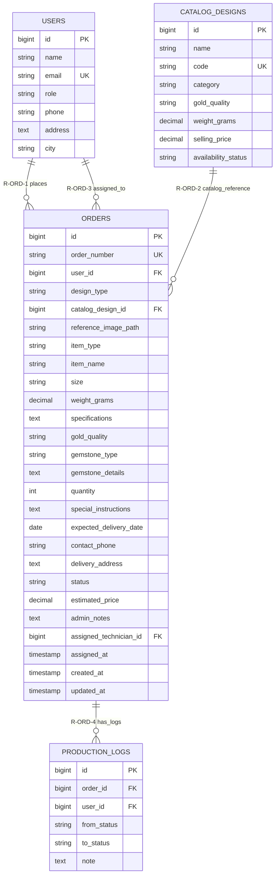

# Module 04 — Order Management

**System:** Rajabharana Jewellery Management System  
**Module:** M4 — Order Management  
**Status:** ✅ Implemented  
**Tables:** `orders`, `users`, `catalog_designs`

---

## 1. Module Overview

Order management is the central transactional module of Rajabharana. Customers submit jewellery orders (catalog or custom design) which staff confirm, price, and track through a defined status workflow. Each order links to the placing customer (`users`), optionally to a catalogue design (`catalog_designs`), and may later be assigned to a workshop technician. The `orders` table contains 26 attributes capturing item specifications, delivery details, pricing, admin notes, and production assignment metadata.

---

## 2. Entities

### 2.1 orders ✅

| Property | Value |
|----------|-------|
| **Entity Name** | orders |
| **Description** | Jewellery production order from customer request through delivery |
| **Primary Key (PK)** | id |
| **Foreign Keys (FK)** | user_id → users.id, catalog_design_id → catalog_designs.id, assigned_technician_id → users.id |
| **Attributes** | id, order_number, user_id, design_type, catalog_design_id, reference_image_path, item_type, item_name, size, weight_grams, specifications, gold_quality, gemstone_type, gemstone_details, quantity, special_instructions, expected_delivery_date, contact_phone, delivery_address, status, estimated_price, admin_notes, assigned_technician_id, assigned_at, created_at, updated_at |
| **Required** | order_number, user_id, design_type, item_type, gold_quality, quantity, expected_delivery_date, contact_phone, status |
| **Optional** | catalog_design_id, reference_image_path, item_name, size, weight_grams, specifications, gemstone_type, gemstone_details, special_instructions, delivery_address, estimated_price, admin_notes, assigned_technician_id, assigned_at |
| **Unique** | order_number |
| **Derived** | days_until_delivery *(from expected_delivery_date − today)* |
| **Multivalued** | production_logs *(via Module 05)* |

### 2.2 users ✅ *(order participants)*

| Property | Value |
|----------|-------|
| **Entity Name** | users |
| **Description** | Customer (order owner) or technician (assignee) |
| **Primary Key (PK)** | id |
| **Foreign Keys (FK)** | — |
| **Attributes** | id, name, email, role, phone, address, city, … |
| **Required** | name, email, password, role, phone, address, city |
| **Optional** | profile_photo_path, email_verified_at |
| **Unique** | email |
| **Derived** | — |
| **Multivalued** | orders_placed, orders_assigned |

### 2.3 catalog_designs ✅ *(optional order reference)*

| Property | Value |
|----------|-------|
| **Entity Name** | catalog_designs |
| **Description** | Catalogue template selected for catalog-type orders |
| **Primary Key (PK)** | id |
| **Foreign Keys (FK)** | — |
| **Attributes** | id, name, code, category, gold_quality, weight_grams, selling_price, availability_status, … |
| **Required** | name, code, category, gold_quality, availability_status |
| **Optional** | description, weight_grams, selling_price |
| **Unique** | code |
| **Derived** | — |
| **Multivalued** | — |

---

## 3. Attributes Table

### 3.1 orders (all 26 attributes)

| # | Name | Data Type | PK | FK | Nullable | Unique | Default |
|---|------|-----------|:--:|:--:|:--------:|:------:|---------|
| 1 | id | BIGINT UNSIGNED | ✓ | | No | Yes | AUTO_INCREMENT |
| 2 | order_number | VARCHAR(255) | | | No | Yes | — |
| 3 | user_id | BIGINT UNSIGNED | | → users.id | No | No | — |
| 4 | design_type | VARCHAR(255) | | | No | No | — |
| 5 | catalog_design_id | BIGINT UNSIGNED | | → catalog_designs.id | Yes | No | NULL |
| 6 | reference_image_path | VARCHAR(255) | | | Yes | No | NULL |
| 7 | item_type | VARCHAR(255) | | | No | No | — |
| 8 | item_name | VARCHAR(255) | | | Yes | No | NULL |
| 9 | size | VARCHAR(255) | | | Yes | No | NULL |
| 10 | weight_grams | DECIMAL(8,2) | | | Yes | No | NULL |
| 11 | specifications | TEXT | | | Yes | No | NULL |
| 12 | gold_quality | VARCHAR(255) | | | No | No | — |
| 13 | gemstone_type | VARCHAR(255) | | | Yes | No | NULL |
| 14 | gemstone_details | TEXT | | | Yes | No | NULL |
| 15 | quantity | SMALLINT UNSIGNED | | | No | No | 1 |
| 16 | special_instructions | TEXT | | | Yes | No | NULL |
| 17 | expected_delivery_date | DATE | | | No | No | — |
| 18 | contact_phone | VARCHAR(20) | | | No | No | — |
| 19 | delivery_address | TEXT | | | Yes | No | NULL |
| 20 | status | VARCHAR(255) | | | No | No | `'pending'` |
| 21 | estimated_price | DECIMAL(12,2) | | | Yes | No | NULL |
| 22 | admin_notes | TEXT | | | Yes | No | NULL |
| 23 | assigned_technician_id | BIGINT UNSIGNED | | → users.id | Yes | No | NULL |
| 24 | assigned_at | TIMESTAMP | | | Yes | No | NULL |
| 25 | created_at | TIMESTAMP | | | Yes | No | NULL |
| 26 | updated_at | TIMESTAMP | | | Yes | No | NULL |

### 3.2 Key foreign key columns (related entities)

| Entity | Column | Data Type | FK Target |
|--------|--------|-----------|-----------|
| users | id | BIGINT UNSIGNED | PK |
| users | role | VARCHAR(255) | customer / admin / manager / staff / technician |
| catalog_designs | id | BIGINT UNSIGNED | PK |
| catalog_designs | code | VARCHAR(255) | UK |

---

## 4. Relationships

| Parent | Child | Name | Description | Business Rule |
|--------|-------|------|-------------|---------------|
| users | orders | **R-ORD-1** places | Customer places order | `user_id` references customer; CASCADE delete |
| catalog_designs | orders | **R-ORD-2** catalog_reference | Catalog order links to design | Required logically when `design_type = 'catalog'` |
| users | orders | **R-ORD-3** assigned_to | Technician assigned to order | `assigned_technician_id` set only in assignable statuses |
| orders | production_logs | **R-ORD-4** has_logs | Order status history | Cross-module; each status change may create a log |

---

## 5. Cardinality (Crow's Foot)

| Relationship | Parent | Child | Crow's Foot | Meaning |
|--------------|--------|-------|-------------|---------|
| R-ORD-1 | users (customer) | orders | **1 ——< N** | One customer, many orders |
| R-ORD-2 | catalog_designs | orders | **1 ——o< N** | One design, zero or many orders |
| R-ORD-3 | users (technician) | orders | **1 ——o< N** | One technician, zero or many assignments |
| R-ORD-4 | orders | production_logs | **1 ——< N** | One order, zero or many log entries |

**Status workflow (business):**

```
pending → confirmed → in_production → quality_check → ready → delivered
                                                              ↘ cancelled (from early stages)
```

**Example (R-ORD-1, R-ORD-2, R-ORD-3):**

```
  users                    orders                    catalog_designs
(customer)              ┌─────────────┐
    │                   │  user_id    │
    │ 1              N  │  catalog_   │  N        1
    └──────────────────►│  design_id  │◄──────────┘
                        │  assigned_  │
  users (technician)    │  technician │
    │ 1              N  └─────────────┘
    └──────────────────►
```

---

## 6. Participation (Total / Partial)

| Entity | Relationship | Participation | Explanation |
|--------|--------------|---------------|-------------|
| users (customer) | R-ORD-1 → orders | **Partial** | Customer may exist without orders |
| orders | R-ORD-1 ← users | **Total** | Every order requires a customer |
| catalog_designs | R-ORD-2 → orders | **Partial** | Not every design has orders |
| orders | R-ORD-2 ← catalog_designs | **Partial** | Custom orders omit catalogue FK |
| users (technician) | R-ORD-3 → orders | **Partial** | Technician may have no assignments |
| orders | R-ORD-3 ← technician | **Partial** | Assignment optional until production phase |

---

## 7. Constraints

| Type | Table | Constraint | Detail |
|------|-------|------------|--------|
| **PK** | orders | PRIMARY KEY (id) | Surrogate key |
| **UK** | orders | UNIQUE (order_number) | System-generated order reference |
| **FK** | orders | user_id → users.id | NOT NULL; ON DELETE CASCADE |
| **FK** | orders | catalog_design_id → catalog_designs.id | NULL; ON DELETE SET NULL |
| **FK** | orders | assigned_technician_id → users.id | NULL; ON DELETE SET NULL |
| **Composite** | — | — | None |
| **Cascade** | orders.user_id | CASCADE | Customer deletion removes orders |
| **Cascade** | orders.catalog_design_id | SET NULL | Design deletion preserves order, clears reference |
| **Application** | orders.design_type | Enum | `catalog`, `custom` |
| **Application** | orders.status | Enum | 7 status values (see workflow) |
| **Application** | orders.quantity | CHECK | Default 1; must be ≥ 1 |
| **Application** | assigned_at | Paired constraint | Set when `assigned_technician_id` is assigned |

---

## 8. Normalization (3NF Analysis)

| Check | Result |
|-------|--------|
| **1NF** | ✓ All 26 attributes are atomic; no repeating groups |
| **2NF** | ✓ All non-key attributes fully depend on `orders.id` |
| **3NF** | ✓ No transitive dependencies (e.g. customer name is not stored on order — only `user_id` FK) |
| **Denormalization note** | `contact_phone` and `delivery_address` duplicate customer profile data intentionally for per-order delivery overrides — not a 3NF violation |
| **Item specification** | Custom and catalog specs stored on same order row; alternative design splits `order_items` table — not required at current scale |

---

## 9. Mermaid erDiagram



---

## 10. Chen Notation (ASCII)

```
                    ┌──────────────────────────────────────────────────────────┐
                    │                   ORDER MANAGEMENT MODULE                 │
                    └──────────────────────────────────────────────────────────┘

   USERS                    ORDERS                      CATALOG_DESIGNS
 (customer)                                         
 ┌──────────┐   places    ┌──────────────────────────────────────────────┐   catalog_ref   ┌──────────────┐
 │ * id     │───(1,N)────►│ * id                                         │◄────(0,N)───────│ * id         │
 │   email  │             │   order_number (UK)                          │                 │   code (UK)  │
 │   role   │             │   user_id (FK)                               │                 │   name       │
 └──────────┘             │   design_type                                │                 └──────────────┘
                          │   catalog_design_id (FK)                     │
   USERS                  │   item_type, gold_quality, quantity          │
 (technician)             │   status, estimated_price                    │
 ┌──────────┐             │   assigned_technician_id (FK)                │
 │ * id     │─assigned───►│   assigned_at                                │
 │ role=tech│   (0,N)     │   expected_delivery_date, contact_phone      │
 └──────────┘             │   ... (26 attributes total)                  │
                          └────────────────────┬─────────────────────────┘
                                               │
                                               │ has_logs (1,N)
                                               ▼
                                    ┌─────────────────────┐
                                    │  PRODUCTION_LOGS    │
                                    │  from_status        │
                                    │  to_status          │
                                    └─────────────────────┘

Order status domain:
  { pending, confirmed, in_production, quality_check, ready, delivered, cancelled }

Design type domain:
  { catalog, custom }
```

---

*Rajabharana Jewellery System — Module ER Diagram M4 — Order Management ✅ Implemented*
