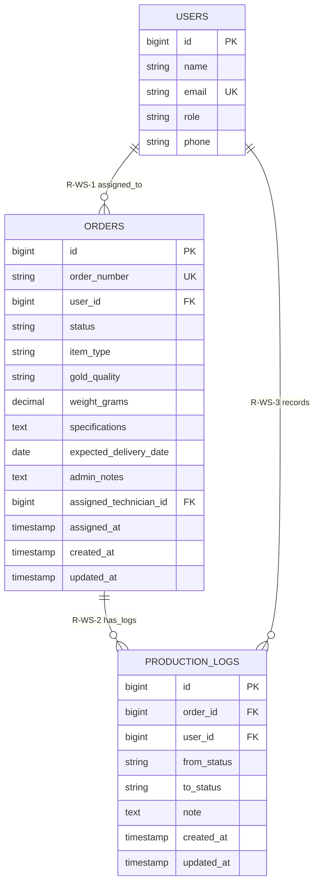

# Module 05 — Workshop & Technician Management

**System:** Rajabharana Jewellery Management System  
**Module:** M5 — Workshop & Technician Management  
**Status:** ✅ Implemented  
**Tables:** `orders` (workshop tasks), `production_logs`, `users` (technician role)

---

## 1. Module Overview

The workshop module treats confirmed production orders as **workshop tasks**. Administrators assign tasks to technicians (`users.role = 'technician'`) via `assigned_technician_id` and `assigned_at`. Technicians advance orders through production statuses; every transition is audited in `production_logs` with the acting user, previous status, new status, and optional note. This module bridges order management and physical jewellery production on the shop floor.

---

## 2. Entities

### 2.1 Workshop Task (Conceptual) ✅

| Property | Value |
|----------|-------|
| **Entity Name** | Workshop Task *(conceptual — implemented as orders subset)* |
| **Description** | Order in an active production workflow assigned to a technician |
| **Primary Key (PK)** | id *(via orders.id)* |
| **Foreign Keys (FK)** | assigned_technician_id → users.id |
| **Attributes** | id, order_number, status, assigned_technician_id, assigned_at, item_type, gold_quality, weight_grams, expected_delivery_date, admin_notes, … |
| **Required** | order_number, user_id, status |
| **Optional** | assigned_technician_id, assigned_at |
| **Unique** | order_number |
| **Derived** | production_duration *(from first in_production log to ready)* |
| **Multivalued** | production_logs |

### 2.2 production_logs ✅

| Property | Value |
|----------|-------|
| **Entity Name** | production_logs |
| **Description** | Audit trail entry for order status change in workshop |
| **Primary Key (PK)** | id |
| **Foreign Keys (FK)** | order_id → orders.id, user_id → users.id |
| **Attributes** | id, order_id, user_id, from_status, to_status, note, created_at, updated_at |
| **Required** | order_id, user_id |
| **Optional** | from_status, to_status, note, created_at, updated_at |
| **Unique** | — |
| **Derived** | — |
| **Multivalued** | — |

### 2.3 users (Technician) ✅

| Property | Value |
|----------|-------|
| **Entity Name** | users *(technician subset)* |
| **Description** | Workshop staff who receive assigned orders and log progress |
| **Primary Key (PK)** | id |
| **Foreign Keys (FK)** | — |
| **Attributes** | id, name, email, role, phone, … |
| **Required** | name, email, password, role, phone, address, city |
| **Optional** | profile_photo_path |
| **Unique** | email |
| **Derived** | active_task_count *(COUNT assigned orders in production)* |
| **Multivalued** | assigned_orders, production_logs |

### 2.4 orders ✅ *(workshop-relevant columns)*

| Property | Value |
|----------|-------|
| **Entity Name** | orders |
| **Description** | Full order row; workshop uses status, assignment, and specification fields |
| **Primary Key (PK)** | id |
| **Foreign Keys (FK)** | user_id, catalog_design_id, assigned_technician_id |
| **Attributes** | All 26 attributes |
| **Required** | order_number, user_id, status, … |
| **Optional** | assigned_technician_id, assigned_at |
| **Unique** | order_number |
| **Derived** | — |
| **Multivalued** | production_logs |

---

## 3. Attributes Table

### 3.1 orders (workshop-relevant attributes)

| Name | Data Type | PK | FK | Nullable | Unique | Default |
|------|-----------|:--:|:--:|:--------:|:------:|---------|
| id | BIGINT UNSIGNED | ✓ | | No | Yes | AUTO_INCREMENT |
| order_number | VARCHAR(255) | | | No | Yes | — |
| user_id | BIGINT UNSIGNED | | → users.id | No | No | — |
| status | VARCHAR(255) | | | No | No | `'pending'` |
| item_type | VARCHAR(255) | | | No | No | — |
| gold_quality | VARCHAR(255) | | | No | No | — |
| weight_grams | DECIMAL(8,2) | | | Yes | No | NULL |
| specifications | TEXT | | | Yes | No | NULL |
| expected_delivery_date | DATE | | | No | No | — |
| admin_notes | TEXT | | | Yes | No | NULL |
| assigned_technician_id | BIGINT UNSIGNED | | → users.id | Yes | No | NULL |
| assigned_at | TIMESTAMP | | | Yes | No | NULL |
| created_at | TIMESTAMP | | | Yes | No | NULL |
| updated_at | TIMESTAMP | | | Yes | No | NULL |

### 3.2 production_logs

| Name | Data Type | PK | FK | Nullable | Unique | Default |
|------|-----------|:--:|:--:|:--------:|:------:|---------|
| id | BIGINT UNSIGNED | ✓ | | No | Yes | AUTO_INCREMENT |
| order_id | BIGINT UNSIGNED | | → orders.id | No | No | — |
| user_id | BIGINT UNSIGNED | | → users.id | No | No | — |
| from_status | VARCHAR(255) | | | Yes | No | NULL |
| to_status | VARCHAR(255) | | | Yes | No | NULL |
| note | TEXT | | | Yes | No | NULL |
| created_at | TIMESTAMP | | | Yes | No | NULL |
| updated_at | TIMESTAMP | | | Yes | No | NULL |

### 3.3 users (technician subset)

| Name | Data Type | PK | FK | Nullable | Unique | Default |
|------|-----------|:--:|:--:|:--------:|:------:|---------|
| id | BIGINT UNSIGNED | ✓ | | No | Yes | AUTO_INCREMENT |
| name | VARCHAR(255) | | | No | No | — |
| email | VARCHAR(255) | | | No | Yes | — |
| role | VARCHAR(255) | | | No | No | `'technician'` |
| phone | VARCHAR(25) | | | No | No | — |

---

## 4. Relationships

| Parent | Child | Name | Description | Business Rule |
|--------|-------|------|-------------|---------------|
| users (technician) | orders | **R-WS-1** assigned_to | Technician receives workshop tasks | Only users with `role = 'technician'`; assignable in confirmed/in_production statuses |
| orders | production_logs | **R-WS-2** has_logs | Order accumulates production history | Log created on each status transition |
| users | production_logs | **R-WS-3** records | Staff/technician records the change | `user_id` is the actor (technician or admin) |
| orders | orders | **R-WS-4** status_workflow | Status field drives workshop pipeline | Valid transitions enforced in `Order` model |

---

## 5. Cardinality (Crow's Foot)

| Relationship | Parent | Child | Crow's Foot | Meaning |
|--------------|--------|-------|-------------|---------|
| R-WS-1 | users (technician) | orders | **1 ——o< N** | One technician, zero or many assigned tasks |
| R-WS-2 | orders | production_logs | **1 ——< N** | One order, zero or many log entries |
| R-WS-3 | users | production_logs | **1 ——< N** | One user, zero or many log entries |

**Workshop status pipeline:**

```
confirmed ──► in_production ──► quality_check ──► ready ──► delivered
     │              │                  │
     └──────────────┴──────────────────┘
              (technician assignable range)
```

**Example (R-WS-1, R-WS-2, R-WS-3):**

```
  users (technician)          orders                 production_logs
 ┌─────────────────┐       ┌─────────────┐         ┌──────────────┐
 │      id         │◄──────│ assigned_   │         │  order_id    │
 │   role=tech     │ 1  N  │ technician  │◄────────│  user_id     │
 └────────┬────────┘       │    id       │  1   N  │ from_status  │
          │                │   status    │         │  to_status   │
          │                └─────────────┘         └──────────────┘
          └──────────────────────────────────────────► user_id
```

---

## 6. Participation (Total / Partial)

| Entity | Relationship | Participation | Explanation |
|--------|--------------|---------------|-------------|
| users (technician) | R-WS-1 → orders | **Partial** | Technician may have no current assignments |
| orders | R-WS-1 ← technician | **Partial** | Orders in `pending` have no assignee |
| orders | R-WS-2 → production_logs | **Partial** | Brand-new orders may have no logs yet |
| production_logs | R-WS-2 ← orders | **Total** | Every log belongs to exactly one order |
| users | R-WS-3 → production_logs | **Partial** | User may never record a log |
| production_logs | R-WS-3 ← users | **Total** | Every log requires an actor (`user_id` NOT NULL) |

---

## 7. Constraints

| Type | Table | Constraint | Detail |
|------|-------|------------|--------|
| **PK** | orders | PRIMARY KEY (id) | Workshop task id |
| **PK** | production_logs | PRIMARY KEY (id) | Log entry id |
| **FK** | orders | assigned_technician_id → users.id | NULL; ON DELETE SET NULL |
| **FK** | production_logs | order_id → orders.id | NOT NULL; ON DELETE CASCADE |
| **FK** | production_logs | user_id → users.id | NOT NULL; ON DELETE CASCADE |
| **UK** | orders | UNIQUE (order_number) | Task reference number |
| **Composite** | — | — | None |
| **Cascade** | production_logs.order_id | CASCADE | Deleting order removes all logs |
| **Cascade** | production_logs.user_id | CASCADE | Deleting user removes their logs |
| **Application** | assigned_technician_id | Role check | Must reference `role = 'technician'` |
| **Application** | assigned_at | Paired field | Populated when technician assigned |
| **Application** | status transitions | State machine | Invalid transitions rejected in application |

---

## 8. Normalization (3NF Analysis)

| Check | Result |
|-------|--------|
| **1NF** | ✓ Log attributes atomic; status history not stored as repeating columns on orders |
| **2NF** | ✓ All log attributes depend on `production_logs.id` |
| **3NF** | ✓ `from_status` and `to_status` depend on log id, not on each other transitively |
| **Design pattern** | Status history normalized into `production_logs` rather than denormalized JSON on orders |
| **Workshop task** | Reusing `orders` avoids duplicate task table — 3NF compliant; task is an order in production states |

---

## 9. Mermaid erDiagram



---

## 10. Chen Notation (ASCII)

```
                    ┌──────────────────────────────────────────────────────────┐
                    │            WORKSHOP & TECHNICIAN MODULE                     │
                    │      Workshop Task = orders in production workflow        │
                    └──────────────────────────────────────────────────────────┘

   USERS                         ORDERS                    PRODUCTION_LOGS
 (technician)                 (workshop task)
 ┌─────────────┐   assigned   ┌─────────────────┐   has_logs   ┌─────────────────┐
 │ * id        │───(0,N)─────►│ * id            │───(1,N)─────►│ * id            │
 │   name      │              │   order_number  │              │   order_id (FK) │
 │   role=     │              │   status        │              │   user_id (FK)  │
 │   technician│              │   assigned_     │              │   from_status   │
 └──────┬──────┘              │   technician_id │              │   to_status     │
        │                     │   assigned_at   │              │   note          │
        │                     │   gold_quality  │              └─────────────────┘
        │                     │   weight_grams  │                       ▲
        │                     └─────────────────┘                       │
        │                              records (1,N) ────────────────────┘
        └──────────────────────────────────────────────────────────────────►

Workshop assignable statuses:
  confirmed, in_production, quality_check

Production log business rules:
  • Every status change SHOULD create a production_log row
  • from_status captures previous order.status before update
  • to_status captures new order.status after update
  • user_id identifies technician or admin who performed the action

Legend:
  * = Primary Key
  (0,N) = Optional many
  (1,N) = Mandatory many on child side (FK NOT NULL)
```

---

*Rajabharana Jewellery System — Module ER Diagram M5 — Workshop & Technician ✅ Implemented*
