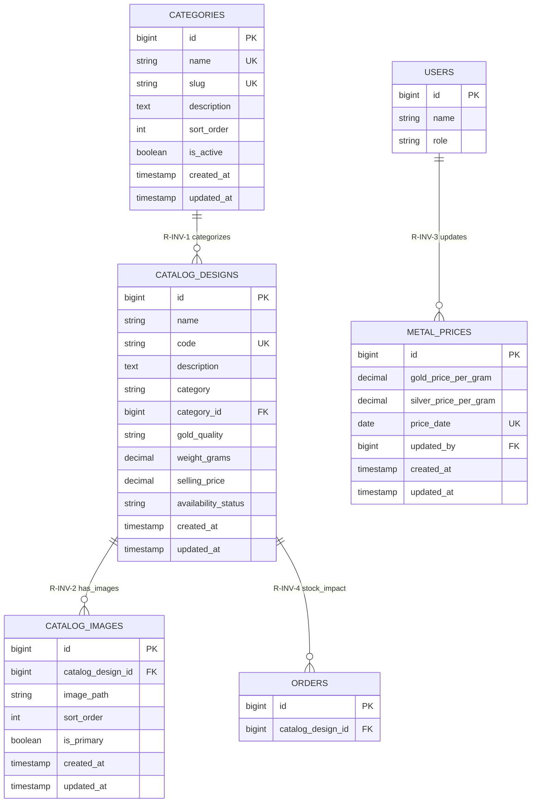

# Module 06 — Inventory & Category Management

**System:** Rajabharana Jewellery Management System  
**Module:** M6 — Inventory & Category Management  
**Status:** ✅ Implemented *(catalogue inventory)* · 🔜 Proposed `categories` table for full 3NF

**Tables:** `catalog_designs`, `catalog_images`, `metal_prices` *(pricing reference)*, **`categories`** *(proposed)*

---

## 1. Module Overview

Inventory management tracks catalogue product availability, categorization, and metal pricing inputs used for cost estimation. Implemented inventory fields live on `catalog_designs` (`availability_status`, `selling_price`, `weight_grams`) with supporting images in `catalog_images`. Daily gold and silver rates are stored in `metal_prices`. To eliminate category-name repetition and achieve full **3NF**, this module proposes a normalized **`categories`** lookup table replacing the free-text `catalog_designs.category` column.

---

## 2. Entities

### 2.1 catalog_designs ✅ *(inventory record)*

| Property | Value |
|----------|-------|
| **Entity Name** | catalog_designs |
| **Description** | Catalogue product with stock availability and pricing |
| **Primary Key (PK)** | id |
| **Foreign Keys (FK)** | category_id → categories.id *(proposed; currently category VARCHAR)* |
| **Attributes** | id, name, code, description, category, gold_quality, weight_grams, selling_price, availability_status, created_at, updated_at |
| **Required** | name, code, category, gold_quality, availability_status |
| **Optional** | description, weight_grams, selling_price |
| **Unique** | code |
| **Derived** | is_in_stock *(availability_status = 'available')* |
| **Multivalued** | catalog_images |

### 2.2 catalog_images ✅

| Property | Value |
|----------|-------|
| **Entity Name** | catalog_images |
| **Description** | Product image for inventory display |
| **Primary Key (PK)** | id |
| **Foreign Keys (FK)** | catalog_design_id → catalog_designs.id |
| **Attributes** | id, catalog_design_id, image_path, sort_order, is_primary, created_at, updated_at |
| **Required** | catalog_design_id, image_path |
| **Optional** | sort_order, is_primary |
| **Unique** | — |
| **Derived** | — |
| **Multivalued** | — |

### 2.3 categories 🔜 *(proposed for 3NF)*

| Property | Value |
|----------|-------|
| **Entity Name** | categories |
| **Description** | Normalized jewellery product category lookup |
| **Primary Key (PK)** | id |
| **Foreign Keys (FK)** | — |
| **Attributes** | id, name, slug, description, sort_order, is_active, created_at, updated_at |
| **Required** | name, slug, is_active |
| **Optional** | description, sort_order |
| **Unique** | name, slug |
| **Derived** | product_count *(COUNT catalog_designs in category)* |
| **Multivalued** | catalog_designs |

### 2.4 metal_prices ✅

| Property | Value |
|----------|-------|
| **Entity Name** | metal_prices |
| **Description** | Daily gold and silver rate snapshot for pricing calculations |
| **Primary Key (PK)** | id |
| **Foreign Keys (FK)** | updated_by → users.id |
| **Attributes** | id, gold_price_per_gram, silver_price_per_gram, price_date, updated_by, created_at, updated_at |
| **Required** | gold_price_per_gram, silver_price_per_gram, price_date |
| **Optional** | updated_by |
| **Unique** | price_date *(recommended UK — one rate row per day)* |
| **Derived** | — |
| **Multivalued** | — |

---

## 3. Attributes Table

### 3.1 catalog_designs (inventory fields)

| Name | Data Type | PK | FK | Nullable | Unique | Default |
|------|-----------|:--:|:--:|:--------:|:------:|---------|
| id | BIGINT UNSIGNED | ✓ | | No | Yes | AUTO_INCREMENT |
| name | VARCHAR(255) | | | No | No | — |
| code | VARCHAR(255) | | | No | Yes | — |
| description | TEXT | | | Yes | No | NULL |
| category | VARCHAR(255) | | | No | No | — |
| category_id | BIGINT UNSIGNED | | → categories.id | Yes* | No | NULL |
| gold_quality | VARCHAR(255) | | | No | No | `'22k'` |
| weight_grams | DECIMAL(8,2) | | | Yes | No | NULL |
| selling_price | DECIMAL(12,2) | | | Yes | No | NULL |
| availability_status | VARCHAR(255) | | | No | No | `'available'` |
| created_at | TIMESTAMP | | | Yes | No | NULL |
| updated_at | TIMESTAMP | | | Yes | No | NULL |

\* `category_id` is **proposed**; not yet in implemented schema. Current implementation uses `category` string.

### 3.2 catalog_images

| Name | Data Type | PK | FK | Nullable | Unique | Default |
|------|-----------|:--:|:--:|:--------:|:------:|---------|
| id | BIGINT UNSIGNED | ✓ | | No | Yes | AUTO_INCREMENT |
| catalog_design_id | BIGINT UNSIGNED | | → catalog_designs.id | No | No | — |
| image_path | VARCHAR(255) | | | No | No | — |
| sort_order | SMALLINT UNSIGNED | | | No | No | 0 |
| is_primary | BOOLEAN | | | No | No | false |
| created_at | TIMESTAMP | | | Yes | No | NULL |
| updated_at | TIMESTAMP | | | Yes | No | NULL |

### 3.3 categories *(proposed)*

| Name | Data Type | PK | FK | Nullable | Unique | Default |
|------|-----------|:--:|:--:|:--------:|:------:|---------|
| id | BIGINT UNSIGNED | ✓ | | No | Yes | AUTO_INCREMENT |
| name | VARCHAR(255) | | | No | Yes | — |
| slug | VARCHAR(255) | | | No | Yes | — |
| description | TEXT | | | Yes | No | NULL |
| sort_order | SMALLINT UNSIGNED | | | No | No | 0 |
| is_active | BOOLEAN | | | No | No | true |
| created_at | TIMESTAMP | | | Yes | No | NULL |
| updated_at | TIMESTAMP | | | Yes | No | NULL |

### 3.4 metal_prices

| Name | Data Type | PK | FK | Nullable | Unique | Default |
|------|-----------|:--:|:--:|:--------:|:------:|---------|
| id | BIGINT UNSIGNED | ✓ | | No | Yes | AUTO_INCREMENT |
| gold_price_per_gram | DECIMAL(12,2) | | | No | No | — |
| silver_price_per_gram | DECIMAL(12,2) | | | No | No | — |
| price_date | DATE | | | No | Yes* | — |
| updated_by | BIGINT UNSIGNED | | → users.id | Yes | No | NULL |
| created_at | TIMESTAMP | | | Yes | No | NULL |
| updated_at | TIMESTAMP | | | Yes | No | NULL |

\* Recommended unique constraint; not enforced in current migration.

---

## 4. Relationships

| Parent | Child | Name | Description | Business Rule |
|--------|-------|------|-------------|---------------|
| categories | catalog_designs | **R-INV-1** categorizes | Category groups catalogue products | Proposed; replaces string `category` column |
| catalog_designs | catalog_images | **R-INV-2** has_images | Product gallery for inventory listing | CASCADE delete on design removal |
| users | metal_prices | **R-INV-3** updates | Admin records daily metal rates | `updated_by` nullable if user deleted |
| catalog_designs | orders | **R-INV-4** stock_impact | Orders reference available designs | Orders should not reference `out_of_stock` designs (application rule) |

---

## 5. Cardinality (Crow's Foot)

| Relationship | Parent | Child | Crow's Foot | Meaning |
|--------------|--------|-------|-------------|---------|
| R-INV-1 | categories | catalog_designs | **1 ——< N** | One category, many products |
| R-INV-2 | catalog_designs | catalog_images | **1 ——< N** | One product, zero or many images |
| R-INV-3 | users | metal_prices | **1 ——o< N** | One admin, zero or many price records |
| R-INV-4 | catalog_designs | orders | **1 ——o< N** | One product, zero or many orders |

**Availability status domain:**

```
available     → product can be ordered from catalogue
out_of_stock  → product hidden or blocked from new orders
```

**Example (R-INV-1 proposed):**

```
  categories                    catalog_designs
 ┌─────────────┐              ┌─────────────────────┐
 │     id      │◄─────────────│   category_id (FK)  │
 │    name     │  1       N   │   availability_stat │
 │    slug     │              │   selling_price     │
 └─────────────┘              └─────────────────────┘
```

---

## 6. Participation (Total / Partial)

| Entity | Relationship | Participation | Explanation |
|--------|--------------|---------------|-------------|
| categories | R-INV-1 → catalog_designs | **Partial** | Category may exist with no products yet |
| catalog_designs | R-INV-1 ← categories | **Total** *(proposed)* | Every product must belong to one category |
| catalog_designs | R-INV-2 → catalog_images | **Partial** | Product may lack images temporarily |
| catalog_images | R-INV-2 ← catalog_designs | **Total** | Every image belongs to one design |
| users | R-INV-3 → metal_prices | **Partial** | Admin may not have updated prices |
| metal_prices | R-INV-3 ← users | **Partial** | `updated_by` may be NULL |

---

## 7. Constraints

| Type | Table | Constraint | Detail |
|------|-------|------------|--------|
| **PK** | catalog_designs | PRIMARY KEY (id) | Product id |
| **PK** | catalog_images | PRIMARY KEY (id) | Image id |
| **PK** | categories | PRIMARY KEY (id) | *(proposed)* |
| **PK** | metal_prices | PRIMARY KEY (id) | Rate record id |
| **UK** | catalog_designs | UNIQUE (code) | SKU-style product code |
| **UK** | categories | UNIQUE (name), UNIQUE (slug) | *(proposed)* |
| **UK** | metal_prices | UNIQUE (price_date) | *(recommended)* |
| **FK** | catalog_images | catalog_design_id → catalog_designs.id | CASCADE |
| **FK** | catalog_designs | category_id → categories.id | *(proposed)* SET NULL or RESTRICT |
| **FK** | metal_prices | updated_by → users.id | NULL; ON DELETE SET NULL |
| **Composite** | — | — | None |
| **Cascade** | catalog_images | CASCADE on design delete | Images removed with product |
| **Application** | availability_status | Enum | `available`, `out_of_stock` |
| **Application** | is_primary | One per design | Single primary storefront image |

### Proposed migration sketch (categories)

```sql
CREATE TABLE categories (
    id BIGINT UNSIGNED AUTO_INCREMENT PRIMARY KEY,
    name VARCHAR(255) NOT NULL UNIQUE,
    slug VARCHAR(255) NOT NULL UNIQUE,
    description TEXT NULL,
    sort_order SMALLINT UNSIGNED NOT NULL DEFAULT 0,
    is_active BOOLEAN NOT NULL DEFAULT TRUE,
    created_at TIMESTAMP NULL,
    updated_at TIMESTAMP NULL
);

ALTER TABLE catalog_designs
    ADD COLUMN category_id BIGINT UNSIGNED NULL AFTER category,
    ADD CONSTRAINT catalog_designs_category_id_foreign
        FOREIGN KEY (category_id) REFERENCES categories(id) ON DELETE SET NULL;
-- Migrate distinct category strings → categories rows, then drop category column
```

---

## 8. Normalization (3NF Analysis)

| Table | 1NF | 2NF | 3NF | Analysis |
|-------|:---:|:---:|:---:|----------|
| catalog_designs | ✓ | ✓ | ⚠ | **Current:** `category` string repeats category metadata across rows → transitive dependency risk. **Proposed:** FK to `categories` achieves 3NF |
| catalog_images | ✓ | ✓ | ✓ | Fully normalized decomposition of multivalued images |
| categories | ✓ | ✓ | ✓ | Category attributes depend only on `categories.id` |
| metal_prices | ✓ | ✓ | ✓ | Rate attributes depend only on `id`; no transitive deps |

**Before (2NF/3NF gap):**

```
catalog_designs.category = 'Necklace'  -- repeated on every necklace row
catalog_designs.category = 'Ring'      -- no shared category metadata
```

**After (3NF):**

```
categories: { id=1, name='Necklace', slug='necklace' }
catalog_designs: { ..., category_id=1, availability_status='available' }
```

**Inventory status:** `availability_status` is a single-valued attribute of each product — 3NF compliant. Replacing legacy `is_active` boolean with enum status improved domain clarity without normalization loss.

---

## 9. Mermaid erDiagram



---

## 10. Chen Notation (ASCII)

```
                    ┌──────────────────────────────────────────────────────────┐
                    │           INVENTORY & CATEGORY MODULE                     │
                    │   ✅ catalog_designs + catalog_images + metal_prices      │
                    │   🔜 categories (proposed 3NF normalization)              │
                    └──────────────────────────────────────────────────────────┘

   CATEGORIES              CATALOG_DESIGNS              CATALOG_IMAGES
  (proposed)              (inventory record)
 ┌─────────────┐  categorizes  ┌─────────────────────┐  has_images  ┌──────────────┐
 │ * id        │────(1,N)─────►│ * id                │───(1,N)─────►│ * id         │
 │   name (UK) │               │   code (UK)         │              │   image_path │
 │   slug (UK) │               │   category (legacy) │              │   is_primary │
 │   is_active │               │   category_id (FK)  │              └──────────────┘
 └─────────────┘               │   selling_price     │
                               │   weight_grams      │
                               │   availability_stat │──────► { available, out_of_stock }
                               │   gold_quality      │
                               └──────────┬──────────┘
                                          │
                                          │ stock_impact (0,N)
                                          ▼
                               ┌─────────────────────┐
                               │       ORDERS        │
                               └─────────────────────┘

   USERS (admin)              METAL_PRICES
 ┌─────────────┐   updates    ┌─────────────────────────┐
 │ * id        │───(0,N)─────►│ * id                    │
 │   role=admin│               │   gold_price_per_gram   │
 └─────────────┘               │   silver_price_per_gram │
                               │   price_date            │
                               │   updated_by (FK)       │
                               └─────────────────────────┘

Inventory business rules:
  • availability_status = 'out_of_stock' blocks new catalogue orders
  • selling_price may be NULL until manager sets retail price
  • metal_prices supports daily gold/silver rate for cost estimation
  • categories table removes duplicate category strings (3NF)

Legend:
  * = Primary Key
  (1,N) = One-to-many
  🔜 = Proposed entity/column not yet migrated
```

---

*Rajabharana Jewellery System — Module ER Diagram M6 — Inventory & Category ✅ Implemented (with proposed categories normalization)*
