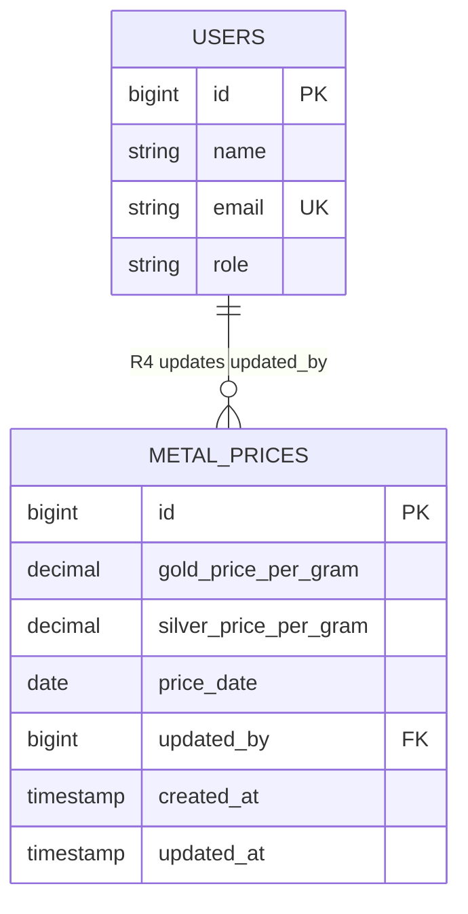

# Module ER Diagram — M7 Metal Price

**Rajabharana Jewellery Management System**

| Field | Value |
|-------|-------|
| **Module** | M7 — Metal Price |
| **Status** | ✅ Implemented |
| **Physical tables** | `metal_prices`, `users` (FK `updated_by`) |
| **Relationship ID** | R4 |
| **Related docs** | [DATABASE_ER_DIAGRAM.md](../DATABASE_ER_DIAGRAM.md) · [README.md](README.md) |

---

## 1. Overview

The **Metal Price** module stores daily gold and silver gram rates (LKR) used across the customer dashboard, admin KPIs, and order price estimation. Administrators with the `metal-prices.manage` permission update rates; each update is attributed to the acting user via `updated_by`.

**Key behaviours:**

- One logical “current rate” is resolved by latest `price_date`, then latest `updated_at`.
- Same-day updates overwrite the existing row; a new calendar day creates a new row (historical trail).
- Customers and staff **read** rates; only authorised admin users **write**.

**Scope:** This module doc covers `metal_prices` and its relationship to `users`. It does not own order pricing logic (M4 Order Management consumes these rates).

---

## 2. Entities

| # | Entity | Type | Physical table | Description |
|---|--------|------|----------------|-------------|
| E1 | **METAL_PRICE** | Strong | `metal_prices` | Daily gold/silver rate record |
| E2 | **USER** (Administrator) | Strong | `users` | Staff who updates metal prices (`role` = admin) |

**External references (not owned by this module):**

| Entity | Module | Link |
|--------|--------|------|
| CUSTOMER | M2 Customer | Reads current rates on dashboard |
| ORDER | M4 Order Management | May reference rates at estimate time |

---

## 3. Attributes

### 3.1 METAL_PRICE (`metal_prices`)

| # | Attribute | Data type | Key | Null | Default | Description |
|---|-----------|-----------|-----|------|---------|-------------|
| 1 | id | BIGINT UNSIGNED | PK | No | AUTO | Metal price record ID |
| 2 | gold_price_per_gram | DECIMAL(12,2) | | No | — | Gold rate in LKR per gram |
| 3 | silver_price_per_gram | DECIMAL(12,2) | | No | — | Silver rate in LKR per gram |
| 4 | price_date | DATE | | No | — | Effective calendar date for this rate |
| 5 | updated_by | BIGINT UNSIGNED | FK → users.id | Yes | NULL | Administrator who last updated (R4) |
| 6 | created_at | TIMESTAMP | | Yes | NULL | Row created datetime |
| 7 | updated_at | TIMESTAMP | | Yes | NULL | Row last modified datetime |

### 3.2 USER — relevant subset (`users`)

| # | Attribute | Data type | Key | Null | Description |
|---|-----------|-----------|-----|------|-------------|
| 1 | id | BIGINT UNSIGNED | PK | No | User ID |
| 2 | name | VARCHAR(255) | | No | Display name |
| 3 | email | VARCHAR(255) | UK | No | Login email |
| 4 | role | VARCHAR(255) | | No | `admin`, `manager`, `staff`, `technician`, `customer` |

---

## 4. Relationships

| ID | Relationship | Entity A | Entity B | FK column | Description |
|----|--------------|----------|----------|-----------|-------------|
| **R4** | **updates** | USER (Administrator) | METAL_PRICE | `metal_prices.updated_by` | Admin user records or revises a metal price row |

**Operational relationships (read-only, cross-module):**

| From | To | Meaning |
|------|-----|---------|
| CUSTOMER | METAL_PRICE | Views current gold/silver rates |
| ADMINISTRATOR | METAL_PRICE | Creates/updates rate via `/admin/metal-prices` |

---

## 5. Cardinality

| Relationship | Entity A | Cardinality | Entity B | Rule |
|--------------|----------|-------------|----------|------|
| R4 **updates** | USER | **1 : N** | METAL_PRICE | One admin may update many price records over time |
| (inverse) | METAL_PRICE | **N : 1** | USER | Each price row references at most one updater |

**Crow's foot:** `users (1) ——< (N) metal_prices`

---

## 6. Participation

| Entity | Relationship | Participation | Reason |
|--------|--------------|---------------|--------|
| METAL_PRICE | R4 updates | **Partial** | `updated_by` is nullable (seeded rows or system-created rows may have no user) |
| USER (Administrator) | R4 updates | **Partial** | Not every user updates prices; only those with permission and action history |

| Constraint | Detail |
|------------|--------|
| Minimum METAL_PRICE rows | At least one row expected after seeding for customer dashboard |
| Updater role | Business rule: only admin-panel users with `metal-prices.manage` may update |

---

## 7. Constraints

| Type | Rule |
|------|------|
| **PK** | `metal_prices.id` — surrogate primary key |
| **FK** | `metal_prices.updated_by` → `users.id` ON DELETE SET NULL |
| **CHECK (business)** | `gold_price_per_gram >= 0` AND `silver_price_per_gram >= 0` |
| **CHECK (business)** | `price_date` must not be in the far future |
| **Application** | Same-day upsert: if a row exists for `price_date = today()`, update in place |
| **Permission** | Route guarded by `permission:metal-prices.manage` |
| **Validation** | `UpdateMetalPriceRequest` validates numeric gram prices |

**Indexes (recommended):**

| Index | Columns | Purpose |
|-------|---------|---------|
| PRIMARY | `id` | PK lookup |
| INDEX | `price_date`, `updated_at` | Resolve `MetalPrice::current()` efficiently |

---

## 8. Normalization (3NF)

| Check | Assessment |
|-------|------------|
| **1NF** | All attributes are atomic; no repeating groups |
| **2NF** | Single-column PK (`id`); no partial dependencies |
| **3NF** | No transitive dependencies — `updated_by` references `users`, not duplicated admin name/email on `metal_prices` |
| **Design note** | Gold and silver on one row is denormalised by metal type but intentional: both rates share the same `price_date` and updater — avoids redundant date/user rows |

**Historical rates:** Each new `price_date` row preserves history without overwriting past dates — satisfies audit requirement without a separate audit table.

---

## 9. Mermaid `erDiagram`



---

## 10. Chen ASCII Notation

```
                    ┌─────────────┐
                    │    USER     │
                    │ (Administrator)│
                    └──────┬──────┘
                           │
                           │ updates (R4)
                           │ 1 : N
                           │
              ┌────────────┴────────────┐
              │                         │
              ▼                         ▼
    ┌─────────────────┐       ┌─────────────────┐
    │  METAL_PRICE    │       │  METAL_PRICE    │  … (historical rows)
    └────────┬────────┘       └─────────────────┘
             │
    ┌────────┴────────────────────────────────────────┐
    │ Attributes (ovals)                               │
    │  (_id_) id PK                                    │
    │  gold_price_per_gram                             │
    │  silver_price_per_gram                           │
    │  price_date                                      │
    │  updated_by FK ───────────────────► USER.id      │
    │  created_at, updated_at                          │
    └──────────────────────────────────────────────────┘

Legend:
  Rectangle     = Entity
  (_underline_) = Primary key attribute
  ───           = Partial participation (updated_by nullable)
  ═══           = Total participation (not used on R4)
```

**Chen relationship diamond:**

```
        ┌─────────┐
        │ updates │  ◆ R4
        └────┬────┘
             │
    USER (1) ──────── (N) METAL_PRICE
```

---

*Module M7 · Metal Price · ✅ Implemented*
