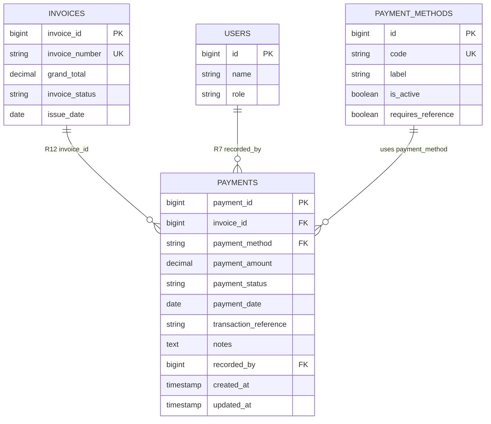

# Module ER Diagram — M9 Payment

**Rajabharana Jewellery Management System**

| Field | Value |
|-------|-------|
| **Module** | M9 — Payment |
| **Status** | 🔜 Sprint 9 |
| **Physical tables** | `payments`, `payment_methods` (lookup) |
| **Cross-module FKs** | `invoices`, `users` |
| **Related module** | [08-billing.md](08-billing.md) (Invoice 1-M Payment) |
| **Relationship IDs** | R7, R12 |

---

## 1. Overview

The **Payment** module records customer payments against issued invoices. It supports **full** and **partial** settlement using **Cash**, **Card**, or **Bank Transfer** methods. Sales staff or administrators record payments at the counter; each entry is attributed to the recording user and may include an external transaction reference (card auth code, bank transfer ID).

**Actors:**

| Actor | Action |
|-------|--------|
| **Sales Staff / Administrator** | Record payment, select method, enter amount and reference |
| **Customer** | Pays against invoice (offline); views payment history on invoice |
| **System** | Updates invoice `invoice_status` and balance when payments complete |

**Business rules:**

1. **Invoice linkage** — every payment must reference exactly one `invoice_id` (R12).
2. **Partial payments** — multiple payment rows allowed per invoice until `SUM(payment_amount)` ≥ `grand_total`.
3. **Full payment** — single or cumulative payments that cover `grand_total` set invoice to `paid`.
4. **Payment methods** — must be one of active codes in `payment_methods`: `cash`, `card`, `bank_transfer`.
5. **Amount validation** — `payment_amount > 0`; cumulative completed payments must not exceed `grand_total` (+ configurable overpayment tolerance).
6. **Status** — `pending` → `completed` (counts toward balance) or `failed` / `refunded` (excluded from balance).
7. **Reference** — `transaction_reference` required for `card` and `bank_transfer`; optional for `cash`.
8. **Recorder** — `recorded_by` must be a staff/admin user (R7); customers cannot self-record payments.
9. **Date** — `payment_date` defaults to today; cannot be before invoice `issue_date`.
10. **Invoice sync** — on `completed`: recompute balance; set invoice `invoice_status` to `partial` or `paid`.

---

## 2. Entities

| # | Entity | Type | Physical table | Description |
|---|--------|------|----------------|-------------|
| E1 | **PAYMENT** | Strong | `payments` | Individual payment transaction |
| E2 | **PAYMENT_METHOD** | Lookup | `payment_methods` | Allowed payment channels |
| E3 | **INVOICE** | Strong (external) | `invoices` | Bill being settled — see M8 |
| E4 | **STAFF** | Strong (external) | `users` | User who recorded payment |

**PAYMENT_METHOD seed data:**

| code | label | requires_reference |
|------|-------|-------------------|
| `cash` | Cash | No |
| `card` | Card | Yes |
| `bank_transfer` | Bank Transfer | Yes |

---

## 3. Attributes

### 3.1 PAYMENT (`payments`)

| # | Attribute | Data type | Key | Null | Description |
|---|-----------|-----------|-----|------|-------------|
| 1 | payment_id | BIGINT UNSIGNED | PK | No | Payment primary key (physical: `id`) |
| 2 | invoice_id | BIGINT UNSIGNED | FK → invoices.id | No | Related invoice (R12) |
| 3 | payment_method | VARCHAR(50) | FK → payment_methods.code* | No | `cash`, `card`, `bank_transfer` |
| 4 | payment_amount | DECIMAL(12,2) | | No | Amount received in LKR |
| 5 | payment_status | VARCHAR(255) | | No | `pending`, `completed`, `failed`, `refunded` |
| 6 | payment_date | DATE | | No | Date payment received |
| 7 | transaction_reference | VARCHAR(255) | | Yes | Card auth / bank ref / cheque no. |
| 8 | notes | TEXT | | Yes | Internal payment notes |
| 9 | recorded_by | BIGINT UNSIGNED | FK → users.id | No | Staff who recorded (R7) |
| 10 | created_at | TIMESTAMP | | Yes | Created datetime |
| 11 | updated_at | TIMESTAMP | | Yes | Updated datetime |

\*Enforced via application validation or FK to `payment_methods.code` if using string FK pattern.

### 3.2 PAYMENT_METHOD (`payment_methods`)

| # | Attribute | Data type | Key | Null | Description |
|---|-----------|-----------|-----|------|-------------|
| 1 | id | BIGINT UNSIGNED | PK | No | Lookup ID |
| 2 | code | VARCHAR(50) | UK | No | Stable code stored on `payments.payment_method` |
| 3 | label | VARCHAR(100) | | No | UI display name |
| 4 | is_active | BOOLEAN | | No | Selectable in payment form |
| 5 | requires_reference | BOOLEAN | | No | Whether `transaction_reference` is mandatory |
| 6 | sort_order | SMALLINT | | No | Dropdown order |

### 3.3 INVOICE — payment-relevant subset (`invoices`)

| # | Attribute | Description |
|---|-----------|-------------|
| invoice_id | PK |
| grand_total | Target amount to settle |
| invoice_status | Updated by payment aggregation |

---

## 4. Relationships

| ID | Relationship | Entity A | Entity B | FK column | Description |
|----|--------------|----------|----------|-----------|-------------|
| **R12** | **receives** | INVOICE | PAYMENT | `payments.invoice_id` | Invoice receives zero or more payments |
| **R7** | **records** | STAFF (users) | PAYMENT | `payments.recorded_by` | Staff member logs payment |
| **R12m** | **uses** | PAYMENT | PAYMENT_METHOD | `payments.payment_method` → `code` | Payment channel lookup |

**Cross-module:**

| From module | Relationship | Detail |
|-------------|--------------|--------|
| M8 Billing | INVOICE → PAYMENT | Header `grand_total` drives settlement |
| M2 Customer | CUSTOMER → INVOICE → PAYMENT | Customer pays via staff; indirect link |

---

## 5. Cardinality

| Relationship | From | Card. | To | Notes |
|--------------|------|-------|-----|-------|
| R12 receives | INVOICE | **1 : M** | PAYMENT | Partial payments = multiple rows |
| R7 records | STAFF | **1 : M** | PAYMENT | Audit trail per staff member |
| R12m uses | PAYMENT | **M : 1** | PAYMENT_METHOD | Each payment uses one method |
| PAYMENT_METHOD | — | **1 : M** | PAYMENT | Lookup referenced by many payments |

---

## 6. Participation

| Entity | Relationship | Participation | Reason |
|--------|--------------|---------------|--------|
| PAYMENT | R12 receives | **Total** | `invoice_id` NOT NULL — orphan payments forbidden |
| INVOICE | R12 receives | **Partial** | Newly issued invoice may have no payments yet |
| PAYMENT | R7 records | **Total** | `recorded_by` NOT NULL |
| STAFF | R7 records | **Partial** | Not all staff record payments |
| PAYMENT | R12m uses | **Total** | Valid `payment_method` required |
| PAYMENT_METHOD | R12m uses | **Partial** | Inactive methods not used on new payments |

---

## 7. Constraints

| Type | Rule |
|------|------|
| **PK** | `payments.payment_id` |
| **FK** | `invoice_id` → `invoices.invoice_id` ON DELETE RESTRICT |
| **FK** | `recorded_by` → `users.id` ON DELETE RESTRICT |
| **FK / ENUM** | `payment_method` must exist in `payment_methods.code` WHERE `is_active = true` |
| **CHECK** | `payment_amount > 0` |
| **CHECK** | `payment_status` IN (`pending`, `completed`, `failed`, `refunded`) |
| **CHECK** | If method requires reference → `transaction_reference IS NOT NULL` |
| **CHECK** | `payment_date >= invoices.issue_date` |
| **CHECK** | SUM(completed `payment_amount`) ≤ `grand_total` per invoice |
| **Application** | Only `completed` payments reduce invoice balance |
| **Application** | Invoice must be `issued`, `partial`, or `overdue` to accept payment |

**Indexes (recommended):**

| Index | Columns | Purpose |
|-------|---------|---------|
| INDEX | `invoice_id` | List payments per invoice |
| INDEX | `payment_date` | Collection reports |
| INDEX | `recorded_by` | Staff activity audit |

---

## 8. Normalization (3NF)

| Check | Assessment |
|-------|------------|
| **1NF** | Atomic values; one payment per row |
| **2NF** | Single-column PK; no partial dependencies |
| **3NF** | Payment method label not duplicated — referenced via `payment_methods`; staff name not stored on `payments` |
| **Balance** | Invoice balance derived from payments + invoice header — avoids storing redundant `amount_paid` on both tables |
| **Lookup table** | `payment_methods` eliminates repeating method metadata |

---

## 9. Mermaid `erDiagram`



---

## 10. Chen ASCII Notation

```
  ┌──────────┐
  │ INVOICE  │  (M8 Billing)
  └────┬─────┘
       │
       │ receives (R12)
       │ 1 : N
       │
       ├──────────────────────────────────────┐
       │                                      │
       ▼                                      ▼
  ┌──────────┐                         ┌──────────┐
  │ PAYMENT  │                         │ PAYMENT  │  (partial #2…)
  └────┬─────┘                         └──────────┘
       │
       ├──────────────── uses (R12m) ────────► ┌─────────────────┐
       │                                        │ PAYMENT_METHOD  │
       │                                        │ cash|card|bank  │
       │                                        └─────────────────┘
       │
       └──────────────── records (R7) ────────► ┌──────────┐
                                                 │  STAFF   │
                                                 │  (USER)  │
                                                 └──────────┘

PAYMENT attributes:
  (_payment_id_) payment_id PK
  invoice_id FK  ═══ total participation
  payment_method FK
  payment_amount
  payment_status
  payment_date
  transaction_reference
  recorded_by FK ═══ total participation

Partial vs full payment (derived):
  SUM(payment_amount WHERE status=completed) < grand_total  → partial
  SUM(payment_amount WHERE status=completed) >= grand_total → paid
```

---

*Module M9 · Payment · 🔜 Sprint 9*
