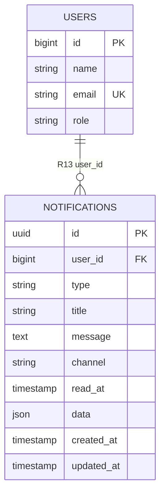
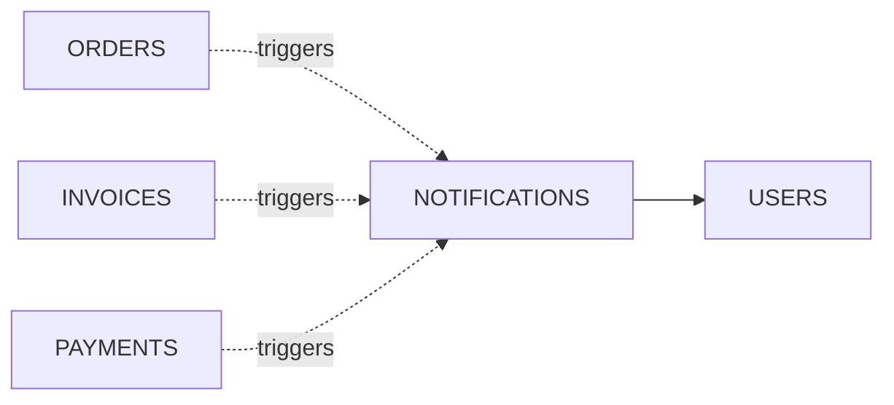

# Module ER Diagram — M10 Notification

**Rajabharana Jewellery Management System**

| Field | Value |
|-------|-------|
| **Module** | M10 — Notification |
| **Status** | 🔜 Planned (Phase 2) |
| **Physical tables** | `notifications` |
| **Cross-module FKs** | `users` |
| **Laravel integration** | Extends `Illuminate\Notifications\DatabaseNotification` pattern |

---

## 1. Overview

The **Notification** module delivers in-app (and future email/SMS) alerts to users about order status changes, invoice issuance, payment confirmation, workshop assignments, and system messages. Each notification is stored per recipient with read/unread state and optional structured payload in JSON.

**Planned channels:**

| Channel | Phase | Description |
|---------|-------|-------------|
| `database` | Phase 2a | In-app notification bell / list |
| `mail` | Phase 2b | Email via Laravel Mail |
| `sms` | Phase 2c | SMS gateway (business decision pending) |

**Actors:**

| Actor | Receives |
|-------|----------|
| **Customer** | Order confirmed, ready for collection, invoice issued, payment received |
| **Sales Staff** | New order placed, payment recorded |
| **Technician** | Job assigned, status change on assigned order |
| **Administrator** | Critical system events, low stock (future) |

**Business rules:**

1. Every notification targets exactly one `user_id`.
2. `read_at = NULL` means unread; setting timestamp marks as read.
3. `type` identifies the notification class (e.g. `App\Notifications\OrderConfirmed`).
4. `data` JSON holds entity references (`order_id`, `invoice_id`) for deep links.
5. Notifications are **append-only** — no hard delete; optional archival job after N days.
6. Customer notifications exclude internal admin notes and technician-only fields.

---

## 2. Entities

| # | Entity | Type | Physical table | Description |
|---|--------|------|----------------|-------------|
| E1 | **NOTIFICATION** | Strong | `notifications` | Single alert record for one user |
| E2 | **USER** | Strong (external) | `users` | Recipient of notification |

**Conceptual event sources (not stored as FKs — referenced in `data` JSON):**

| Source module | Example `type` | Payload keys |
|---------------|------------------|--------------|
| M4 Order | `order.confirmed` | `order_id`, `order_number` |
| M8 Billing | `invoice.issued` | `invoice_id`, `invoice_number` |
| M9 Payment | `payment.received` | `payment_id`, `invoice_id` |
| M5 Workshop | `production.assigned` | `order_id`, `technician_id` |

---

## 3. Attributes

### 3.1 NOTIFICATION (`notifications`)

| # | Attribute | Data type | Key | Null | Description |
|---|-----------|-----------|-----|------|-------------|
| 1 | id | UUID / BIGINT | PK | No | Notification ID (Laravel default: UUID string) |
| 2 | user_id | BIGINT UNSIGNED | FK → users.id | No | Recipient user |
| 3 | type | VARCHAR(255) | | No | Notification class / event type identifier |
| 4 | title | VARCHAR(255) | | No | Short headline for UI |
| 5 | message | TEXT | | No | Human-readable body |
| 6 | channel | VARCHAR(50) | | No | `database`, `mail`, `sms` |
| 7 | read_at | TIMESTAMP | | Yes | NULL = unread; set when user opens notification |
| 8 | data | JSON | | Yes | Structured payload (entity IDs, URLs, metadata) |
| 9 | created_at | TIMESTAMP | | Yes | Sent / created datetime |
| 10 | updated_at | TIMESTAMP | | Yes | Updated datetime |

**Example `data` JSON:**

```json
{
  "order_id": 42,
  "order_number": "ORD-20250719-0001",
  "action_url": "/orders/42",
  "icon": "order"
}
```

### 3.2 USER — relevant subset (`users`)

| # | Attribute | Data type | Key | Description |
|---|-----------|-----------|-----|-------------|
| 1 | id | BIGINT UNSIGNED | PK | User ID |
| 2 | name | VARCHAR(255) | | Recipient name |
| 3 | email | VARCHAR(255) | UK | Used for `mail` channel |
| 4 | role | VARCHAR(255) | | Determines which events fire |

---

## 4. Relationships

| ID | Relationship | Entity A | Entity B | FK column | Description |
|----|--------------|----------|----------|-----------|-------------|
| **R13** | **receives** | USER | NOTIFICATION | `notifications.user_id` | User receives many notifications |
| *(logical)* | **triggers** | ORDER / INVOICE / PAYMENT | NOTIFICATION | via `data` JSON | Source entity causes notification creation — no direct FK |

---

## 5. Cardinality

| Relationship | From | Card. | To | Notes |
|--------------|------|-------|-----|-------|
| R13 receives | USER | **1 : M** | NOTIFICATION | One user, many notifications over time |
| R13 (inverse) | NOTIFICATION | **M : 1** | USER | Each notification has exactly one recipient |
| triggers (logical) | ORDER | **1 : M** | NOTIFICATION | One order may generate multiple notifications (customer + staff) |

---

## 6. Participation

| Entity | Relationship | Participation | Reason |
|--------|--------------|---------------|--------|
| NOTIFICATION | R13 receives | **Total** | `user_id` NOT NULL — every notification has a recipient |
| USER | R13 receives | **Partial** | Users may have zero notifications |
| NOTIFICATION | read state | **Partial** | `read_at` NULL until opened |

---

## 7. Constraints

| Type | Rule |
|------|------|
| **PK** | `notifications.id` |
| **FK** | `user_id` → `users.id` ON DELETE CASCADE (remove notifications when user deleted) |
| **CHECK** | `channel` IN (`database`, `mail`, `sms`) |
| **CHECK** | `type` NOT NULL — must map to registered notification class |
| **INDEX** | (`user_id`, `read_at`, `created_at`) — unread feed query |
| **Application** | Idempotency: avoid duplicate `order.confirmed` for same order+user within window |
| **Privacy** | Technician notifications must not include customer PII beyond order number |

**Retention (planned):**

| Rule | Detail |
|------|--------|
| Archive | Soft-delete or move notifications older than 90 days |
| GDPR | User account deletion cascades notifications |

---

## 8. Normalization (3NF)

| Check | Assessment |
|-------|------------|
| **1NF** | Scalar columns; `data` JSON is atomic document blob |
| **2NF** | Single PK; no partial dependencies |
| **3NF** | User name/email not duplicated — only `user_id` FK; order details in `data` are event snapshot, not transitive dependency on user |
| **JSON payload** | Avoids polymorphic FK (`notifiable_type`, `notifiable_id`) complexity for v1; Laravel Notifiable trait may add morph columns in implementation |
| **Channel per row** | One row per channel delivery — same event may create 2 rows (database + mail) with shared `data` |

---

## 9. Mermaid `erDiagram`



**Logical triggers (dashed — no FK):**



---

## 10. Chen ASCII Notation

```
  ┌──────────┐         ┌──────────┐         ┌──────────┐
  │  ORDER   │- - - - ►│          │         │          │
  └──────────┘ triggers│          │         │          │
                        │NOTIFICATION│◄──────│   USER   │
  ┌──────────┐ triggers│          │ receives│          │
  │ INVOICE  │- - - - ►│          │ (R13)   │          │
  └──────────┘         │          │ 1 : N   └──────────┘
                        └────┬─────┘
  ┌──────────┐               │
  │ PAYMENT  │- - triggers - -┘
  └──────────┘         (logical — via application event)

NOTIFICATION attributes:
  (_id_) id PK
  user_id FK ═══ total participation (double line to USER)
  type
  title
  message
  channel
  read_at  (NULL = unread)
  data JSON
  created_at, updated_at

Legend:
  - - - -  = Logical / no FK (event source)
  ═══      = Total participation
```

---

*Module M10 · Notification · 🔜 Planned*
