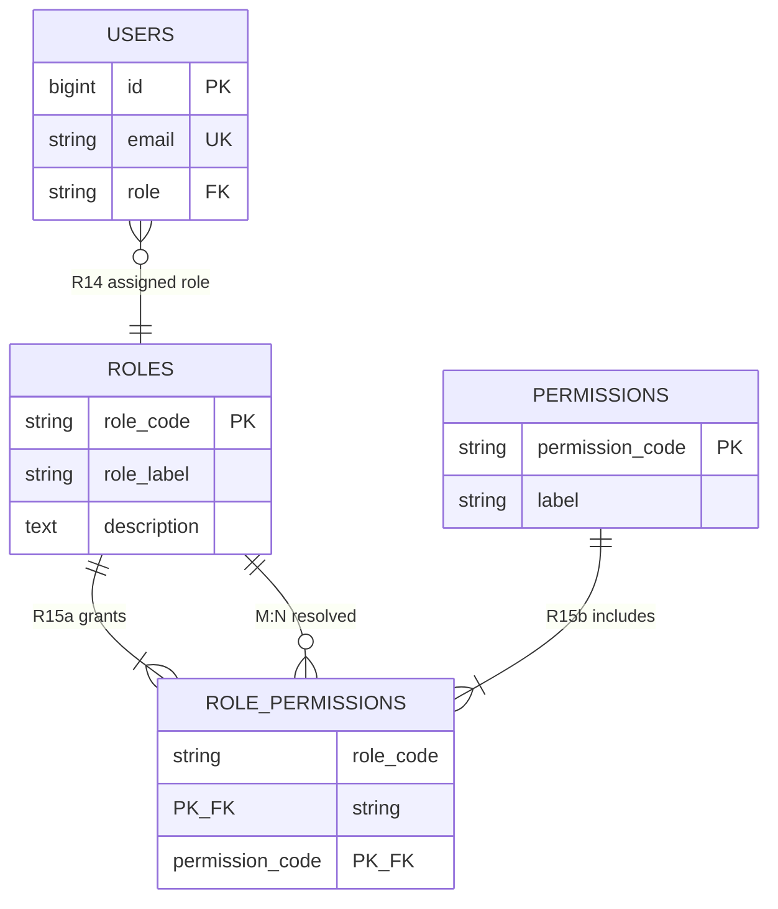
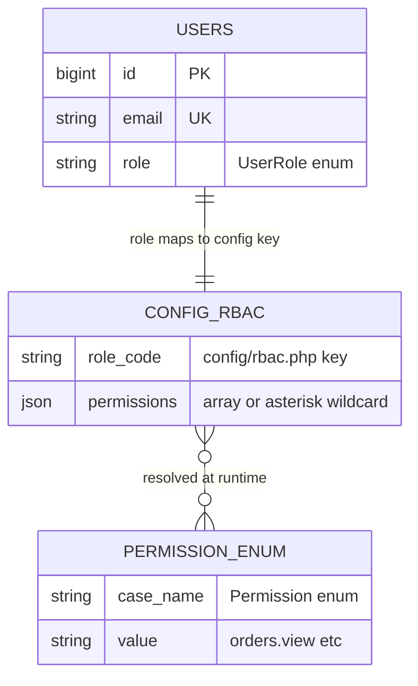

# Module ER Diagram — M11 Role-Based Access Control (RBAC)

**Rajabharana Jewellery Management System**

| Field | Value |
|-------|-------|
| **Module** | M11 — RBAC |
| **Status** | ✅ Implemented (config + `users.role` column) |
| **Conceptual entities** | ROLE, PERMISSION, ROLE_PERMISSION |
| **Physical implementation** | `users.role` + `config/rbac.php` + `App\Enums\Permission` |
| **No physical tables** | `roles`, `permissions`, `role_permission` — logical only |

---

## 1. Overview

RBAC controls which users may access admin panels, workshop routes, and specific operations. The system uses a **hybrid model**:

- **Conceptual (Chen ER):** normalised ROLE ↔ PERMISSION many-to-many via ROLE_PERMISSION bridge.
- **Physical (implemented):** single `role` column on `users` plus a static role→permission map in `config/rbac.php`, evaluated by `App\Support\Rbac` and `User::hasPermission()`.

**Five roles:**

| Role | `UserRole` enum | Panel access |
|------|-----------------|--------------|
| Administrator | `admin` | Full (`*` wildcard) |
| Inventory Manager | `manager` | Admin catalog only |
| Sales Staff | `staff` | Admin orders, customers, dashboard |
| Workshop Technician | `technician` | `/technician/*` production jobs |
| Customer | `customer` | `/dashboard`, `/orders` (no permission enum) |

**Enforcement layers:**

1. **Middleware** — `EnsureCustomer`, `EnsureAdmin`, `EnsureTechnician`, `EnsurePermission`
2. **Form requests** — `authorize()` calls `hasPermission()`
3. **Routes** — `Route::middleware('permission:…')` in `routes/web.php`
4. **Gate** — `Gate::define('permission', …)` in `AppServiceProvider`

---

## 2. Entities

### 2.1 Conceptual (Chen / logical model)

| # | Entity | Type | Description |
|---|--------|------|-------------|
| E1 | **ROLE** | Strong | Named job function in the organisation |
| E2 | **PERMISSION** | Strong | Atomic capability (e.g. `orders.manage`) |
| E3 | **ROLE_PERMISSION** | Associative (M:N bridge) | Maps roles to permissions |
| E4 | **USER** | Strong | Account assigned exactly one role |

### 2.2 Physical (implemented model)

| # | Entity | Physical storage | Description |
|---|--------|------------------|-------------|
| E4 | **USER** | `users.role` VARCHAR | One role per user |
| E1 + E3 | **ROLE + ROLE_PERMISSION** | `config/rbac.php` `roles` array | In-memory map at boot |
| E2 | **PERMISSION** | `App\Enums\Permission` PHP enum | Canonical permission strings |

---

## 3. Attributes

### 3.1 ROLE (conceptual)

| # | Attribute | Data type | Key | Description |
|---|-----------|-----------|-----|-------------|
| 1 | role_id | — | PK | Surrogate (not persisted) |
| 2 | role_code | VARCHAR(50) | UK | `admin`, `manager`, `staff`, `technician`, `customer` |
| 3 | role_label | VARCHAR(100) | | Human-readable name |
| 4 | description | TEXT | | Role purpose |

### 3.2 PERMISSION (conceptual — `App\Enums\Permission`)

| # | Attribute | Enum case | Value (`->value`) | Label |
|---|-----------|-----------|-------------------|-------|
| 1 | permission_id | — | PK (logical) | — |
| 2 | permission_code | DashboardView | `dashboard.view` | View dashboard |
| 3 | permission_code | OrdersView | `orders.view` | View orders |
| 4 | permission_code | OrdersManage | `orders.manage` | Manage orders |
| 5 | permission_code | CustomersView | `customers.view` | View customers |
| 6 | permission_code | CatalogView | `catalog.view` | View catalog |
| 7 | permission_code | CatalogManage | `catalog.manage` | Manage catalog |
| 8 | permission_code | MetalPricesManage | `metal-prices.manage` | Manage metal prices |
| 9 | permission_code | UsersManage | `users.manage` | Manage staff accounts |
| 10 | permission_code | ProductionView | `production.view` | View production queue |
| 11 | permission_code | ProductionAssign | `production.assign` | Assign technicians |
| 12 | permission_code | ProductionManage | `production.manage` | Manage assigned jobs |

### 3.3 ROLE_PERMISSION (conceptual bridge)

| # | Attribute | Data type | Key | Description |
|---|-----------|-----------|-----|-------------|
| 1 | role_code | VARCHAR(50) | PK (composite) | FK → ROLE |
| 2 | permission_code | VARCHAR(100) | PK (composite) | FK → PERMISSION |

### 3.4 USER — RBAC attributes (`users`)

| # | Attribute | Data type | Key | Null | Description |
|---|-----------|-----------|-----|------|-------------|
| 1 | id | BIGINT UNSIGNED | PK | No | User ID |
| 2 | role | VARCHAR(255) | | No | Assigned role (`UserRole` enum cast) |
| 3 | email | VARCHAR(255) | UK | No | Login identity |

### 3.5 Config map (`config/rbac.php`)

| Key | Purpose |
|-----|---------|
| `roles` | Role → list of permission strings (or `*`) |
| `panel_roles` | Roles allowed on `/admin/*` |
| `assignable_roles` | Roles admin may assign when creating staff |

---

## 4. Relationships

| ID | Relationship | Entity A | Entity B | Implementation | Description |
|----|--------------|----------|----------|----------------|-------------|
| **R14** | **assigned** | USER | ROLE | `users.role` | Each user has exactly one role |
| **R15** | **grants** | ROLE | PERMISSION | `config/rbac.php` | Role grants many permissions |
| **R15a** | **via** | ROLE | ROLE_PERMISSION | config array keys | Bridge resolves M:N |
| **R15b** | **via** | PERMISSION | ROLE_PERMISSION | config array values | Bridge resolves M:N |

**Role → permission matrix (implemented):**

| Role | Permissions |
|------|-------------|
| `admin` | `*` (all) |
| `manager` | `catalog.view`, `catalog.manage` |
| `staff` | `dashboard.view`, `orders.view`, `orders.manage`, `customers.view`, `catalog.view` |
| `technician` | `production.manage` |
| `customer` | *(none — route middleware `EnsureCustomer`)* |

---

## 5. Cardinality

| Relationship | From | Card. | To | Notes |
|--------------|------|-------|-----|-------|
| R14 assigned | USER | **M : 1** | ROLE | Many users share one role |
| R15 grants | ROLE | **M : N** | PERMISSION | Via bridge table / config array |
| R15 (inverse) | PERMISSION | **M : N** | ROLE | Same permission may apply to multiple roles |

**Physical simplification:** USER → ROLE is **1 : 1** at instance level (one role column); ROLE → PERMISSION is **1 : N** stored as array in config.

---

## 6. Participation

| Entity | Relationship | Participation | Reason |
|--------|--------------|---------------|--------|
| USER | R14 assigned | **Total** | `role` NOT NULL on every user |
| ROLE | R14 assigned | **Partial** | Role exists even with zero users (e.g. new `manager`) |
| ROLE | R15 grants | **Partial** | `customer` role has no Permission enum entries |
| PERMISSION | R15 grants | **Partial** | Not all permissions assigned to every role |
| ADMIN role | R15 grants | **Total** | Wildcard `*` implies all permissions |

---

## 7. Constraints

| Type | Rule |
|------|------|
| **ENUM** | `users.role` must be valid `UserRole` case |
| **Application** | Admin always passes `hasPermission()` (hard-coded in `Rbac::userHasPermission`) |
| **Application** | Customer routes use role check, not Permission enum |
| **Application** | Technician uses separate middleware — not in `panel_roles` |
| **Business** | At least one `admin` user must remain (enforced in `UpdateStaffUserRequest`) |
| **Business** | Only `assignable_roles` may be set by admin when creating staff |
| **Config** | Permission strings must match `Permission` enum values exactly |
| **Route** | Unknown permission string → 403 via `EnsurePermission` middleware |

**Future Sprint 9+ permissions (planned, not in enum yet):**

| Permission | Roles (planned) |
|------------|-----------------|
| `billing.view` | admin, staff |
| `billing.manage` | admin, staff |
| `reports.view` | admin |

---

## 8. Normalization (3NF)

| Model | Assessment |
|-------|------------|
| **Conceptual 3NF** | ROLE, PERMISSION, ROLE_PERMISSION fully normalised — no repeating permission groups on ROLE |
| **Physical trade-off** | Denormalised: permissions duplicated in PHP config rather than DB — acceptable for small static matrix |
| **users.role** | No transitive dependency — role label stored in enum, not duplicated on user |
| **Why not DB tables?** | Fixed 5 roles, ~12 permissions — config file avoids join overhead and migration churn |
| **Upgrade path** | If dynamic roles needed: migrate `config/rbac.php` → `roles`, `permissions`, `role_permission` tables without changing Permission enum |

---

## 9. Mermaid `erDiagram`

**Conceptual (Chen target model):**



**Physical (implemented):**



---

## 10. Chen ASCII Notation

```
Conceptual (normalised):

    ┌──────┐                    ┌─────────────────┐                    ┌────────────┐
    │ USER │                    │ ROLE_PERMISSION │                    │ PERMISSION │
    └──┬───┘                    └────────┬────────┘                    └─────┬──────┘
       │                                 │                                    │
       │ assigned (R14)                  │ grants (R15) M:N                   │
       │ M : 1                           │                                    │
       ▼                                 ▼                                    │
    ┌──────┐         ┌──────────────────────────┐                            │
    │ ROLE │◄────────┤ role_code + permission_code ├───────────────────────────┘
    └──────┘         └──────────────────────────┘
    admin
    manager
    staff
    technician
    customer

Physical (implemented):

    ┌──────────────────────────────────────┐
    │              USER                    │
    │  (_id_) id PK                        │
    │  role  ──────────────┐               │
    └──────────────────────┼───────────────┘
                           │
                           ▼
              ┌────────────────────────────┐
              │   config/rbac.php          │
              │   (logical ROLE + bridge)  │
              ├────────────────────────────┤
              │ admin  → [*]               │
              │ manager → catalog.view,    │
              │           catalog.manage   │
              │ staff  → orders.view, …    │
              │ technician → production.   │
              │              manage        │
              └─────────────┬──────────────┘
                            │ resolves to
                            ▼
              ┌────────────────────────────┐
              │ App\Enums\Permission     │
              │ (12 permission codes)    │
              └────────────────────────────┘

Middleware flow:
  Request → auth → role middleware → permission middleware → controller
```

---

*Module M11 · RBAC · ✅ Implemented (config + role column)*
