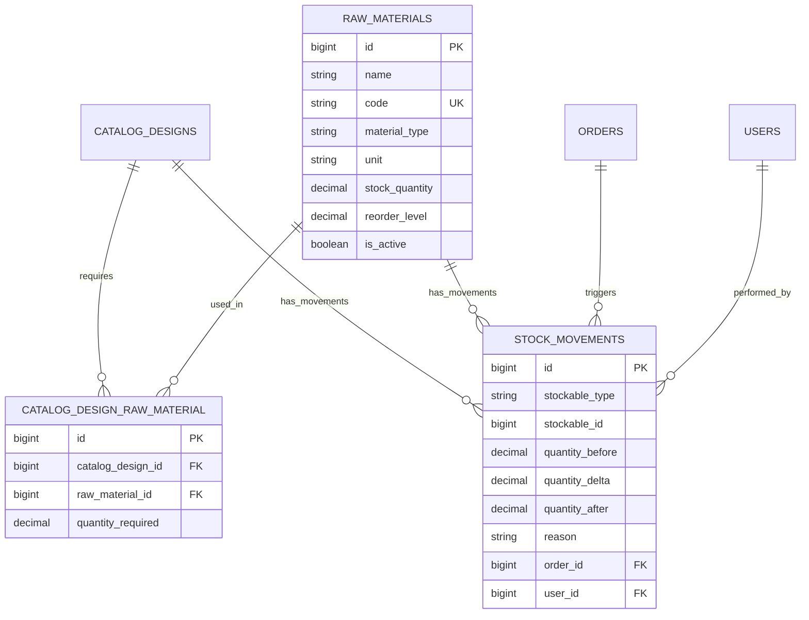

# Module 12 — Raw Materials & Stock Management

**System:** Rajabharana Jewellery Management System  
**Module:** M12 — Raw Materials · Bill of Materials · Stock Movements  
**Status:** ✅ Implemented

**Tables:** `raw_materials`, `catalog_design_raw_material`, `stock_movements`, `catalog_designs.stock_quantity`

**Full diagram document (ER + Use Case + Sequence):** [../MATERIALS_INVENTORY_DIAGRAMS.md](../MATERIALS_INVENTORY_DIAGRAMS.md)

---

## 1. Module Overview

Workshop raw material inventory, catalog Bill of Materials (BOM), finished-item stock quantity, stock movement audit trail, and automatic stock deduction/restoration on order accept/reject.

---

## 2. Entities

### 2.1 raw_materials ✅

| Property | Value |
|----------|-------|
| **Entity Name** | raw_materials |
| **Description** | Workshop raw material stock item |
| **Primary Key (PK)** | id |
| **Attributes** | id, name, code, material_type, unit, stock_quantity, reorder_level, unit_cost, notes, is_active, created_at, updated_at |
| **Unique** | code |

### 2.2 catalog_design_raw_material ✅

| Property | Value |
|----------|-------|
| **Entity Name** | catalog_design_raw_material |
| **Description** | BOM link — material quantity required per 1 catalog unit |
| **Primary Key (PK)** | id |
| **Foreign Keys (FK)** | catalog_design_id, raw_material_id |
| **Unique** | (catalog_design_id, raw_material_id) |

### 2.3 stock_movements ✅

| Property | Value |
|----------|-------|
| **Entity Name** | stock_movements |
| **Description** | Polymorphic stock change audit log |
| **Primary Key (PK)** | id |
| **Foreign Keys (FK)** | order_id → orders, user_id → users |
| **Polymorphic** | stockable → CatalogDesign or RawMaterial |

---

## 3. Relationships & Cardinality

| ID | Parent | Child | Crow's Foot | Description |
|----|--------|-------|-------------|-------------|
| R-MAT-1 | catalog_designs | catalog_design_raw_material | 1 ——< N | Catalog requires materials |
| R-MAT-2 | raw_materials | catalog_design_raw_material | 1 ——< N | Material used in catalog |
| R-MAT-3 | catalog_designs | raw_materials | M ——< M | Many-to-many via bridge |
| R-MAT-4 | catalog_designs | stock_movements | 1 ——< N | Catalog stock audit |
| R-MAT-5 | raw_materials | stock_movements | 1 ——< N | Material stock audit |
| R-MAT-6 | orders | stock_movements | 1 ——o< N | Order-triggered movements |
| R-MAT-7 | users | stock_movements | 1 ——o< N | User-performed adjustments |

---

## 4. Mermaid erDiagram

---

*See [MATERIALS_INVENTORY_DIAGRAMS.md](../MATERIALS_INVENTORY_DIAGRAMS.md) for use case and sequence diagrams.*
