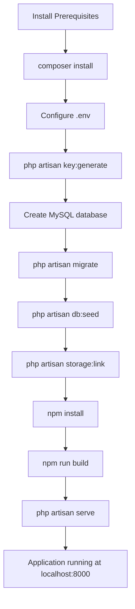

# Laravel Project Setup — Rajabharana Jewellery Management System

**Section:** System Development / Environment Setup  
**Use in report:** Chapter on implementation environment, installation steps, and configuration

| Resource | File |
|----------|------|
| **Printable view** | [`PROJECT_SETUP.html`](PROJECT_SETUP.html) |
| **Technology stack** | [`TECHNOLOGY_STACK.md`](TECHNOLOGY_STACK.md) |

---

## 1. Introduction

The Rajabharana Jewellery Management System is built on **Laravel 12** using the **MVC (Model–View–Controller)** architecture. This section documents the software prerequisites, project creation, environment configuration, database setup, and how to run the application on a local development machine.

---

## 2. Software Prerequisites

The following software must be installed before setting up the project:

| Software | Minimum Version | Purpose |
|----------|-----------------|---------|
| **PHP** | 8.2+ | Server-side language (Laravel runtime) |
| **Composer** | 2.x | PHP dependency manager |
| **Node.js** | 18+ | JavaScript runtime for frontend build |
| **NPM** | 9+ | Frontend package manager |
| **MySQL** | 8.x | Relational database (recommended) |
| **Git** | Latest | Version control (optional) |

### Required PHP extensions

Laravel requires these PHP extensions (usually enabled in XAMPP/WAMP/Laragon):

- `BCMath`, `Ctype`, `cURL`, `DOM`, `Fileinfo`, `JSON`, `Mbstring`, `OpenSSL`, `PDO`, `Tokenizer`, `XML`

### Verify installation

```bash
php -v
composer --version
node -v
npm -v
mysql --version
```

**Example output (development machine):**

```
PHP 8.2.12
Composer version 2.10.1
v24.16.0
11.13.0
```

---

## 3. Project Creation (Initial Setup)

The project was created using Laravel’s official installer and extended with Laravel Breeze for authentication.

### Step 1 — Create new Laravel project

```bash
composer create-project laravel/laravel jewellery-system
cd jewellery-system
```

This command downloads Laravel 12 and creates the base folder structure (`app/`, `routes/`, `resources/`, `database/`, etc.).

### Step 2 — Install Laravel Breeze (Authentication)

```bash
composer require laravel/breeze --dev
php artisan breeze:install blade
```

Breeze scaffolds login, registration, password reset, and profile views using **Blade + Tailwind CSS**.

### Step 3 — Install PHP dependencies

```bash
composer install
```

Reads `composer.json` and installs Laravel framework, Tinker, and dev tools (Breeze, PHPUnit, Pint).

**Key dependencies from `composer.json`:**

```json
"require": {
    "php": "^8.2",
    "laravel/framework": "^12.0",
    "laravel/tinker": "^2.10.1"
},
"require-dev": {
    "laravel/breeze": "^2.4",
    "phpunit/phpunit": "^11.5.50"
}
```

### Step 4 — Install frontend dependencies

```bash
npm install
```

Reads `package.json` and installs Vite, Tailwind CSS, Alpine.js, and related tools.

**Key frontend dependencies from `package.json`:**

```json
"devDependencies": {
    "@tailwindcss/forms": "^0.5.2",
    "alpinejs": "^3.4.2",
    "laravel-vite-plugin": "^2.0.0",
    "tailwindcss": "^3.1.0",
    "vite": "^7.0.7"
}
```

---

## 4. Environment Configuration (`.env`)

Laravel stores environment settings in a `.env` file (not committed to Git for security).

### Step 1 — Create `.env` from example

```bash
copy .env.example .env
```

On Linux/macOS:

```bash
cp .env.example .env
```

### Step 2 — Generate application key

```bash
php artisan key:generate
```

This sets `APP_KEY` in `.env`. Laravel uses it to encrypt sessions and cookies.

### Step 3 — Configure application name and URL

Edit `.env`:

```env
APP_NAME="Rajabharana Jewellery"
APP_ENV=local
APP_DEBUG=true
APP_URL=http://127.0.0.1:8000
```

### Step 4 — Configure MySQL database

Create an empty database in MySQL (e.g. via phpMyAdmin or command line):

```sql
CREATE DATABASE rajabharana_jewellery CHARACTER SET utf8mb4 COLLATE utf8mb4_unicode_ci;
```

Update `.env`:

```env
DB_CONNECTION=mysql
DB_HOST=127.0.0.1
DB_PORT=3306
DB_DATABASE=rajabharana_jewellery
DB_USERNAME=root
DB_PASSWORD=
```

### Step 5 — Session and queue (used by this project)

```env
SESSION_DRIVER=database
QUEUE_CONNECTION=database
CACHE_STORE=database
```

Sessions are stored in the `sessions` table (not file-based), which supports secure multi-user login.

---

## 5. Database Setup

### Step 1 — Run migrations

Migrations create all database tables from PHP files in `database/migrations/`:

```bash
php artisan migrate
```

**Tables created (15 business + Laravel system tables):**

| Migration file | Tables created |
|----------------|----------------|
| `0001_01_01_000000_create_users_table.php` | `users`, `password_reset_tokens`, `sessions` |
| `0001_01_01_000001_create_cache_table.php` | `cache`, `cache_locks` |
| `0001_01_01_000002_create_jobs_table.php` | `jobs`, `job_batches`, `failed_jobs` |
| `2025_06_07_000001_add_customer_fields_to_users_table.php` | Adds `role`, `phone`, `address`, `city` to `users` |
| `2025_06_07_000002_create_catalog_designs_table.php` | `catalog_designs`, `catalog_images` |
| `2025_06_07_000003_create_orders_table.php` | `orders` |
| `2025_06_09_000001_create_metal_prices_table.php` | `metal_prices` |
| `2025_06_11_000001_create_billing_tables.php` | `invoices`, `invoice_items`, `payment_methods` |
| `2025_06_12_000001_create_billing_enhancements_tables.php` | `payments`, `billing_settings`, `category_discounts`, `notifications` |
| Others | Production logs, profile photo, etc. |

**Example migration code** — `users` table base structure:

```php
Schema::create('users', function (Blueprint $table) {
    $table->id();
    $table->string('name');
    $table->string('email')->unique();
    $table->timestamp('email_verified_at')->nullable();
    $table->string('password');
    $table->rememberToken();
    $table->timestamps();
});
```

### Step 2 — Seed sample data

```bash
php artisan db:seed
```

Runs `DatabaseSeeder.php`, which creates test users and sample catalog, metal prices, billing settings, and payment methods.

**Seeder code (`database/seeders/DatabaseSeeder.php`):**

```php
User::updateOrCreate(
    ['email' => 'admin@rajabharana.com'],
    [
        'name' => 'Admin User',
        'phone' => '0779876543',
        'address' => '456 Kandy Road, Rajagiriya',
        'city' => 'Colombo',
        'role' => 'admin',
        'password' => Hash::make('password'),
        'email_verified_at' => now(),
    ]
);

$this->call(CatalogDesignSeeder::class);
$this->call(MetalPriceSeeder::class);
$this->call(PaymentMethodSeeder::class);
$this->call(BillingSettingSeeder::class);
$this->call(CategoryDiscountSeeder::class);
```

### Step 3 — Test login accounts (after seeding)

| Role | Email | Password |
|------|-------|----------|
| Customer | `customer@rajabharana.com` | `password` |
| Administrator | `admin@rajabharana.com` | `password` |
| Sales Staff | `staff@rajabharana.com` | `Password1` |
| Inventory Manager | `manager@rajabharana.com` | `Password1` |
| Technician | `technician@rajabharana.com` | `Password1` |

---

## 6. File Storage Setup

Catalog images and order reference uploads are stored under `storage/app/public`. A symbolic link makes them accessible from the web:

```bash
php artisan storage:link
```

This creates `public/storage` → `storage/app/public` so uploaded files can be served at URLs like `/storage/catalog/image.jpg`.

---

## 7. Frontend Asset Build (Vite)

### Development (hot reload)

```bash
npm run dev
```

Starts Vite dev server; CSS/JS changes reload automatically.

### Production build

```bash
npm run build
```

Compiles assets into `public/build/` for deployment.

**Vite configuration (`vite.config.js`):**

```javascript
import { defineConfig } from 'vite';
import laravel from 'laravel-vite-plugin';

export default defineConfig({
    plugins: [
        laravel({
            input: ['resources/css/app.css', 'resources/js/app.js'],
            refresh: true,
        }),
    ],
});
```

**Entry points:**

| File | Purpose |
|------|---------|
| `resources/css/app.css` | Tailwind CSS + custom jewellery theme classes |
| `resources/js/app.js` | Alpine.js initialization |

**Blade layout includes Vite assets:**

```blade
@vite(['resources/css/app.css', 'resources/js/app.js'])
```

---

## 8. Running the Application

### Option A — Standard development (two terminals)

**Terminal 1 — Laravel server:**

```bash
php artisan serve
```

Application URL: **http://127.0.0.1:8000**

**Terminal 2 — Vite (frontend assets):**

```bash
npm run dev
```

### Option B — Combined dev script (Composer)

The project includes a single command that runs server, queue, logs, and Vite together:

```bash
composer run dev
```

Defined in `composer.json`:

```json
"dev": [
    "npx concurrently ... \"php artisan serve\" \"npm run dev\" ..."
]
```

### Option C — One-shot setup script

For first-time setup after cloning:

```bash
composer run setup
```

This runs: `composer install` → copy `.env` → `key:generate` → `migrate` → `npm install` → `npm run build`.

---

## 9. Project Folder Structure

```
jewellery-system/
├── app/
│   ├── Enums/              # UserRole, OrderStatus, Permission, etc.
│   ├── Http/
│   │   ├── Controllers/    # Admin, Customer, Technician, Auth
│   │   ├── Middleware/     # EnsureAdmin, EnsureCustomer, EnsurePermission
│   │   └── Requests/       # Form validation (RegisterRequest, etc.)
│   ├── Models/             # User, Order, Invoice, CatalogDesign, ...
│   ├── Notifications/      # InvoiceIssued, PaymentReceived
│   ├── Services/           # InvoiceService, PaymentService, InvoiceCalculator
│   └── Support/            # Rbac, ValidationRules
├── bootstrap/
│   └── app.php             # Middleware aliases (admin, customer, permission)
├── config/
│   ├── rbac.php            # Role → permission mapping
│   └── jewellery.php       # Categories, gold qualities
├── database/
│   ├── migrations/         # Table schema definitions
│   └── seeders/            # Sample data
├── public/                 # Web root (index.php, built assets)
├── resources/
│   ├── css/app.css         # Tailwind + custom styles
│   ├── js/app.js           # Alpine.js
│   └── views/              # Blade templates (admin, customer, auth)
├── routes/
│   ├── web.php             # Main application routes
│   └── auth.php            # Login, register, password reset
├── storage/                # Uploads, logs, cache
├── .env                    # Environment config (local, not in Git)
├── composer.json           # PHP dependencies
├── package.json            # JavaScript dependencies
└── vite.config.js          # Frontend build config
```

---

## 10. Key Configuration Files

### Middleware registration (`bootstrap/app.php`)

```php
->withMiddleware(function (Middleware $middleware): void {
    $middleware->alias([
        'admin' => \App\Http\Middleware\EnsureAdmin::class,
        'customer' => \App\Http\Middleware\EnsureCustomer::class,
        'permission' => \App\Http\Middleware\EnsurePermission::class,
        'technician' => \App\Http\Middleware\EnsureTechnician::class,
    ]);
})
```

### RBAC config (`config/rbac.php`)

Maps staff roles to permissions; used by `EnsurePermission` middleware on admin routes.

### Routes loaded (`routes/web.php`)

```php
require __DIR__.'/auth.php';
```

Auth routes (register/login) are included at the bottom of `web.php`.

---

## 11. Complete Setup Checklist

Use this ordered checklist when installing the project on a new machine:

| Step | Command / Action |
|------|------------------|
| 1 | Install PHP 8.2+, Composer, Node.js, MySQL |
| 2 | Clone or copy project to local folder |
| 3 | `composer install` |
| 4 | `copy .env.example .env` |
| 5 | Edit `.env` — set `APP_NAME`, `DB_*` for MySQL |
| 6 | `php artisan key:generate` |
| 7 | Create MySQL database `rajabharana_jewellery` |
| 8 | `php artisan migrate` |
| 9 | `php artisan db:seed` |
| 10 | `php artisan storage:link` |
| 11 | `npm install` |
| 12 | `npm run build` (or `npm run dev` during development) |
| 13 | `php artisan serve` |
| 14 | Open http://127.0.0.1:8000 and log in with test accounts |

---

## 12. Setup Flow Diagram



---

## 13. Common Issues and Solutions

| Problem | Solution |
|---------|----------|
| `No application encryption key` | Run `php artisan key:generate` |
| `SQLSTATE connection refused` | Start MySQL; check `DB_HOST`, `DB_DATABASE`, credentials in `.env` |
| CSS/JS not loading | Run `npm run dev` or `npm run build`; ensure `@vite` in layout |
| `419 Page Expired` on forms | Clear browser cookies; check `APP_URL` matches server URL |
| Uploaded images not visible | Run `php artisan storage:link` |
| Permission denied on storage | Ensure `storage/` and `bootstrap/cache/` are writable |

---

## 14. Report Paragraph (Copy-Paste)

> The Rajabharana Jewellery Management System was developed on Laravel 12 with PHP 8.2, using Composer for backend dependencies and NPM for frontend tooling. The development environment requires PHP 8.2 or higher, MySQL 8.x, Node.js, and Composer. The project was initialized with the Laravel installer and Laravel Breeze for authentication scaffolding. Environment variables were configured in the `.env` file, including database connection settings for MySQL and session storage in the database. Database schema was created using Laravel migrations (`php artisan migrate`), and sample data including test user accounts and catalog items was inserted using seeders (`php artisan db:seed`). Frontend assets were compiled with Vite and Tailwind CSS. The application was served locally using `php artisan serve` at http://127.0.0.1:8000. File uploads were enabled via `php artisan storage:link`. This setup provides a complete MVC development environment with separated presentation (Blade/Tailwind), application logic (Controllers/Services), and data layers (Eloquent/MySQL).

---

*Project Setup · Rajabharana Jewellery Management System*
