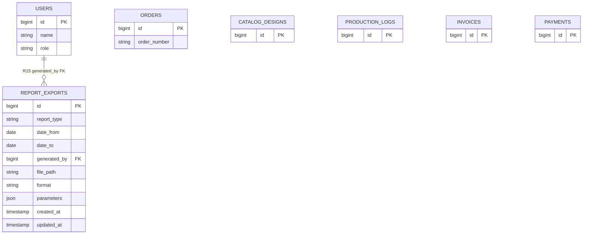

# REPORT_EXPORTS — Relationship Diagram

**Module:** M12 Reports · **Entity:** E15 `report_exports` · **Status:** 🔜 Planned

**Visual:** [`REPORTS_ER.html`](REPORTS_ER.html)

---

## Figure 1 — ER diagram (physical + logical)



**Logical reads (Report Engine — dashed, no FK):**

```
REPORT_ENGINE - - - reads - - -> ORDERS
REPORT_ENGINE - - - reads - - -> USERS
REPORT_ENGINE - - - reads - - -> CATALOG_DESIGNS
REPORT_ENGINE - - - reads - - -> PRODUCTION_LOGS
REPORT_ENGINE - - - reads - - -> METAL_PRICES
REPORT_ENGINE - - - reads - - -> INVOICES
REPORT_ENGINE - - - reads - - -> PAYMENTS
REPORT_ENGINE - - - reads - - -> CATEGORIES
```

---

## Figure 2 — Focused relationship view

```
                    ┌─────────────────────────────────────┐
                    │         REPORT_ENGINE               │
                    │    (logical — no database table)    │
                    └──────────────┬──────────────────────┘
           reads (dashed)          │          saves export metadata
    ┌────────┬────────┬───────────┼───────────┬────────┐
    ▼        ▼        ▼           ▼           ▼        ▼
 ORDERS  USERS  CATALOG_*   PROD_LOGS   INVOICES  PAYMENTS
    │                              ▲
    │                              │
    │         ┌────────────────────┴──────────────┐
    │         │       REPORT_EXPORTS (E15)        │
    │         │  id, report_type, file_path, ...  │
    │         └────────────────▲──────────────────┘
    │                          │
    │              R15 generates_export (1:N)
    │              FK: generated_by
    │                          │
    └──────────────────────────┴── USERS (admin/staff)
```

---

## All relationships

| ID | Relationship | From | To | FK column | Card. | Type |
|----|--------------|------|-----|-----------|-------|------|
| **R15** | generates_export | USERS | REPORT_EXPORTS | `generated_by` | 1 : N | **Physical FK** |
| — | reads | REPORT_ENGINE | ORDERS | — | M : N | Logical |
| — | reads | REPORT_ENGINE | USERS | — | M : N | Logical |
| — | reads | REPORT_ENGINE | CATALOG_DESIGNS | — | M : N | Logical |
| — | reads | REPORT_ENGINE | PRODUCTION_LOGS | — | M : N | Logical |
| — | reads | REPORT_ENGINE | METAL_PRICES | — | M : N | Logical |
| — | reads | REPORT_ENGINE | INVOICES | — | M : N | Logical |
| — | reads | REPORT_ENGINE | PAYMENTS | — | M : N | Logical |
| — | reads | REPORT_ENGINE | CATEGORIES | — | M : N | Logical |

---

## Participation

| Entity | Relationship | Participation |
|--------|--------------|---------------|
| REPORT_EXPORTS | R15 ← USERS | **Total** — every export must have `generated_by` |
| USERS (admin) | R15 → REPORT_EXPORTS | **Partial** — admin may never export |
| Other entities | logical reads | **Partial** — read only when report runs |

---

## Report type → entities

| report_type | Entities used |
|-------------|---------------|
| order_summary | orders, users, catalog_designs |
| sales_revenue | orders, invoices, payments |
| customer | users, orders |
| production | orders, production_logs, users |
| delivery | orders |
| inventory | catalog_designs, categories |
| billing_collection | invoices, payments, users |
| daily_summary | all tables |

---

## Viva one-liner

> **`report_exports` has one physical relationship R15 to users (1:N via generated_by). All other links are logical read-only queries through the Report Engine — no foreign keys to orders, invoices, or other entities.**

---

*Open [`REPORTS_ER.html`](REPORTS_ER.html) · Print → PDF*
