# Sequence Diagrams — Rajabharana Jewellery System

**Stack:** Laravel 12 · Blade · MySQL

| Resource | File |
|----------|------|
| **Visual (browser / PDF)** | [`SEQUENCE_DIAGRAM.html`](SEQUENCE_DIAGRAM.html) |
| **Architecture reference** | [`SYSTEM_ARCHITECTURE.md`](SYSTEM_ARCHITECTURE.md) |

**Legend:** ✅ Implemented · 🔜 Planned (Sprint 9–10)

---

## Figure 1 — Customer login ✅

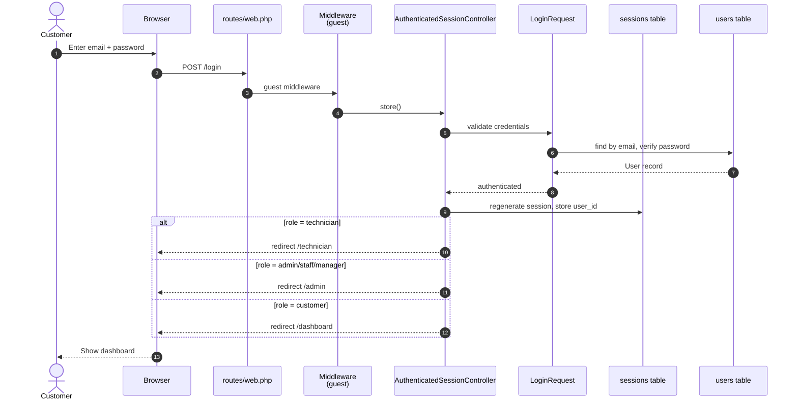

---

## Figure 2 — Customer registration ✅

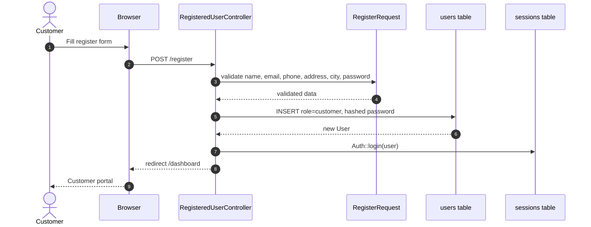

---

## Figure 3 — Customer places order ✅

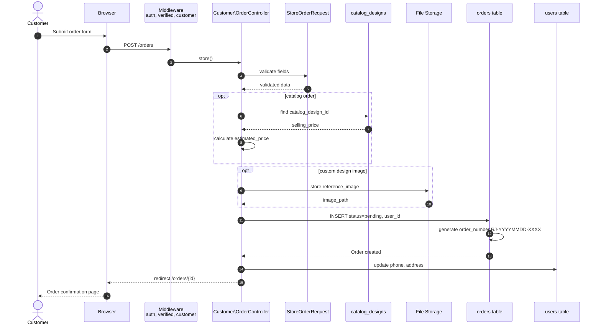

---

## Figure 4 — Admin confirms & updates order ✅

```mermaid
sequenceDiagram
    autonumber
    actor Staff as Sales Staff / Admin
    participant Browser
    participant MW as Middleware<br/>auth, admin, permission:orders.manage
    participant OrderCtrl as Admin\OrderController
    participant UpdateReq as UpdateOrderRequest
    participant Order as orders table

    Staff->>Browser: Update status, price, notes
    Browser->>MW: PATCH /admin/orders/{order}
    MW->>MW: EnsureAdmin + EnsurePermission
    MW->>OrderCtrl: update()
    OrderCtrl->>UpdateReq: validate status, estimated_price, admin_notes
    UpdateReq-->>OrderCtrl: validated
    OrderCtrl->>Order: UPDATE status, estimated_price, etc.
    Order-->>OrderCtrl: updated Order
    opt delivery overdue
        OrderCtrl-->>Browser: redirect + warning flash
    else success
        OrderCtrl-->>Browser: redirect + success flash
    end
    Browser-->>Staff: Updated order detail page
```

---

## Figure 5 — Admin assigns technician ✅

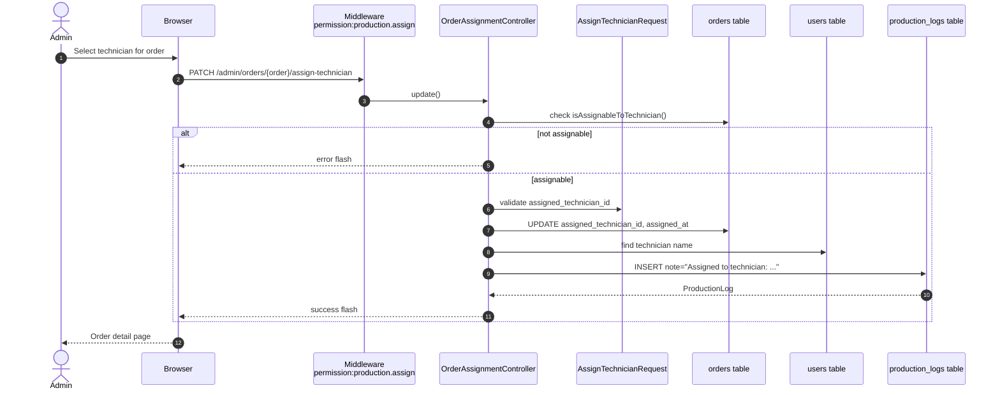

---

## Figure 6 — Technician updates production status ✅

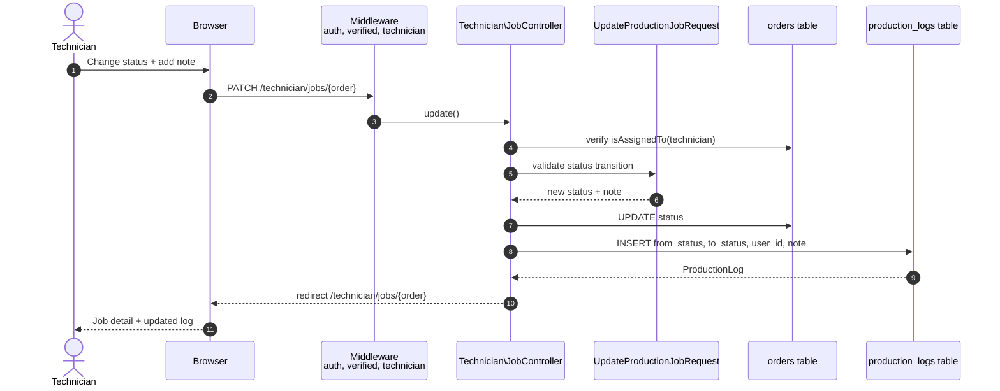

---

## Figure 7 — Inventory manager updates catalogue ✅

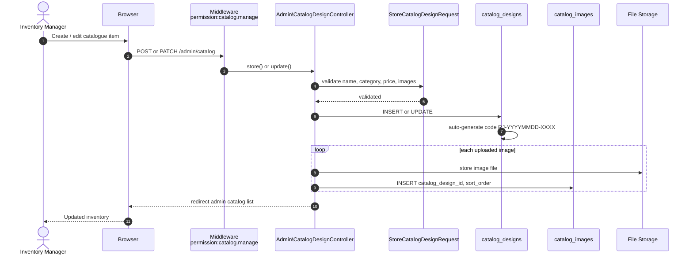

---

## Figure 8 — Admin updates metal prices ✅

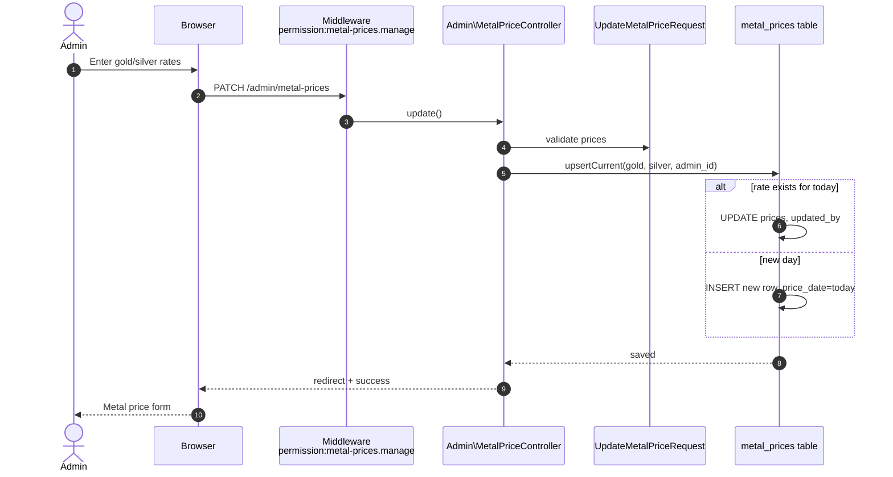

---

## Figure 9 — Generate invoice (Billing) 🔜

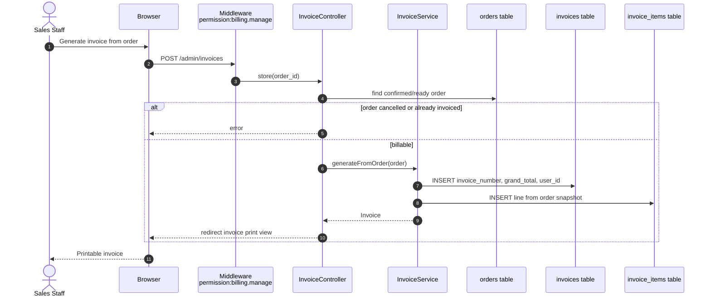

---

## Figure 10 — Record payment (Payment) 🔜

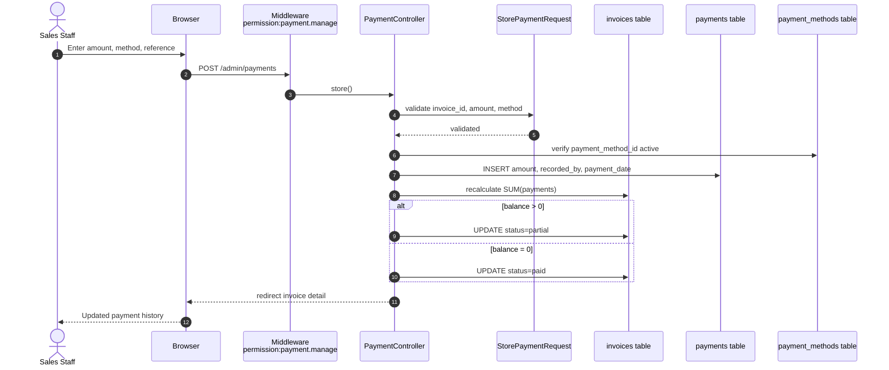

---

## Figure 11 — Generate report (Reports) 🔜

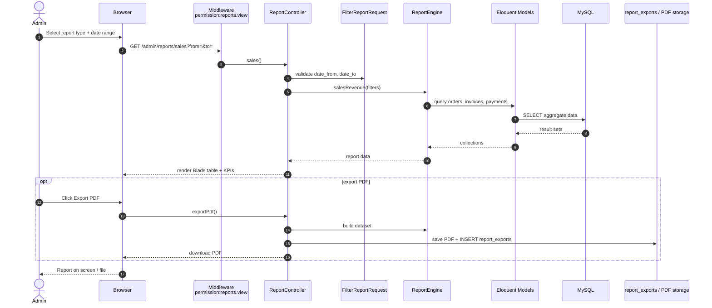

---

## Figure 12 — Complete order lifecycle ✅ + 🔜

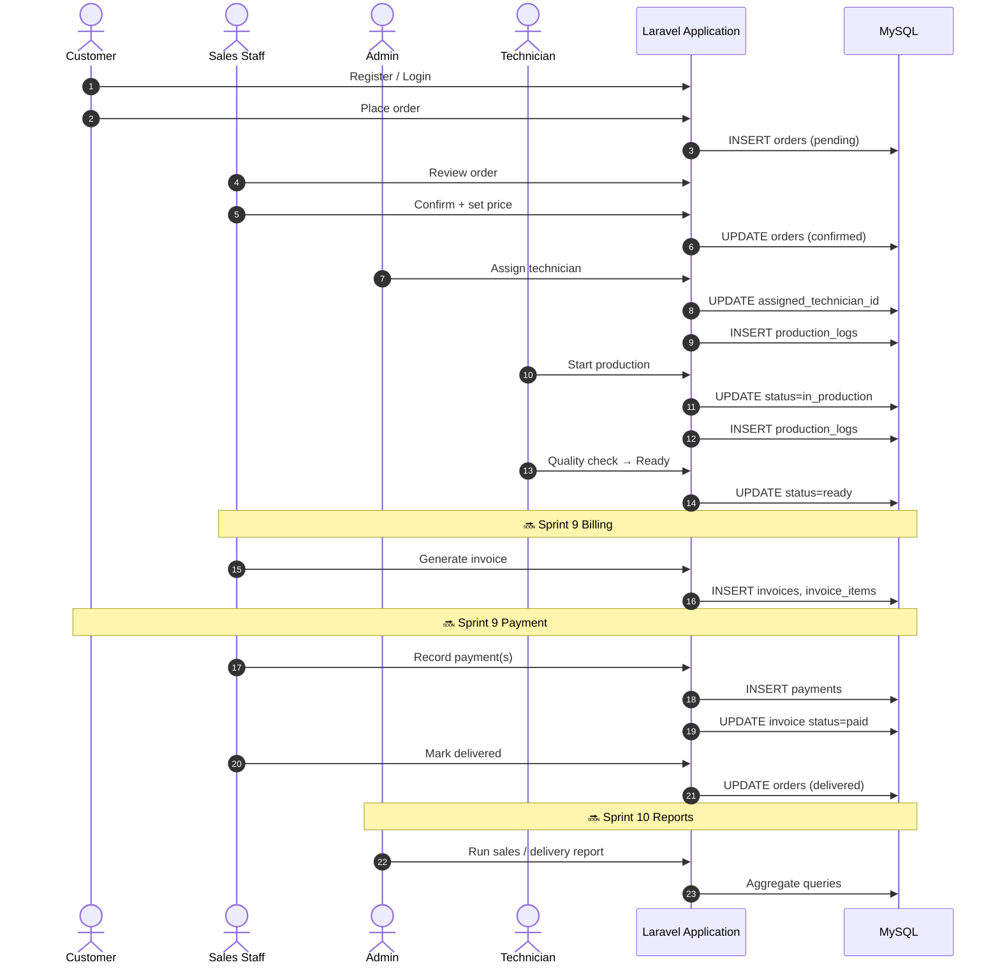

---

## Diagram usage in report

| Figure | Report section | Actor |
|--------|----------------|-------|
| 1–2 | Authentication design | Customer |
| 3 | Customer module / Order placement | Customer |
| 4–5 | Admin order management | Staff, Admin |
| 6 | Workshop module | Technician |
| 7–8 | Inventory & metal price | Manager, Admin |
| 9–10 | Billing & payment (planned) | Staff |
| 11 | Reports module (planned) | Admin |
| 12 | End-to-end workflow | All users |

---

## Viva one-liner

> **Sequence diagrams show message flow between actors, controllers, middleware, form requests, models, and the database — from login through order placement, admin confirmation, technician assignment, production updates, and planned billing/payment/report flows.**

---

*Open [`SEQUENCE_DIAGRAM.html`](SEQUENCE_DIAGRAM.html) · Print → PDF for Word.*
