# Rajabharana Jewellery Management System — Architecture Diagrams

Use these diagrams in your project report (Word). Export from [Mermaid Live Editor](https://mermaid.live) or screenshot from VS Code/Cursor preview.

**Whole system class diagram:** [`SYSTEM_ARCHITECTURE_CLASS_DIAGRAM.html`](SYSTEM_ARCHITECTURE_CLASS_DIAGRAM.html) · [`SYSTEM_ARCHITECTURE_CLASS_DIAGRAM.md`](SYSTEM_ARCHITECTURE_CLASS_DIAGRAM.md)

**Sequence diagrams:** [`SEQUENCE_DIAGRAM.html`](SEQUENCE_DIAGRAM.html) · [`SEQUENCE_DIAGRAM.md`](SEQUENCE_DIAGRAM.md)

**Use case diagrams (whole system + generalization):** [`USE_CASE_DIAGRAM.html`](USE_CASE_DIAGRAM.html) · [`USE_CASE_DIAGRAM.md`](USE_CASE_DIAGRAM.md)

**Use case diagrams (by user role):** [`USE_CASE_DIAGRAM_USERS.html`](USE_CASE_DIAGRAM_USERS.html) · [`USE_CASE_DIAGRAM_USERS.md`](USE_CASE_DIAGRAM_USERS.md)

**Use case diagram (Administrator):** [`USE_CASE_DIAGRAM_ADMIN.html`](USE_CASE_DIAGRAM_ADMIN.html) · [`USE_CASE_DIAGRAM_ADMIN.md`](USE_CASE_DIAGRAM_ADMIN.md)

**Activity diagram (Administrator):** [`ACTIVITY_DIAGRAM_ADMIN.html`](ACTIVITY_DIAGRAM_ADMIN.html) · [`ACTIVITY_DIAGRAM_ADMIN.md`](ACTIVITY_DIAGRAM_ADMIN.md)

**Wireframe diagrams:** [`WIREFRAME.html`](WIREFRAME.html) · [`WIREFRAME.md`](WIREFRAME.md)

**Technology stack (for report):** [`TECHNOLOGY_STACK.html`](TECHNOLOGY_STACK.html) · [`TECHNOLOGY_STACK.md`](TECHNOLOGY_STACK.md)

**Design patterns (for report):** [`DESIGN_PATTERNS.html`](DESIGN_PATTERNS.html) · [`DESIGN_PATTERNS.md`](DESIGN_PATTERNS.md)

**Implementation (Section 6.3):** [`IMPLEMENTATION.html`](IMPLEMENTATION.html) · [`IMPLEMENTATION.md`](IMPLEMENTATION.md)

**Registration module (detailed):** [`IMPLEMENTATION_REGISTER.html`](IMPLEMENTATION_REGISTER.html) · [`IMPLEMENTATION_REGISTER.md`](IMPLEMENTATION_REGISTER.md)

**Project setup (installation):** [`PROJECT_SETUP.html`](PROJECT_SETUP.html) · [`PROJECT_SETUP.md`](PROJECT_SETUP.md)

**Planned modules included:** Reports (Sprint 10)

---

## 1. High-Level System Architecture (3-Tier)

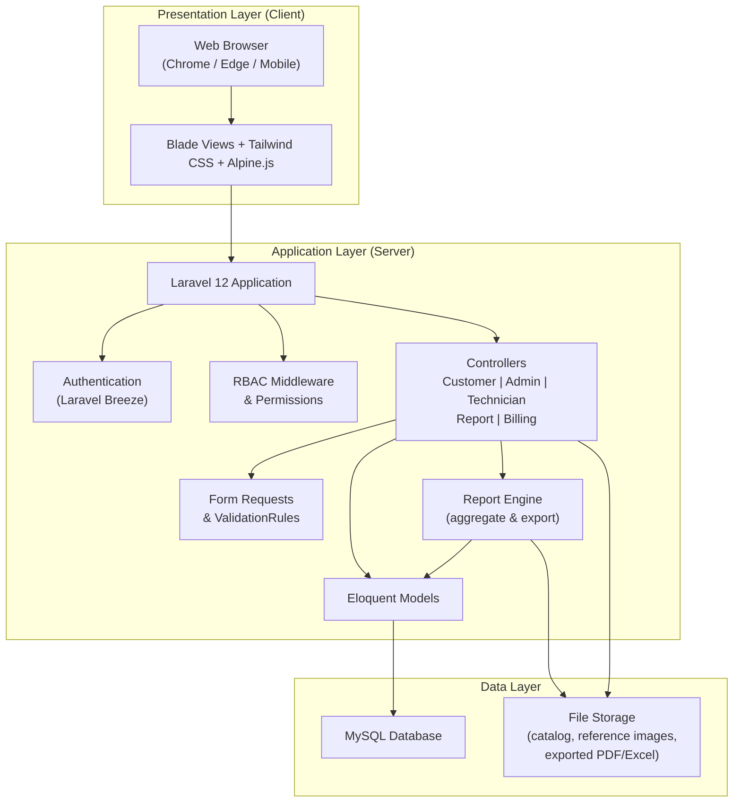

---

## 2. User & Panel Architecture

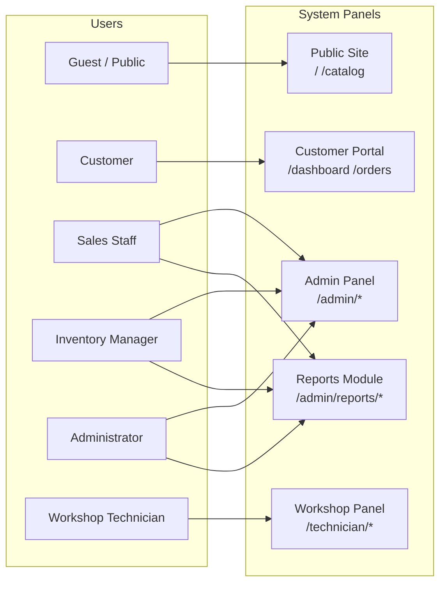

---

## 3. Application Module Architecture

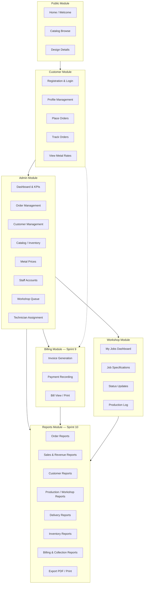

---

## 4. MVC Architecture (Laravel)

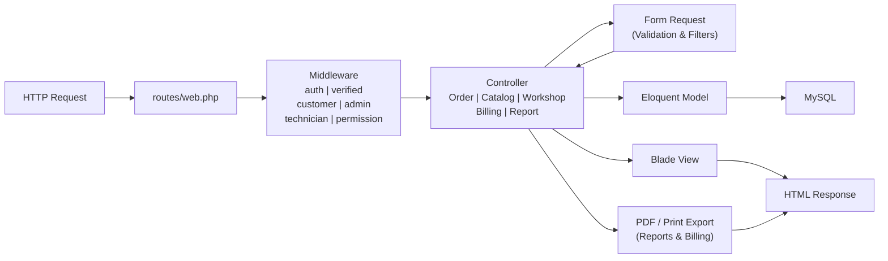

---

## 5. Security & RBAC Architecture

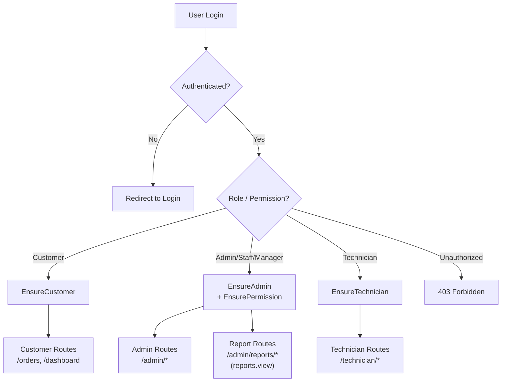

---

## 6. Database Architecture (Entity Relationship — Full Attributes)

**Legend:** ✅ Implemented · 🔜 Planned (Sprint 9 Billing)

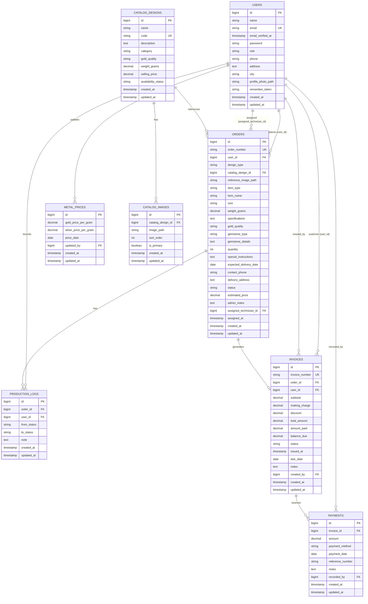

**Note:** Reports module (Sprint 10) reads from all tables above — no separate report table; PDF exports stored in file storage.

### Relationship Summary

| Relationship | Type | Description |
|--------------|------|-------------|
| users → orders (user_id) | 1:N | Customer places many orders |
| users → orders (assigned_technician_id) | 1:N | Technician assigned to many orders |
| users → production_logs | 1:N | Staff/technician records log entries |
| users → metal_prices (updated_by) | 1:N | Admin updates metal rates |
| catalog_designs → catalog_images | 1:N | One design has many images |
| catalog_designs → orders | 1:N | Catalogue design linked to orders |
| orders → production_logs | 1:N | One order has many log entries |
| orders → invoices | 1:1 | One order generates one invoice |
| invoices → payments | 1:N | One invoice has many payments |
| users → invoices (user_id) | 1:N | Customer billed on many invoices |
| users → payments (recorded_by) | 1:N | Staff records many payments |

---

## 7. Order Processing Architecture

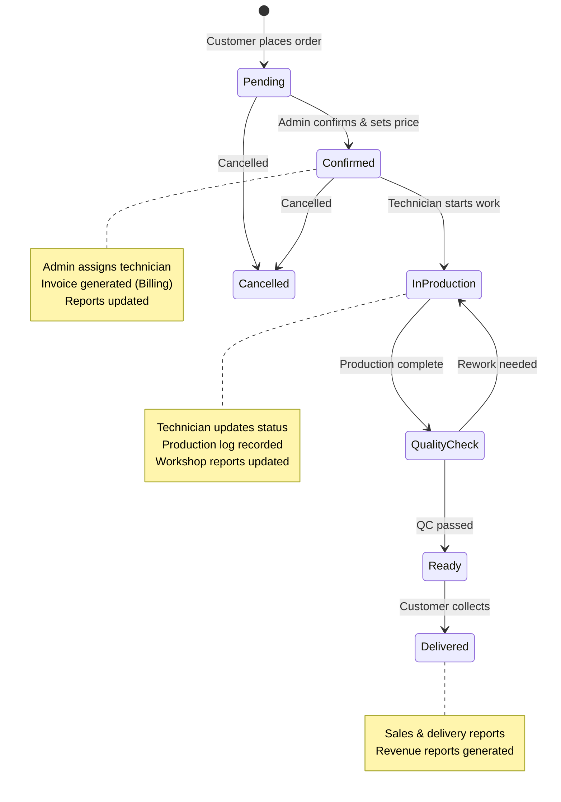

---

## 8. Deployment Architecture

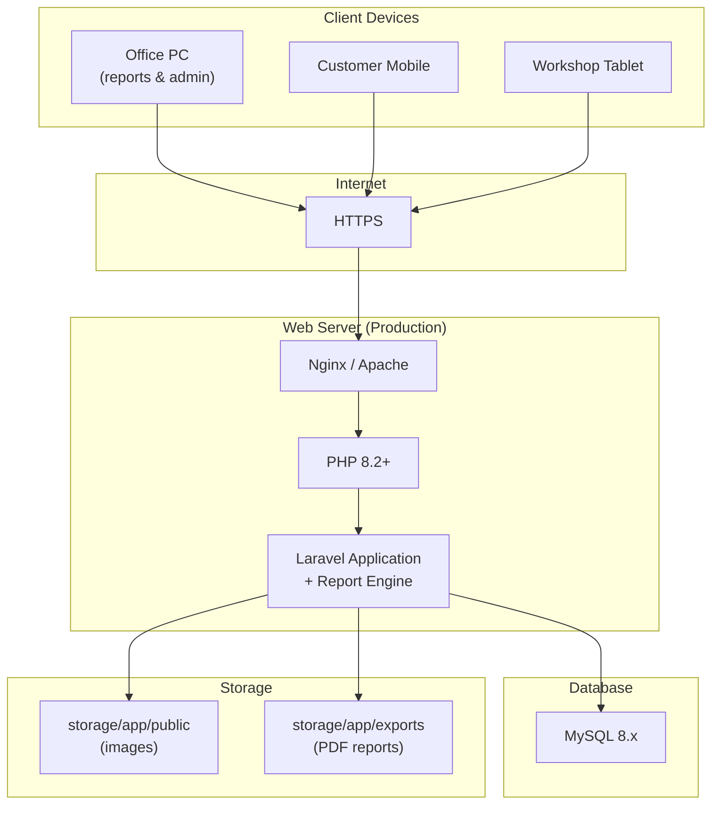

---

## 9. Technology Stack Diagram

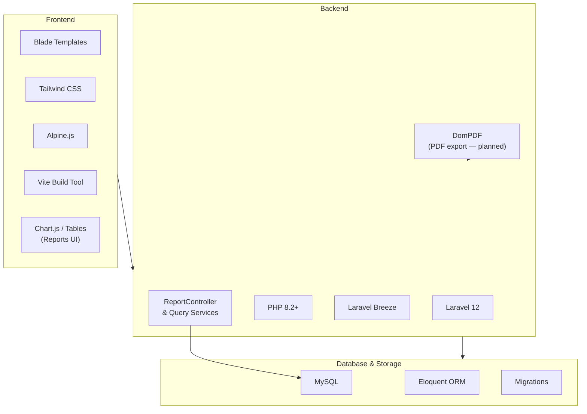

---

## 10. Billing Module Architecture (Sprint 9 — Planned)

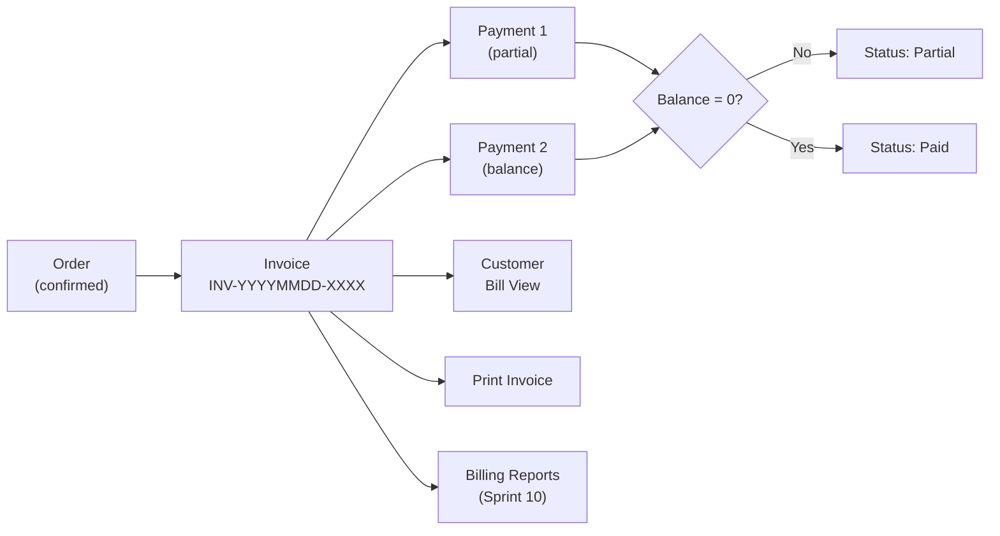

---

## 11. Reports Module Architecture (Sprint 10 — Planned)

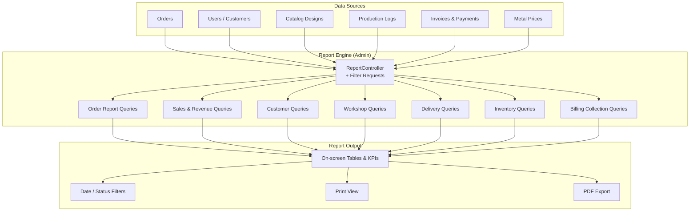

### Reports Module — Report Types

| Report | Description | Data source | Access |
|--------|-------------|-------------|--------|
| Order Summary | Orders by status, date range | `orders` | Admin, Sales Staff |
| Sales & Revenue | Total quoted/delivered value | `orders`, `invoices` | Admin |
| Customer Report | Customers and order counts | `users`, `orders` | Admin, Sales Staff |
| Production Report | Jobs per technician, stages | `orders`, `production_logs` | Admin |
| Delivery Report | Overdue, due soon, on-time | `orders` | Admin, Sales Staff |
| Inventory Report | Stock status, catalogue items | `catalog_designs` | Admin, Manager |
| Billing Collection | Paid, unpaid, partial balances | `invoices`, `payments` | Admin |
| Daily Summary | Combined KPIs for management | All modules | Admin |

### Reports Module — Routes (Planned)

| Route | Description |
|-------|-------------|
| `/admin/reports` | Reports dashboard / index |
| `/admin/reports/orders` | Order reports |
| `/admin/reports/sales` | Sales & revenue reports |
| `/admin/reports/customers` | Customer reports |
| `/admin/reports/production` | Workshop / technician reports |
| `/admin/reports/delivery` | Delivery performance reports |
| `/admin/reports/inventory` | Inventory reports |
| `/admin/reports/billing` | Billing & collection reports |

### Reports Module — RBAC (Planned)

| Permission | Roles |
|------------|-------|
| `reports.view` | Administrator, Sales Staff, Inventory Manager (inventory only) |
| `reports.export` | Administrator |

---

## 12. Complete System Overview (All Modules)

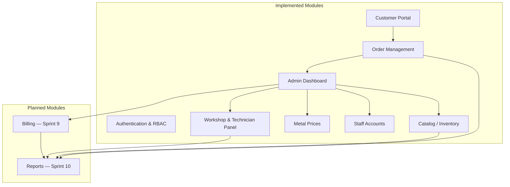

---

## Diagram Usage in Report

| Diagram | Report section |
|---------|----------------|
| 1. High-Level 3-Tier | System Architecture |
| 2. User & Panel | System Overview |
| 3. Application Modules | System Design |
| 4. MVC | Implementation / Design |
| 5. Security & RBAC | Security Design |
| 6. Database ER | Database Design |
| 7. Order Processing | Workflow / Process Design |
| 8. Deployment | Deployment Architecture |
| 9. Technology Stack | Technology Stack |
| 10. Billing | Sprint 9 — Billing Module |
| 11. Reports | Sprint 10 — Reports Module |
| 12. Complete System Overview | Full System Architecture Summary |
