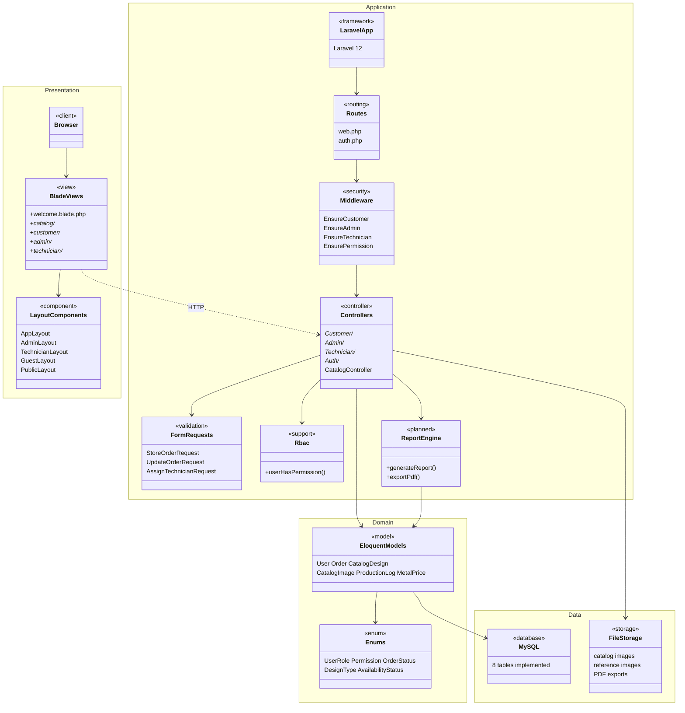
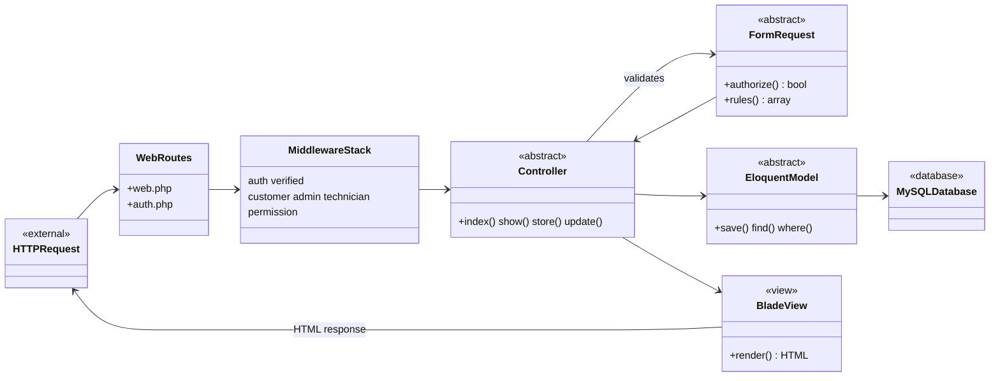
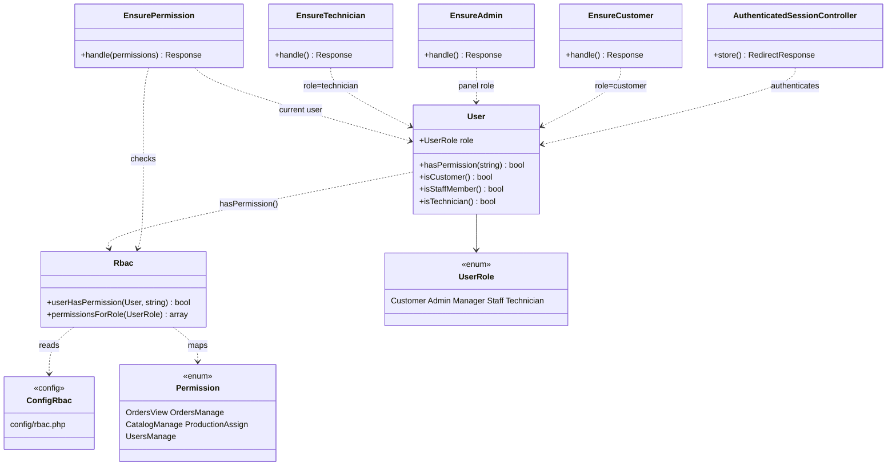
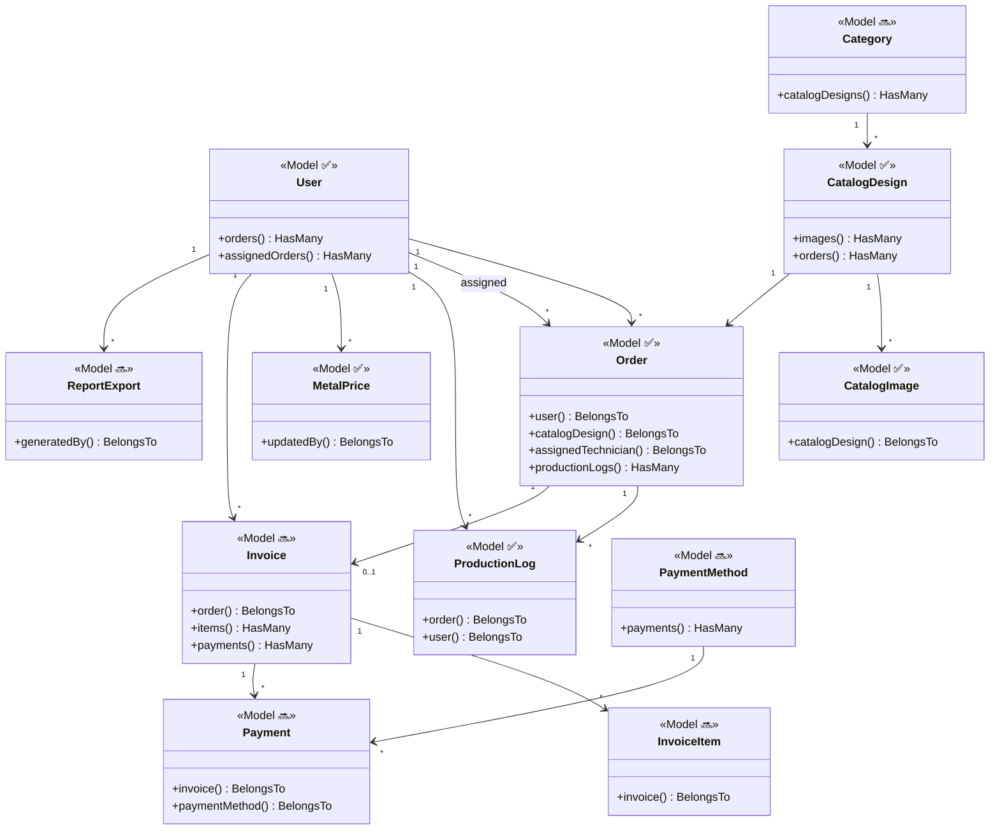
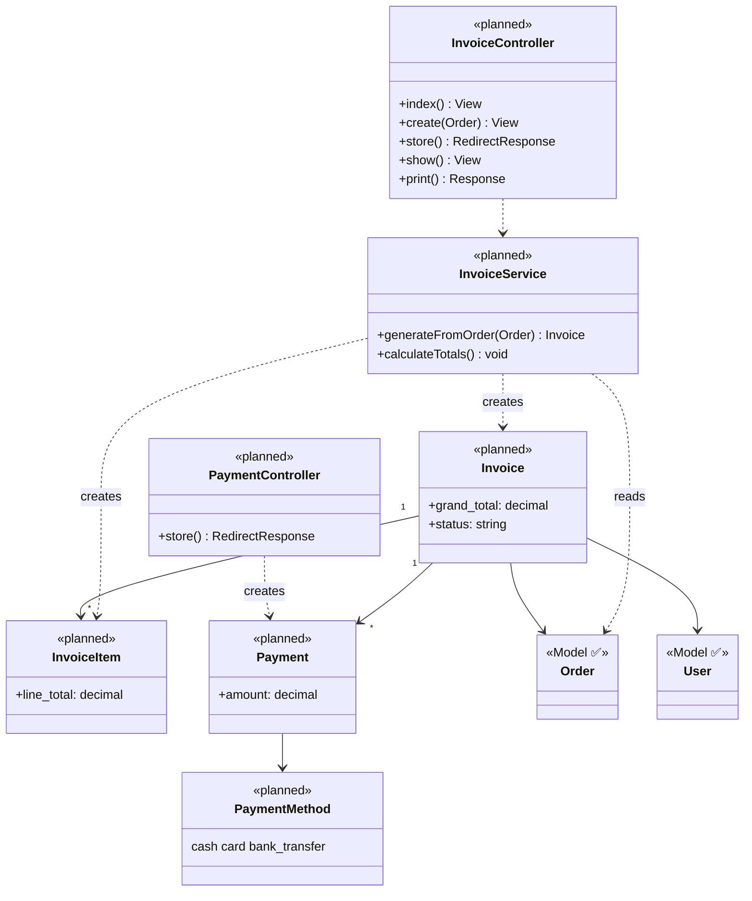
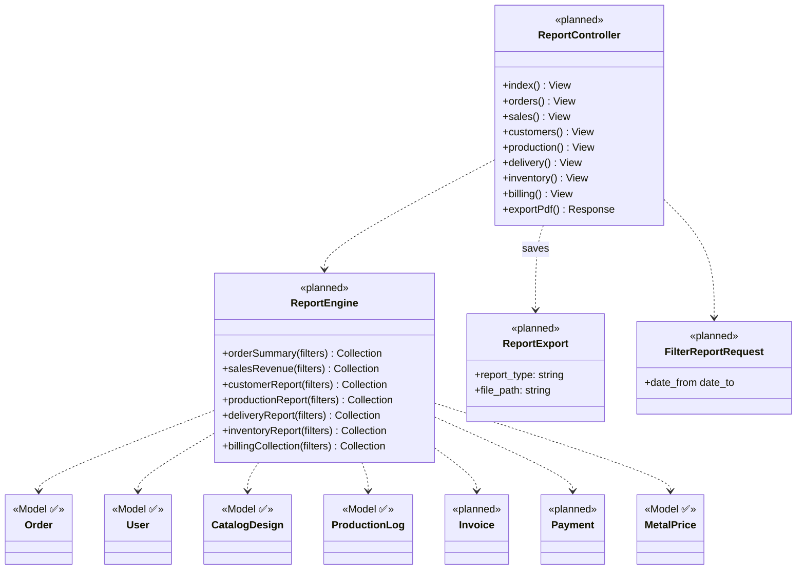

# System Architecture — Whole System Class Diagram

**Rajabharana Jewellery Management System**  
Aligned with [`SYSTEM_ARCHITECTURE.md`](SYSTEM_ARCHITECTURE.md)

| Resource | File |
|----------|------|
| **Visual (browser / PDF)** | [`SYSTEM_ARCHITECTURE_CLASS_DIAGRAM.html`](SYSTEM_ARCHITECTURE_CLASS_DIAGRAM.html) |
| **Domain-only class diagram** | [`CLASS_DIAGRAM.md`](CLASS_DIAGRAM.md) |

**Legend:** ✅ Implemented · 🔜 Planned (Sprint 9–10)

---

## 1. Three-tier architecture (class view)

Maps **Presentation → Application → Data** from System Architecture §1.



---

## 2. Module architecture (all modules → classes)

Maps System Architecture §3 and §12.

```mermaid
classDiagram
    direction TB

    namespace M1_Auth_RBAC {
        class AuthControllers {
            AuthenticatedSessionController
            RegisteredUserController
            PasswordResetLinkController
        }
        class StaffUserController
        class Rbac
        class User
        class UserRole
        class Permission
    }

    namespace M2_Customer {
        class CustomerDashboardController
        class CustomerOrderController
        class ProfileController
    }

    namespace M3_Catalog {
        class CatalogController
        class CatalogDesignController
        class CatalogDesign
        class CatalogImage
    }

    namespace M4_Orders {
        class CustomerOrderController
        class AdminOrderController
        class Order
        class OrderStatus
        class DesignType
    }

    namespace M5_Workshop {
        class WorkshopController
        class OrderAssignmentController
        class TechnicianJobController
        class ProductionLog
    }

    namespace M6_Inventory {
        class CatalogDesignController
        class AvailabilityStatus
        class Category {
            <<planned>>
        }
    }

    namespace M7_MetalPrice {
        class MetalPriceController
        class MetalPrice
    }

    namespace M8_Billing {
        class InvoiceController {
            <<planned>>
        }
        class Invoice {
            <<planned>>
        }
        class InvoiceItem {
            <<planned>>
        }
    }

    namespace M9_Payment {
        class PaymentController {
            <<planned>>
        }
        class Payment {
            <<planned>>
        }
        class PaymentMethod {
            <<planned>>
        }
    }

    namespace M10_Notification {
        class NotificationModel {
            <<planned>>
        }
    }

    namespace M11_Reports {
        class ReportController {
            <<planned>>
        }
        class ReportExport {
            <<planned>>
        }
        class ReportEngine {
            <<planned>>
        }
    }

    M2_Customer --> M4_Orders
    M4_Orders --> M5_Workshop
    M3_Catalog --> M4_Orders
    M4_Orders --> M8_Billing
    M8_Billing --> M9_Payment
    M8_Billing --> M11_Reports
    M5_Workshop --> M11_Reports
    M1_Auth_RBAC --> M2_Customer
    M1_Auth_RBAC --> M4_Orders
```

---

## 3. MVC request flow (class interactions)

Maps System Architecture §4.



---

## 4. Security & RBAC class diagram

Maps System Architecture §5.



---

## 5. Domain model (implemented + planned)

Maps System Architecture §6.



---

## 6. Controller layer (full list) ✅

| Package | Class | Uses model(s) |
|---------|-------|---------------|
| `Auth` | AuthenticatedSessionController, RegisteredUserController, PasswordResetLinkController, NewPasswordController, PasswordController, VerifyEmailController, … | User |
| `Customer` | DashboardController, OrderController | Order, CatalogDesign, User |
| `Admin` | DashboardController, OrderController, OrderAssignmentController, CatalogDesignController, CustomerController, WorkshopController, MetalPriceController, StaffUserController | All models |
| `Technician` | DashboardController, JobController | Order, ProductionLog |
| — | CatalogController | CatalogDesign |
| — | ProfileController | User |

---

## 7. Billing module class diagram 🔜

Maps System Architecture §10.



---

## 8. Reports module class diagram 🔜

Maps System Architecture §11.



---

## 9. Complete class inventory

| Layer | Implemented ✅ | Planned 🔜 |
|-------|----------------|------------|
| **Models** | User, Order, CatalogDesign, CatalogImage, ProductionLog, MetalPrice | Invoice, InvoiceItem, Payment, PaymentMethod, Category, Notification, ReportExport |
| **Controllers** | 20+ (Auth, Customer, Admin, Technician, Catalog, Profile) | InvoiceController, PaymentController, ReportController |
| **Middleware** | EnsureCustomer, EnsureAdmin, EnsureTechnician, EnsurePermission | — |
| **Enums** | UserRole, Permission, OrderStatus, DesignType, AvailabilityStatus | InvoiceStatus, PaymentStatus (optional) |
| **Support** | Rbac, ValidationRules, ValidPhone | InvoiceService, ReportEngine |
| **Form Requests** | 22 classes | FilterReportRequest, StoreInvoiceRequest, StorePaymentRequest |
| **View Components** | AppLayout, AdminLayout, TechnicianLayout, GuestLayout, PublicLayout | — |

---

## 10. Viva one-liner

> **The system architecture class diagram shows a 3-tier Laravel MVC design: Blade views and layout components in the presentation layer; controllers grouped by module (Customer, Admin, Technician) with middleware and FormRequests in the application layer; six Eloquent models and five enums in the domain layer; and MySQL plus file storage in the data layer. Billing and Reports add Invoice, Payment, ReportController, and ReportEngine classes in Sprint 9–10.**

---

*Open [`SYSTEM_ARCHITECTURE_CLASS_DIAGRAM.html`](SYSTEM_ARCHITECTURE_CLASS_DIAGRAM.html) for all figures · Print → PDF for report.*
