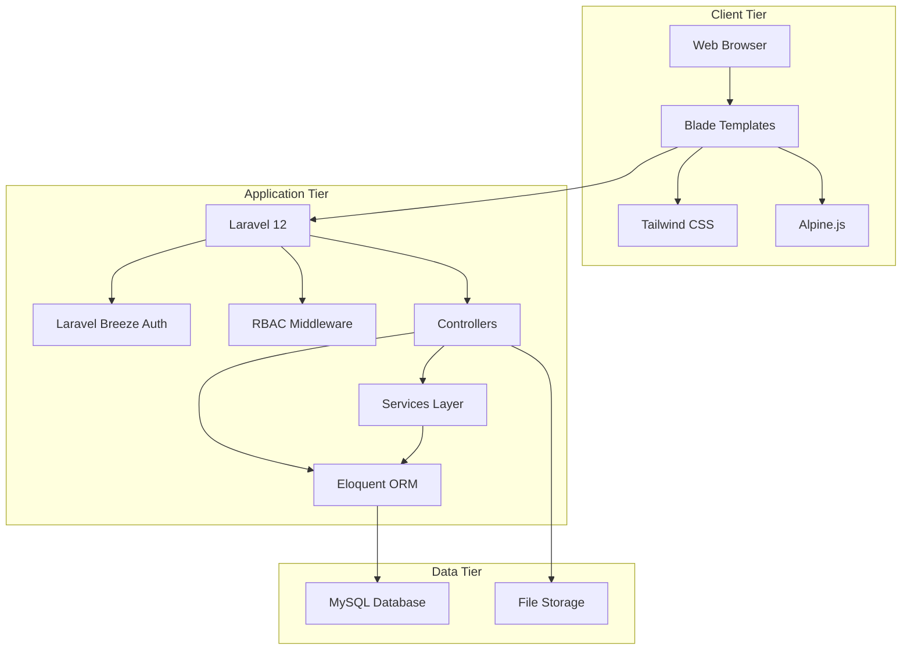

# Technology Stack — Rajabharana Jewellery Management System

**Project:** Rajabharana Jewellery Management System  
**Architecture:** 3-Tier · MVC (Model–View–Controller)  
**Type:** Web-based business application

Use this document directly in your project report (Chapter: Technology / System Development).

---

## 1. Stack overview

| Layer | Technology | Version | Purpose |
|-------|------------|---------|---------|
| **Programming language** | PHP | 8.2+ | Server-side application logic |
| **Backend framework** | Laravel | 12.x | Routing, MVC, ORM, auth, validation |
| **Authentication** | Laravel Breeze | 2.x | Login, registration, email verification, password reset |
| **Template engine** | Blade | (Laravel) | Server-rendered HTML views |
| **CSS framework** | Tailwind CSS | 3.x | Responsive UI styling |
| **CSS forms plugin** | @tailwindcss/forms | 0.5.x | Form input styling |
| **JavaScript (UI)** | Alpine.js | 3.x | Lightweight interactivity (dropdowns, sidebar) |
| **Build tool** | Vite | 7.x | Frontend asset bundling and hot reload |
| **HTTP client** | Axios | 1.x | AJAX requests (where needed) |
| **Database** | MySQL | 8.x (recommended) | Relational data storage |
| **ORM** | Eloquent | (Laravel) | Database models and relationships |
| **Session storage** | Database sessions | — | Secure user sessions |
| **File storage** | Laravel Filesystem (local/public disk) | — | Catalog images, order reference uploads |
| **Notifications** | Laravel Database Notifications | — | In-app customer billing alerts |
| **Testing** | PHPUnit | 11.x | Unit and feature tests |
| **Code style** | Laravel Pint | 1.x | PHP code formatting |
| **Package manager (PHP)** | Composer | 2.x | Dependency management |
| **Package manager (JS)** | NPM | — | Frontend dependencies |

---

## 2. Architecture diagram

---

## 3. Backend technologies

| Component | Description |
|-----------|-------------|
| **Laravel 12** | Core framework handling HTTP routing, middleware, dependency injection, and application lifecycle |
| **PHP 8.2+** | Typed properties, enums, and modern language features used across models and services |
| **Eloquent ORM** | Maps 12 domain models to database tables with relationships (HasMany, BelongsTo, HasOne) |
| **Form Requests** | Dedicated validation classes for orders, catalog, billing, payments, and staff accounts |
| **Service classes** | Business logic for invoicing (`InvoiceService`, `InvoiceCalculator`) and payments (`PaymentService`) |
| **Enums** | Type-safe statuses: `UserRole`, `OrderStatus`, `InvoiceStatus`, `PaymentStatus`, `DesignType`, etc. |
| **RBAC (Role-Based Access Control)** | Custom permission system via `config/rbac.php`, middleware, and `Rbac` support class |
| **Laravel Notifications** | Database notifications for invoice issued and payment received events |

---

## 4. Frontend technologies

| Component | Description |
|-----------|-------------|
| **Blade** | Layout components (`admin`, `app`, `guest`, `technician`), reusable UI components, and module views |
| **Tailwind CSS** | Utility-first styling; custom design tokens (jewel-gold, jewel-dark theme) |
| **Alpine.js** | Client-side behaviour: mobile nav, admin sidebar toggle, billing dropdown menu |
| **Vite + laravel-vite-plugin** | Compiles `resources/css/app.css` and `resources/js/app.js` for production |
| **Responsive design** | Mobile-friendly admin sidebar and customer portal layouts |

---

## 5. Database and storage

| Component | Description |
|-----------|-------------|
| **MySQL** | Primary database for production and academic deployment (users, orders, catalog, invoices, payments) |
| **Migrations** | Version-controlled schema definitions for all tables |
| **Seeders** | Sample users, catalog designs, metal prices, payment methods, billing settings |
| **Sessions table** | Server-side session persistence |
| **Notifications table** | Stores customer in-app notification records |
| **Public disk storage** | Uploaded catalog images and custom order reference designs |

**Main database tables (15):** users, password_reset_tokens, sessions, catalog_designs, catalog_images, orders, production_logs, metal_prices, invoices, invoice_items, payments, payment_methods, billing_settings, category_discounts, notifications

---

## 6. Security technologies

| Feature | Implementation |
|---------|----------------|
| **Authentication** | Laravel Breeze — session-based login with email verification |
| **Password hashing** | Bcrypt (configurable rounds) |
| **Authorization** | RBAC with role-to-permission mapping (Admin, Manager, Staff, Technician, Customer) |
| **Middleware** | `EnsureCustomer`, `EnsureAdmin`, `EnsureTechnician`, `EnsurePermission` |
| **CSRF protection** | Laravel built-in CSRF tokens on all forms |
| **Input validation** | Form Request classes + custom `ValidationRules` (including HTML sanitization rules) |
| **Mass assignment protection** | Eloquent `$fillable` on all models |

---

## 7. Development and deployment tools

| Tool | Use |
|------|-----|
| **Composer** | Install and manage PHP packages |
| **NPM** | Install and manage JavaScript/CSS packages |
| **Vite (`npm run dev`)** | Development server with hot module replacement |
| **Vite (`npm run build`)** | Production asset compilation |
| **Artisan CLI** | Migrations, seeders, route listing, cache management |
| **PHPUnit** | Automated testing |
| **Laravel Pint** | Code style enforcement |
| **Git** | Source code version control |

**Typical deployment stack:** Windows/Linux server · Apache or Nginx · PHP 8.2+ · MySQL 8 · Composer · Node.js (build step only)

---

## 8. Module-to-technology mapping

| Module | Key technologies used |
|--------|----------------------|
| M1 Authentication | Laravel Breeze, sessions, bcrypt, email verification |
| M2 Customer portal | Blade, Tailwind, Eloquent, Form Requests |
| M3 Public catalog | Blade, Eloquent, file storage |
| M4 Orders | Eloquent, enums, validation, Blade |
| M5 Workshop / Production | Eloquent, RBAC middleware, production logs |
| M6 Inventory (Catalog) | Eloquent, image upload, Tailwind admin UI |
| M7 Metal prices | Eloquent, admin form, config |
| M8 Billing | InvoiceService, InvoiceCalculator, Blade admin UI |
| M9 Payment | PaymentService, Eloquent, partial payment support |
| M10 Notifications | Laravel Database Notifications, Blade customer UI |
| M11 RBAC | Enums, middleware, config-driven permissions |

---

## 9. Report paragraph (copy-paste)

> The Rajabharana Jewellery Management System was developed as a web-based application using a **3-tier architecture**. The **presentation tier** consists of HTML rendered through **Laravel Blade** templates, styled with **Tailwind CSS**, and enhanced with **Alpine.js** for interactive components. The **application tier** is built on **PHP 8.2** and the **Laravel 12** framework, which provides routing, authentication (**Laravel Breeze**), role-based access control, form validation, and a service-oriented business logic layer. The **data tier** uses a **MySQL** relational database accessed through **Eloquent ORM**, with **Laravel migrations** for schema management. File uploads (catalog images and custom design references) are stored using Laravel's filesystem abstraction. Frontend assets are compiled using **Vite**. The system supports six user roles (Guest, Customer, Staff, Manager, Administrator, and Technician) across separate web panels, with session-based authentication and permission middleware enforcing secure access to each module.

---

## 10. Related documentation

| Document | Content |
|----------|---------|
| [`SYSTEM_ARCHITECTURE.md`](SYSTEM_ARCHITECTURE.md) | Architecture diagrams |
| [`CLASS_DIAGRAM.md`](CLASS_DIAGRAM.md) | Class diagrams with all attributes |
| [`COMPLETE_ER_DIAGRAM.md`](COMPLETE_ER_DIAGRAM.md) | Database ER diagram |
| [`USER_ROLES_FUNCTIONS.md`](USER_ROLES_FUNCTIONS.md) | User roles and permissions |

---

*Rajabharana Jewellery Management System · Technology Stack · For academic project report*
