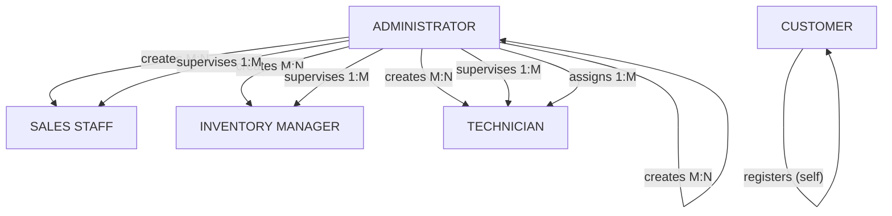
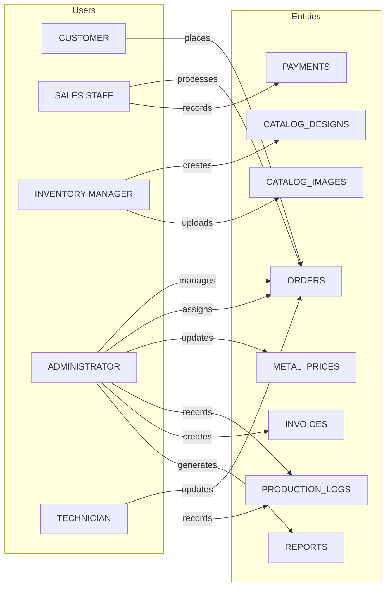
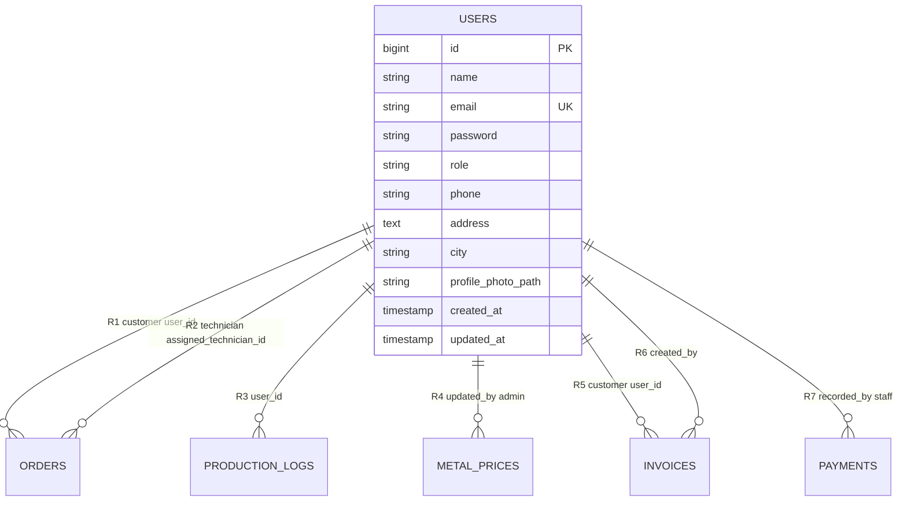
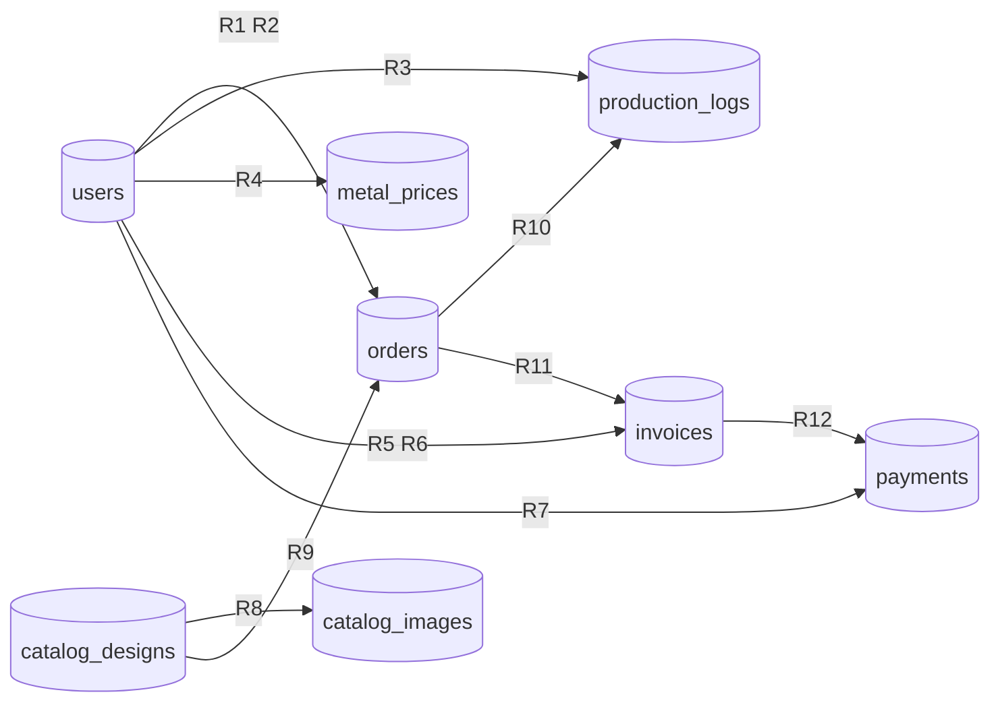

# ER Diagram — All Users + All Modules

**Rajabharana Jewellery Management System**

**Recommended visual:** [`docs/WHOLE_SYSTEM_ER_DIAGRAM.html`](WHOLE_SYSTEM_ER_DIAGRAM.html) — all users, all modules, R1–R12.

Also: [`USERS_ER_DIAGRAM.html`](USERS_ER_DIAGRAM.html) · [`DATABASE_ER_DIAGRAM.md`](DATABASE_ER_DIAGRAM.md)

---

## 1. All User Entities (Conceptual ER)

Five user types in the system:

| # | User Entity | `role` value | Panel | Description |
|---|-------------|--------------|-------|-------------|
| U1 | **CUSTOMER** | `customer` | `/dashboard`, `/orders` | Places and tracks jewellery orders |
| U2 | **SALES STAFF** | `staff` | `/admin/*` | Processes orders, views customers & catalog |
| U3 | **INVENTORY MANAGER** | `manager` | `/admin/catalog/*` | Manages catalogue items and images |
| U4 | **ADMINISTRATOR** | `admin` | `/admin/*` | Full system access, staff management |
| U5 | **TECHNICIAN** | `technician` | `/technician/*` | Workshop jobs (no customer phone/address) |

---

## 2. User Entity Attributes

| Attribute | CUSTOMER | STAFF | MANAGER | ADMIN | TECHNICIAN |
|-----------|:--------:|:-----:|:-------:|:-----:|:----------:|
| id (PK) | ✓ | ✓ | ✓ | ✓ | ✓ |
| name | ✓ | ✓ | ✓ | ✓ | ✓ |
| email (UK) | ✓ | ✓ | ✓ | ✓ | ✓ |
| password | ✓ | ✓ | ✓ | ✓ | ✓ |
| role | ✓ | ✓ | ✓ | ✓ | ✓ |
| phone | ✓ | — | — | — | — |
| address | ✓ | — | — | — | — |
| city | ✓ | — | — | — | — |
| profile_photo_path | ✓ | ✓ | ✓ | ✓ | ✓ |

**Physical DB:** All attributes stored in one `users` table; `role` distinguishes user type.

---

## 3. User-to-User Relationships (Account Management)

| Relationship | From | To | Cardinality | Meaning |
|--------------|------|-----|-------------|---------|
| **registers** | — | CUSTOMER | N | Self-registration via `/register` |
| **creates** | ADMINISTRATOR | STAFF, MANAGER, TECHNICIAN, ADMIN | 1 : M | Admin creates staff accounts |
| **supervises** | ADMINISTRATOR | STAFF, MANAGER, TECHNICIAN | 1 : M | Admin manages all staff |
| **assigns** | ADMINISTRATOR | TECHNICIAN → ORDERS | 1 : M | Admin assigns technician to production job |

---

## 4. All Users → System Operations (Conceptual ER)

### Operations by user

| User | Relationship | Target Entity | FK / Link | Status |
|------|--------------|---------------|-----------|--------|
| CUSTOMER | **places** | ORDERS | `orders.user_id` | ✅ |
| SALES STAFF | **processes** | ORDERS | status, price updates | ✅ |
| SALES STAFF | **records** | PAYMENTS | `payments.recorded_by` | 🔜 Sprint 9 |
| INVENTORY MANAGER | **creates** | CATALOG_DESIGNS | — | ✅ |
| INVENTORY MANAGER | **uploads** | CATALOG_IMAGES | — | ✅ |
| ADMINISTRATOR | **manages** | ORDERS | all order fields | ✅ |
| ADMINISTRATOR | **assigns** | ORDERS → TECHNICIAN | `assigned_technician_id` | ✅ |
| ADMINISTRATOR | **updates** | METAL_PRICES | `updated_by` | ✅ |
| ADMINISTRATOR | **records** | PRODUCTION_LOGS | `user_id` | ✅ |
| ADMINISTRATOR | **creates** | INVOICES | `created_by` | 🔜 Sprint 9 |
| ADMINISTRATOR | **generates** | REPORTS | `generated_by` | 🔜 Sprint 10 |
| TECHNICIAN | **updates** | ORDERS | production status | ✅ |
| TECHNICIAN | **records** | PRODUCTION_LOGS | `user_id` | ✅ |

---

## 5. Physical ER — users Table Relationships

| Role in `users.role` | Relationships used |
|----------------------|-------------------|
| `customer` | R1 (places orders) |
| `staff` | R3 (logs), R6 (invoices), R7 (payments) |
| `manager` | No direct FK — operates via catalog tables |
| `admin` | R2, R3, R4, R6 + staff account creation |
| `technician` | R2 (assigned), R3 (production logs) |

---

## 6. Test Accounts (Seeder)

| User Entity | Email | Password |
|-------------|-------|----------|
| CUSTOMER | customer@rajabharana.com | password |
| SALES STAFF | staff@rajabharana.com | Password1 |
| INVENTORY MANAGER | manager@rajabharana.com | Password1 |
| ADMINISTRATOR | admin@rajabharana.com | password |
| TECHNICIAN | technician@rajabharana.com | Password1 |

---

## 7. All Modules + Relationships (R1–R12)

| Module | Status | Entities | Relationships |
|--------|--------|----------|---------------|
| **M1 Auth & RBAC** | ✅ | users | Parent of R1–R7 |
| **M2 Catalogue** | ✅ | catalog_designs, catalog_images | R8, R9 |
| **M3 Customer Orders** | ✅ | users, orders, catalog_designs | R1, R9 |
| **M4 Metal Prices** | ✅ | metal_prices, users | R4 |
| **M5 Workshop** | ✅ | orders, production_logs, users | R2, R3, R10 |
| **M6 Billing** | 🔜 Sprint 9 | invoices, payments | R5, R6, R7, R11, R12 |
| **M7 Reports** | 🔜 Sprint 10 | reads all tables | uses R1–R12 |

---

## Related Diagrams

| File | Purpose |
|------|---------|
| [`WHOLE_SYSTEM_ER_DIAGRAM.html`](WHOLE_SYSTEM_ER_DIAGRAM.html) | **Complete** — users + modules + R1–R12 |
| [`USERS_ER_DIAGRAM.html`](USERS_ER_DIAGRAM.html) | Users + modules (4 figures) |
| [`CHEN_ER_DIAGRAM.html`](CHEN_ER_DIAGRAM.html) | Chen notation — full system |
| [`ER_DIAGRAM.html`](ER_DIAGRAM.html) | Database ER — all attributes |
| [`DATABASE_ER_DIAGRAM.md`](DATABASE_ER_DIAGRAM.md) | Full attribute & relationship tables |
