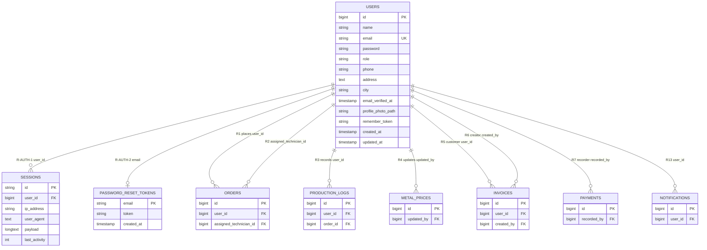

# User Module — Entities, Attributes & Relationships

**Rajabharana Jewellery Management System**

**Visual:** [`USER_MODULE_ER.html`](USER_MODULE_ER.html) · **Modules:** M1 Auth · M2 Customer · M11 RBAC

---

## 1. Module Overview

The **User Module** covers identity, authentication, customer accounts, staff accounts, role assignment, and all foreign-key links from `users` to other modules. Five user types share one physical table (`users`) distinguished by the `role` column.

| User Type | `role` value | Panel |
|-----------|--------------|-------|
| Customer | `customer` | `/dashboard`, `/orders` |
| Sales Staff | `staff` | `/admin/*` |
| Inventory Manager | `manager` | `/admin/catalog/*` |
| Administrator | `admin` | `/admin/*` (full) |
| Technician | `technician` | `/technician/*` |

---

## 2. Entities

### 2.1 users ✅ (core entity)

| Property | Value |
|----------|-------|
| **Description** | Registered account for all user types |
| **PK** | `id` |
| **FK** | — |
| **Required** | name, email, password, role, phone, address, city |
| **Optional** | email_verified_at, profile_photo_path, remember_token |
| **Unique** | email |
| **Derived** | role label (from `UserRole` enum) |
| **Multivalued** | — |

### 2.2 sessions ✅

| Property | Value |
|----------|-------|
| **Description** | Browser session store |
| **PK** | `id` |
| **FK** | `user_id` → users.id |
| **Required** | id, payload, last_activity |
| **Optional** | user_id, ip_address, user_agent |

### 2.3 password_reset_tokens ✅

| Property | Value |
|----------|-------|
| **Description** | Password recovery token |
| **PK** | `email` |
| **FK** | email → users.email (logical) |
| **Required** | email, token |
| **Optional** | created_at |

### 2.4 ROLE ✅ (conceptual — physical: `users.role`)

| Property | Value |
|----------|-------|
| **Description** | Job function (admin, manager, staff, technician, customer) |
| **PK** | role_code (conceptual) |
| **Physical** | `users.role` VARCHAR |

### 2.5 PERMISSION ✅ (conceptual — physical: `config/rbac.php`)

| Property | Value |
|----------|-------|
| **Description** | Atomic capability (e.g. orders.manage) |
| **PK** | permission_code (conceptual) |
| **Physical** | `App\Enums\Permission` + config map |

---

## 3. Entity Attributes — users

| # | Attribute | Data Type | Key | Nullable | Unique | Default |
|---|-----------|-----------|-----|:--------:|:------:|---------|
| 1 | id | BIGINT UNSIGNED | PK | No | Yes | AUTO_INCREMENT |
| 2 | name | VARCHAR(255) | | No | No | — |
| 3 | email | VARCHAR(255) | UK | No | Yes | — |
| 4 | email_verified_at | TIMESTAMP | | Yes | No | NULL |
| 5 | password | VARCHAR(255) | | No | No | — |
| 6 | role | VARCHAR(255) | | No | No | `customer` |
| 7 | phone | VARCHAR(25) | | No | No | — |
| 8 | address | TEXT | | No | No | — |
| 9 | city | VARCHAR(100) | | No | No | — |
| 10 | profile_photo_path | VARCHAR(255) | | Yes | No | NULL |
| 11 | remember_token | VARCHAR(100) | | Yes | No | NULL |
| 12 | created_at | TIMESTAMP | | Yes | No | NULL |
| 13 | updated_at | TIMESTAMP | | Yes | No | NULL |

---

## 4. Relationships with Attributes

### 4.1 Internal User Module relationships

| ID | Name | Parent | Child | FK Column | Card. | Nullable | On Delete | Business Rule |
|----|------|--------|-------|-----------|-------|:--------:|-----------|---------------|
| **R-AUTH-1** | has_session | users | sessions | user_id | 1:N | Yes | — | Guest sessions have NULL user_id |
| **R-AUTH-2** | requests_reset | users | password_reset_tokens | email | 1:0..1 | No | — | One token row per email during reset |
| **R14** | assigned | users | ROLE | role | M:1 | No | — | Every user has exactly one role |

### 4.2 User → other modules (outgoing FK references)

| ID | Name | Parent | Child | FK Column | Card. | Nullable | On Delete | Used By Role |
|----|------|--------|-------|-----------|-------|:--------:|-----------|--------------|
| **R1** | places | users | orders | user_id | 1:N | No | CASCADE | Customer |
| **R2** | assigned_to | users | orders | assigned_technician_id | 1:N | Yes | SET NULL | Technician |
| **R3** | records | users | production_logs | user_id | 1:N | No | CASCADE | Admin, Technician |
| **R4** | updates | users | metal_prices | updated_by | 1:N | Yes | SET NULL | Administrator |
| **R5** | billed_customer | users | invoices | user_id | 1:N | No | CASCADE | Customer 🔜 |
| **R6** | invoice_creator | users | invoices | created_by | 1:N | Yes | SET NULL | Admin, Staff 🔜 |
| **R7** | payment_recorder | users | payments | recorded_by | 1:N | No | CASCADE | Staff 🔜 |
| **R13** | receives | users | notifications | user_id | 1:N | No | CASCADE | All 🔜 |

### 4.3 RBAC relationships (conceptual)

| ID | Name | Parent | Child | Implementation | Card. | Business Rule |
|----|------|--------|-------|----------------|-------|---------------|
| **R15** | grants | ROLE | PERMISSION | config/rbac.php | M:N | Admin has `*` wildcard |
| **R15a** | via | ROLE | role_permission | config array | M:N | Bridge table (logical) |

---

## 5. Cardinality (Crow's Foot)

```
users (1) ——< (N) sessions              R-AUTH-1  FK: user_id
users (1) ——| (0..1) password_reset     R-AUTH-2  FK: email
users (M) ——| (1) role                  R14       attr: role

users (1) ——< (N) orders                R1        FK: user_id
users (1) ——o< (N) orders               R2        FK: assigned_technician_id
users (1) ——< (N) production_logs       R3        FK: user_id
users (1) ——o< (N) metal_prices         R4        FK: updated_by
users (1) ——< (N) invoices              R5        FK: user_id
users (1) ——o< (N) invoices             R6        FK: created_by
users (1) ——< (N) payments              R7        FK: recorded_by
users (1) ——< (N) notifications         R13       FK: user_id

ROLE (M) ——< (N) PERMISSION             R15       via config/rbac.php
```

---

## 6. Participation

| Relationship | Parent participation | Child participation |
|--------------|---------------------|---------------------|
| R-AUTH-1 | Partial (user may have no session) | Partial (guest sessions) |
| R-AUTH-2 | Partial (only during reset) | Total (token needs valid email) |
| R14 | Total (role NOT NULL) | Partial (role may have zero users) |
| R1 | Partial (staff never place orders) | Total (order requires customer) |
| R2 | Partial (not all techs assigned) | Partial (order may lack technician) |
| R3 | Partial | Total (log requires user_id) |
| R4 | Partial | Partial (updated_by nullable) |

---

## 7. Mermaid ER Diagram



---

## 8. Chen Notation (Text)

```
                    ┌──────── USERS ────────┐
                    │  id (PK)              │
                    │  name, email (UK)     │
                    │  password, role       │
                    │  phone, address, city │
                    └──────────┬────────────┘
           has_session (1,N)  │  requests_reset (1,1)
              FK: user_id      │     FK: email
                    ▼          ▼
              SESSIONS    PASSWORD_RESET_TOKENS

    assigned (M,1) FK: role ──► ROLE ──grants (M,N)──► PERMISSION

    places (1,N) FK: user_id ──────────────► ORDERS
    assigned_to (1,N) FK: assigned_technician_id ──► ORDERS
    records (1,N) FK: user_id ──► PRODUCTION_LOGS
    updates (1,N) FK: updated_by ──► METAL_PRICES
    billed (1,N) FK: user_id ──► INVOICES
    creates (1,N) FK: created_by ──► INVOICES
    records (1,N) FK: recorded_by ──► PAYMENTS
    receives (1,N) FK: user_id ──► NOTIFICATIONS
```

---

*See also: [01-authentication.md](MODULE_ER_DIAGRAMS/01-authentication.md) · [02-customer.md](MODULE_ER_DIAGRAMS/02-customer.md) · [11-rbac.md](MODULE_ER_DIAGRAMS/11-rbac.md)*
