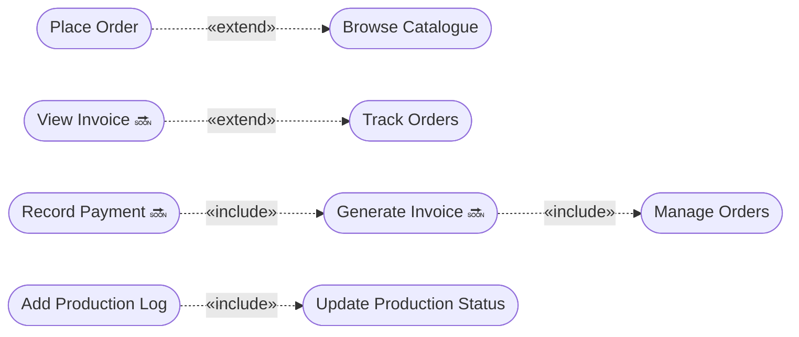

# Use Case Diagram — Whole System (with Generalization)

**Rajabharana Jewellery Management System**

| Resource | File |
|----------|------|
| **Visual (browser / PDF)** | [`USE_CASE_DIAGRAM.html`](USE_CASE_DIAGRAM.html) |
| **Per-user roles** | [`USE_CASE_DIAGRAM_USERS.md`](USE_CASE_DIAGRAM_USERS.md) |
| **User functions detail** | [`USER_ROLES_FUNCTIONS.md`](USER_ROLES_FUNCTIONS.md) |

**Legend:** ✅ Implemented · 🔜 Planned · `▷──` «generalize» (UML inheritance)

**UML relationships used:**
- **Generalization (▷──):** specialized actor/use case inherits from general — hollow triangle points to **parent**
- **Include (- -▷):** base use case always calls included use case
- **Extend (- -▷):** optional extension under certain conditions
- **Association (──):** actor performs use case

---

## Figure 1 — Whole system (actors + use cases + generalization)

```mermaid
flowchart TB
    G((Guest))
    RU((Registered User))
    IU((Internal User))
    C((Customer))
    S((Sales Staff))
    M((Inventory Manager))
    T((Workshop Technician))
    A((Administrator))

    G -.-> RU
    C --|>|«generalize»| RU
    S --|>|«generalize»| IU
    M --|>|«generalize»| IU
    T --|>|«generalize»| IU
    IU --|>|«generalize»| RU
    A --|>|«generalize»| S
    A --|>|«generalize»| M

    subgraph SYS[" «system» Rajabharana Jewellery System "]
        direction TB

        subgraph AUTH["Authentication"]
            UCA([Authenticate])
            UC1([Login / Logout])
            UC2([Register Account])
            UC3([Reset Password])
            UC1 --|>|«generalize»| UCA
            UC2 --|>|«generalize»| UCA
            UC3 --|>|«generalize»| UCA
        end

        subgraph PUB["Public Catalogue"]
            UCB([Browse Catalogue])
            UC4([View Design Details])
            UC4 --|>|«generalize»| UCB
        end

        subgraph PROF["Profile"]
            UCP([Manage Profile])
        end

        subgraph CUST["Customer Portal"]
            UC5([View Dashboard])
            UCO([Manage Own Orders])
            UC6([Place Order])
            UC7([Track Orders])
            UC8([Cancel Order])
            UC6 --|>|«generalize»| UCO
            UC7 --|>|«generalize»| UCO
            UC8 --|>|«generalize»| UCO
            UC9([View Invoice 🔜])
            UC9 -.->|«extend»| UC7
        end

        subgraph ORD["Order Management"]
            UCM([Manage Orders])
            UC10([Update Order Status])
            UC11([View Customers])
            UC10 --|>|«generalize»| UCM
            UC11 --|>|«generalize»| UCM
            UC12([View Admin Dashboard])
        end

        subgraph INV["Inventory"]
            UCI([Manage Catalogue])
            UC13([Create / Edit Design])
            UC14([Upload Images])
            UC15([Set Availability])
            UC13 --|>|«generalize»| UCI
            UC14 --|>|«generalize»| UCI
            UC15 --|>|«generalize»| UCI
        end

        subgraph WS["Workshop"]
            UCW([Manage Production])
            UC16([Assign Technician])
            UC17([View Workshop Queue])
            UC18([Update Production Status])
            UC19([Add Production Log])
            UC16 --|>|«generalize»| UCW
            UC17 --|>|«generalize»| UCW
            UC18 --|>|«generalize»| UCW
            UC19 --|>|«generalize»| UCW
        end

        subgraph ADM["System Administration"]
            UCS([Manage System])
            UC20([Manage Metal Prices])
            UC21([Manage Staff Accounts])
            UC20 --|>|«generalize»| UCS
            UC21 --|>|«generalize»| UCS
        end

        subgraph BILL["Billing 🔜"]
            UCBill([Manage Billing])
            UC22([Generate Invoice])
            UC23([Record Payment])
            UC24([Print Invoice])
            UC22 --|>|«generalize»| UCBill
            UC23 --|>|«generalize»| UCBill
            UC24 --|>|«generalize»| UCBill
        end

        subgraph REP["Reports 🔜"]
            UCR([Generate Reports])
            UC25([Order Summary Report])
            UC26([Sales Report])
            UC27([Production Report])
            UC28([Inventory Report])
            UC29([Export PDF])
            UC25 --|>|«generalize»| UCR
            UC26 --|>|«generalize»| UCR
            UC27 --|>|«generalize»| UCR
            UC28 --|>|«generalize»| UCR
            UC29 --|>|«generalize»| UCR
        end
    end

    G --> UCB & UC4 & UC2 & UC1 & UC3
    RU --> UC1 & UCP
    C --> UCB & UC4 & UC5 & UCO & UC9
    S --> UC12 & UCM & UCBill & UCR
    M --> UCI & UCR
    T --> UC18 & UC19
    A --> UCS & UCW & UCBill & UCR

    UC6 -.->|«extend»| UCB
    UC22 -.->|«include»| UCM
    UC23 -.->|«include»| UC22
    UC19 -.->|«include»| UC18
```

---

## Figure 2 — Actor generalization hierarchy

```mermaid
flowchart BT
    G((Guest))
    RU((Registered User\n«abstract»))
    IU((Internal User\n«abstract»))
    C((Customer))
    S((Sales Staff))
    M((Inventory Manager))
    T((Workshop Technician))
    A((Administrator))

    C --|>|«generalize»| RU
    IU --|>|«generalize»| RU
    S --|>|«generalize»| IU
    M --|>|«generalize»| IU
    T --|>|«generalize»| IU
    A --|>|«generalize»| S
    A --|>|«generalize»| M

    G -.- RU
```

| Actor | Parent | Inherits use cases from |
|-------|--------|-------------------------|
| **Customer** | Registered User | Login, Logout, Manage Profile |
| **Sales Staff** | Internal User → Registered User | + Admin dashboard, Manage Orders |
| **Inventory Manager** | Internal User → Registered User | + Manage Catalogue |
| **Technician** | Internal User → Registered User | + Update Production |
| **Administrator** | Sales Staff + Inventory Manager | All staff + manager + system admin |
| **Guest** | — | Public access only (not registered) |

---

## Figure 3 — Use case generalization hierarchy

```mermaid
flowchart BT
    UCA([Authenticate])
    UC1([Login / Logout]) & UC2([Register]) & UC3([Reset Password])
    UC1 & UC2 & UC3 --|>|«generalize»| UCA

    UCB([Browse Catalogue])
    UC4([View Design Details]) --|>|«generalize»| UCB

    UCO([Manage Own Orders])
    UC5([Place Order]) & UC6([Track Orders]) & UC7([Cancel Order])
    UC5 & UC6 & UC7 --|>|«generalize»| UCO

    UCM([Manage Orders])
    UC8([Update Status]) & UC9([View Customers])
    UC8 & UC9 --|>|«generalize»| UCM

    UCI([Manage Catalogue])
    UC10([Create/Edit Design]) & UC11([Upload Images]) & UC12([Set Availability])
    UC10 & UC11 & UC12 --|>|«generalize»| UCI

    UCW([Manage Production])
    UC13([Assign Technician]) & UC14([View Queue]) & UC15([Update Status]) & UC16([Add Log])
    UC13 & UC14 & UC15 & UC16 --|>|«generalize»| UCW

    UCBill([Manage Billing 🔜])
    UC17([Generate Invoice]) & UC18([Record Payment]) & UC19([Print Invoice])
    UC17 & UC18 & UC19 --|>|«generalize»| UCBill

    UCR([Generate Reports 🔜])
    UC20([Order Report]) & UC21([Sales Report]) & UC22([Production Report]) & UC23([Inventory Report]) & UC24([Export PDF])
    UC20 & UC21 & UC22 & UC23 & UC24 --|>|«generalize»| UCR
```

---

## Figure 4 — Include & extend relationships



| Relationship | Meaning |
|--------------|---------|
| Place Order **extends** Browse Catalogue | Customer may browse catalogue before ordering |
| View Invoice **extends** Track Orders | Invoice viewed from order detail |
| Generate Invoice **includes** Manage Orders | Invoice created from an existing order |
| Record Payment **includes** Generate Invoice | Payment requires an invoice |
| Add Production Log **includes** Update Status | Log written on every status change |

---

## Figure 5 — Actor × generalized use case matrix

| Generalized use case | Guest | Customer | Staff | Manager | Admin | Technician |
|---------------------|:-----:|:--------:|:-----:|:-------:|:-----:|:----------:|
| Authenticate | ✅ | ✅ | ✅ | ✅ | ✅ | ✅ |
| Browse Catalogue | ✅ | ✅ | | | | |
| Manage Profile | | ✅ | ✅ | ✅ | ✅ | ✅ |
| Manage Own Orders | | ✅ | | | | |
| View Admin Dashboard | | | ✅ | | ✅ | |
| Manage Orders | | | ✅ | | ✅ | |
| Manage Catalogue | | | | ✅ | ✅ | |
| Manage Production | | | | | ✅* | ✅** |
| Manage System | | | | | ✅ | |
| Manage Billing 🔜 | | | ✅ | | ✅ | |
| Generate Reports 🔜 | | | ✅ | ✅*** | ✅ | |

\* Assign Technician, View Workshop Queue only  
\*\* Update Status, Add Log on assigned jobs only  
\*\*\* Inventory Report only

---

## Use case descriptions (summary)

| ID | Generalized UC | Specialized UC | Primary actor |
|----|----------------|----------------|---------------|
| UCA | Authenticate | Login, Register, Reset Password | All / Guest |
| UCB | Browse Catalogue | View Design Details | Guest, Customer |
| UCO | Manage Own Orders | Place, Track, Cancel | Customer |
| UCM | Manage Orders | Update Status, View Customers | Staff, Admin |
| UCI | Manage Catalogue | CRUD, Images, Availability | Manager, Admin |
| UCW | Manage Production | Assign, Queue, Update, Log | Admin, Technician |
| UCBill | Manage Billing 🔜 | Invoice, Payment, Print | Staff, Admin, Customer |
| UCR | Generate Reports 🔜 | Order, Sales, Production, Inventory, Export | Admin, Staff, Manager |

---

## System boundary

Everything inside **«system» Rajabharana Jewellery System** runs in Laravel (Blade + MySQL).  
External actors interact via **web browser** only.

---

## Viva one-liner

> **Actors generalize from Registered User and Internal User — Administrator inherits Sales Staff and Inventory Manager roles; use cases generalize from parent groups like Manage Orders and Manage Catalogue, with include/extend for billing and production flows.**

---

*Open [`USE_CASE_DIAGRAM.html`](USE_CASE_DIAGRAM.html) · Print → PDF*
