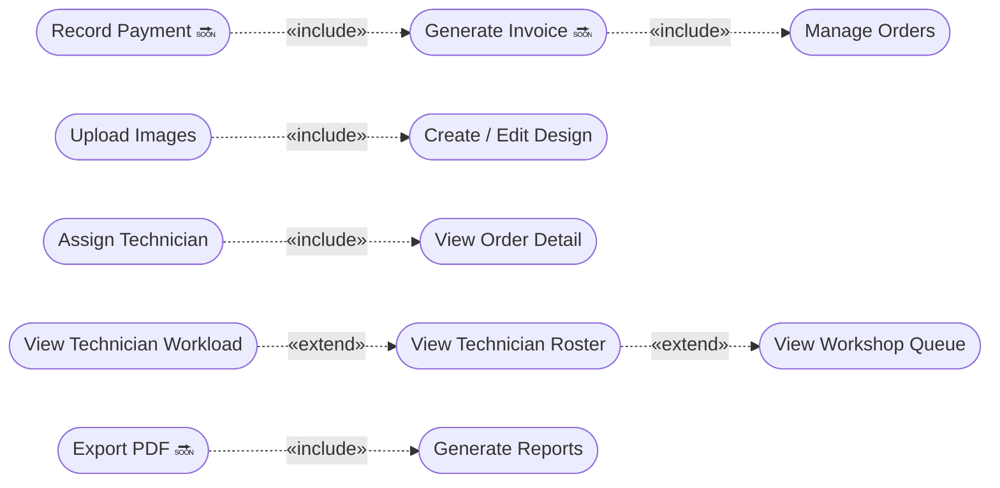

# Use Case Diagram — Administrator

**Rajabharana Jewellery Management System**

| Resource | File |
|----------|------|
| **Visual (browser / PDF)** | [`USE_CASE_DIAGRAM_ADMIN.html`](USE_CASE_DIAGRAM_ADMIN.html) |
| **Admin tasks detail** | [`USER_ROLES_FUNCTIONS.md`](USER_ROLES_FUNCTIONS.md) · Section 5 |
| **Admin activity diagram** | [`ACTIVITY_DIAGRAM_ADMIN.md`](ACTIVITY_DIAGRAM_ADMIN.md) |
| **Whole system** | [`USE_CASE_DIAGRAM.md`](USE_CASE_DIAGRAM.md) |

**Actor:** Administrator  
**Role value:** `admin`  
**Permission:** `*` (wildcard — full access)  
**Panel:** `/admin/*`  
**Test account:** `admin@rajabharana.com`

**Legend:** ✅ Implemented · 🔜 Planned (Sprint 9–10)

---

## Figure 1 — Administrator use case diagram (main)

```mermaid
flowchart TB
    A((Administrator))

    subgraph SYS[" «system» Rajabharana Admin Panel "]
        direction TB

        subgraph AUTH["Authentication & Profile"]
            UC1([Login / Logout])
            UC2([Manage Profile])
            UC3([Change Password])
        end

        subgraph DASH["Dashboard"]
            UC4([View Admin Dashboard KPIs])
        end

        subgraph ORD["Order Management ✅"]
            UCM([Manage Orders])
            UC5([List & Filter Orders])
            UC6([View Order Detail])
            UC7([Update Order Status])
            UC8([Set Price & Delivery Date])
            UC9([Add Admin Notes])
            UC5 --|>|«generalize»| UCM
            UC6 --|>|«generalize»| UCM
            UC7 --|>|«generalize»| UCM
            UC8 --|>|«generalize»| UCM
            UC9 --|>|«generalize»| UCM
        end

        subgraph CUST["Customer Management ✅"]
            UC10([View Customer List])
            UC11([View Customer Profile & Orders])
        end

        subgraph INV["Inventory Management ✅"]
            UCI([Manage Catalogue])
            UC12([Create Design])
            UC13([Edit Design])
            UC14([Delete Design])
            UC15([Upload Design Images])
            UC16([Set Primary Image])
            UC17([Set Availability Status])
            UC12 & UC13 & UC14 & UC15 & UC16 & UC17 --|>|«generalize»| UCI
        end

        subgraph WS["Workshop ✅"]
            UCW([Manage Production])
            UC18([Assign Technician])
            UC19([Unassign Technician])
            UC20([View Workshop Queue])
            UC21([View Technician Roster])
            UC22([View Technician Workload])
            UC18 & UC19 & UC20 & UC21 & UC22 --|>|«generalize»| UCW
        end

        subgraph SYSADM["System Administration ✅"]
            UCS([Manage System])
            UC23([Manage Metal Prices])
            UC24([Manage Staff Accounts])
            UC25([Create Staff Account])
            UC26([Edit Staff Account])
            UC27([Delete Staff Account])
            UC23 & UC24 & UC25 & UC26 & UC27 --|>|«generalize»| UCS
        end

        subgraph BILL["Billing 🔜"]
            UCB([Manage Billing])
            UC28([Generate Invoice])
            UC29([Record Payment])
            UC30([Print Invoice])
            UC28 & UC29 & UC30 --|>|«generalize»| UCB
        end

        subgraph REP["Reports 🔜"]
            UCR([Generate Reports])
            UC31([Order Summary Report])
            UC32([Sales & Revenue Report])
            UC33([Production Report])
            UC34([Inventory Report])
            UC35([Export Report PDF])
            UC31 & UC32 & UC33 & UC34 & UC35 --|>|«generalize»| UCR
        end
    end

    A --> UC1 & UC2 & UC3
    A --> UC4 & UCM & UC10 & UC11
    A --> UCI & UCW & UCS
    A --> UCB & UCR

    UC28 -.->|«include»| UCM
    UC29 -.->|«include»| UC28
    UC15 -.->|«include»| UC12
    UC15 -.->|«include»| UC13
    UC18 -.->|«include»| UC6
    UC21 -.->|«extend»| UC20
    UC22 -.->|«extend»| UC21
    UC35 -.->|«include»| UCR
```

---

## Figure 2 — Actor generalization (Administrator)

Administrator **inherits** all use cases from Sales Staff and Inventory Manager.

```mermaid
flowchart BT
    RU((Registered User))
    IU((Internal User))
    S((Sales Staff))
    M((Inventory Manager))
    A((Administrator))

    S --|>|«generalize»| IU
    M --|>|«generalize»| IU
    IU --|>|«generalize»| RU
    A --|>|«generalize»| S
    A --|>|«generalize»| M

    subgraph Inherited["Inherited use cases"]
        I1[Manage Orders · View Customers · Dashboard]
        I2[Manage Catalogue · Upload Images]
    end

    S -.-> I1
    M -.-> I2
    A -.-> I1 & I2
```

---

## Figure 3 — Include & extend relationships



| Relationship | From | To | Condition |
|--------------|------|-----|-----------|
| **«include»** | Generate Invoice 🔜 | Manage Orders | Invoice always created from an order |
| **«include»** | Record Payment 🔜 | Generate Invoice | Payment requires invoice |
| **«include»** | Upload Images | Create/Edit Design | Images saved with design |
| **«include»** | Assign Technician | View Order Detail | Assignment done on order page |
| **«extend»** | View Technician Roster | View Workshop Queue | Optional drill-down |
| **«extend»** | View Technician Workload | View Roster | Optional drill-down |
| **«include»** | Export PDF 🔜 | Generate Reports | Export is part of reporting |

---

## Figure 4 — Use case list by module

| Module | Use case | Route | Status |
|--------|----------|-------|--------|
| **Auth** | Login / Logout | `/login`, POST `/logout` | ✅ |
| **Profile** | Manage Profile | `/profile` | ✅ |
| **Dashboard** | View Admin Dashboard | `/admin` | ✅ |
| **Orders** | List & Filter Orders | `/admin/orders` | ✅ |
| **Orders** | View Order Detail | `/admin/orders/{id}` | ✅ |
| **Orders** | Update Status / Price / Notes | PATCH `/admin/orders/{id}` | ✅ |
| **Customers** | View Customer List | `/admin/customers` | ✅ |
| **Customers** | View Customer & Orders | `/admin/customers/{id}` | ✅ |
| **Catalogue** | CRUD Designs | `/admin/catalog/*` | ✅ |
| **Catalogue** | Upload / Delete Images | `/admin/catalog/{id}/edit` | ✅ |
| **Workshop** | Assign Technician | PATCH `.../assign-technician` | ✅ |
| **Workshop** | View Production Queue | `/admin/workshop` | ✅ |
| **Workshop** | View Technicians | `/admin/workshop/technicians` | ✅ |
| **Metal Prices** | Update Gold & Silver | `/admin/metal-prices` | ✅ |
| **Staff** | CRUD Staff Accounts | `/admin/users/*` | ✅ |
| **Billing** | Generate Invoice | — | 🔜 |
| **Billing** | Record Payment | — | 🔜 |
| **Reports** | Generate & Export Reports | — | 🔜 |

---

## Use case descriptions

| ID | Use case | Description |
|----|----------|-------------|
| UC4 | View Admin Dashboard | KPIs: order counts, due orders, recent activity |
| UCM | Manage Orders | Full order lifecycle: status, price, delivery date, notes |
| UC10 | View Customers | List all registered customers |
| UCI | Manage Catalogue | CRUD jewellery designs, images, availability |
| UC18 | Assign Technician | Link confirmed production order to workshop technician |
| UC20 | View Workshop Queue | Monitor all in-production orders |
| UC23 | Manage Metal Prices | Set daily gold/silver price per gram |
| UC24 | Manage Staff Accounts | Create/edit/delete admin, manager, staff, technician |
| UC28 | Generate Invoice 🔜 | Create bill from delivered order |
| UC29 | Record Payment 🔜 | Record cash/card/bank payment against invoice |
| UCR | Generate Reports 🔜 | Analytics across orders, sales, production, inventory |

---

## What Administrator cannot do

| Cannot | Reason |
|--------|--------|
| Place customer orders | Customer portal (`/orders`) — different role |
| Update production on jobs | Technician panel (`/technician/*`) |
| Delete last admin account | System guard — at least one admin required |

---

## Viva one-liner

> **The Administrator actor has wildcard permission and use cases spanning Dashboard, Orders, Customers, Catalogue, Workshop, Metal Prices, Staff Management, plus planned Billing and Reports — generalizing Sales Staff and Inventory Manager roles.**

---

*Open [`USE_CASE_DIAGRAM_ADMIN.html`](USE_CASE_DIAGRAM_ADMIN.html) · Print → PDF*
