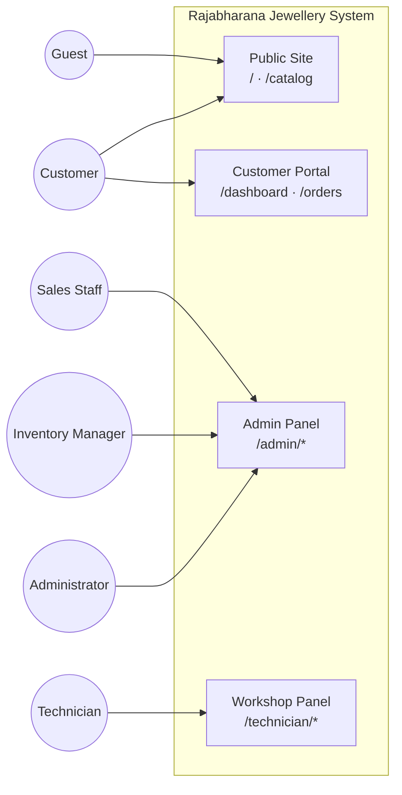
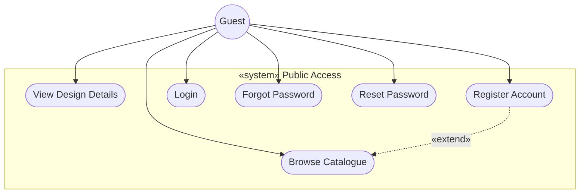
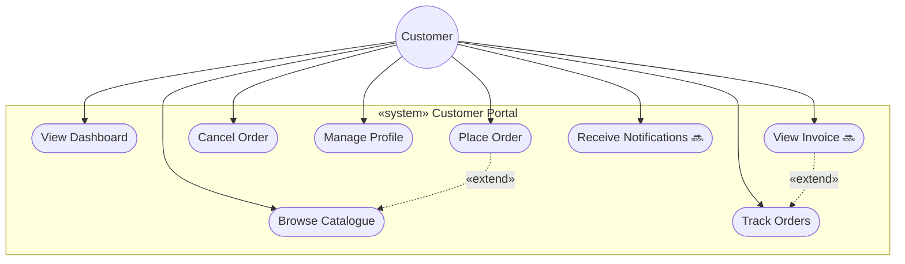
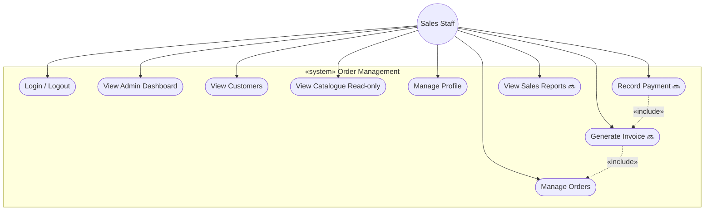
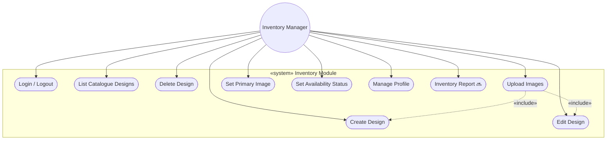
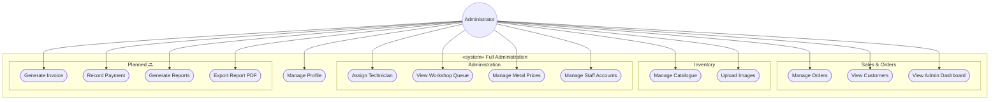
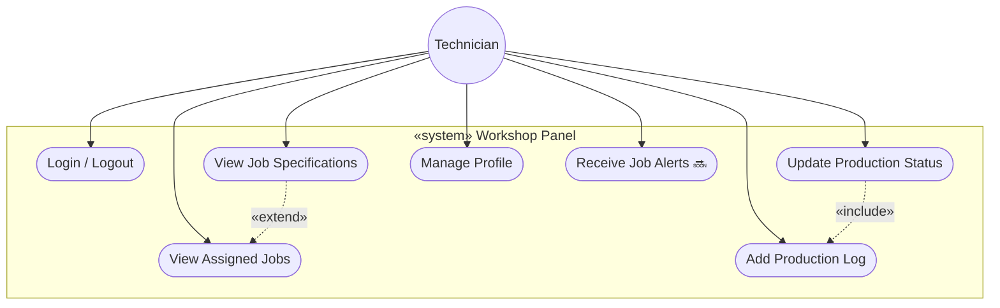

# Use Case Diagram — Users (By Role)

**Rajabharana Jewellery Management System**

| Resource | File |
|----------|------|
| **Visual (browser / PDF)** | [`USE_CASE_DIAGRAM_USERS.html`](USE_CASE_DIAGRAM_USERS.html) |
| **Whole system use cases** | [`USE_CASE_DIAGRAM.md`](USE_CASE_DIAGRAM.md) |
| **User functions detail** | [`USER_ROLES_FUNCTIONS.md`](USER_ROLES_FUNCTIONS.md) |

**Legend:** ✅ Implemented · 🔜 Planned (Sprint 9–10)

**Six user types:** Guest · Customer · Sales Staff · Inventory Manager · Administrator · Workshop Technician

All registered users are stored in the `users` table with a `role` column. RBAC is enforced via `config/rbac.php` and middleware.

---

## Figure 1 — All users & system panels

---

## Figure 2 — Guest use cases

**Actor:** Guest (not registered) · **Panel:** Public site only

| Use case | Description |
|----------|-------------|
| Browse Catalogue | Search/filter jewellery designs at `/catalog` |
| View Design Details | View photos, specs, price at `/catalog/{id}` |
| Register Account | Create customer account at `/register` |
| Login | Authenticate at `/login` |
| Forgot / Reset Password | Password recovery flow |

---

## Figure 3 — Customer use cases

**Role:** `customer` · **Panel:** `/dashboard`, `/orders`, public catalogue

---

## Figure 4 — Sales Staff use cases

**Role:** `staff` · **Panel:** `/admin/*` (permission-filtered)

---

## Figure 5 — Inventory Manager use cases

**Role:** `manager` · **Panel:** `/admin/catalog/*`

---

## Figure 6 — Administrator use cases

**Role:** `admin` · **Panel:** `/admin/*` (full access — permission `*`)

*Administrator inherits all Sales Staff and Inventory Manager use cases.*

---

## Figure 7 — Workshop Technician use cases

**Role:** `technician` · **Panel:** `/technician/*` · **No customer PII**

**Status flow:** In Production → Quality Check → Ready

---

## Figure 8 — Actor × use case matrix

| Use case | Guest | Customer | Staff | Manager | Admin | Technician |
|----------|:-----:|:--------:|:-----:|:-------:|:-----:|:----------:|
| Browse catalogue | ✅ | ✅ | | | | |
| Register / Login / Reset password | ✅ | ✅ | ✅ | ✅ | ✅ | ✅ |
| Manage profile | | ✅ | ✅ | ✅ | ✅ | ✅ |
| View customer dashboard | | ✅ | | | | |
| Place / track / cancel order | | ✅ | | | | |
| View admin dashboard | | | ✅ | | ✅ | |
| Manage orders | | | ✅ | | ✅ | |
| View customers | | | ✅ | | ✅ | |
| Manage catalogue & images | | | | ✅ | ✅ | |
| Assign technician | | | | | ✅ | |
| View workshop queue | | | | | ✅ | |
| Manage metal prices | | | | | ✅ | |
| Manage staff accounts | | | | | ✅ | |
| View / update assigned jobs | | | | | | ✅ |
| Generate invoice 🔜 | | | ✅ | | ✅ | |
| Record payment 🔜 | | | ✅ | | ✅ | |
| View invoice 🔜 | | ✅ | | | | |
| Reports / export 🔜 | | | ✅ | ✅* | ✅ | |

*Manager: inventory report only*

---

## Shared use cases (all logged-in users)

| Use case | Route |
|----------|-------|
| Edit profile | `/profile` |
| Update password | `/password` |
| Verify email | `/verify-email` |
| Logout | POST `/logout` |

---

## Viva one-liner

> **Six user types interact with the system through four panels — Public, Customer Portal, Admin Panel, and Workshop Panel — with RBAC controlling which use cases each role can perform.**

---

*Open [`USE_CASE_DIAGRAM_USERS.html`](USE_CASE_DIAGRAM_USERS.html) · Print → PDF*
