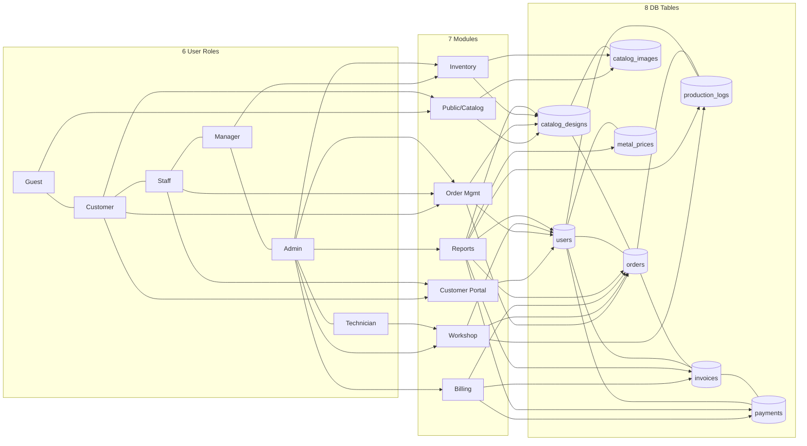

# Whole System Diagram — All Users, All Operations, All Entities

Single diagram for project report. Export from [mermaid.live](https://mermaid.live).

**Covers:** 6 user types · 40+ operations · 8 database entities · 12 relationships

---

## Complete System ER + Users + Operations (One Diagram)

```mermaid
flowchart TB
    subgraph USERS["👤 USER ROLES"]
        direction TB
        G["Guest / Public"]
        CU["Customer"]
        ST["Sales Staff"]
        IM["Inventory Manager"]
        AD["Administrator"]
        TE["Workshop Technician"]
    end

    subgraph OPS["⚙️ OPERATIONS"]
        direction TB

        subgraph OP_PUB["Public Operations"]
            O1["Browse Home"]
            O2["Browse Catalogue"]
            O3["View Design Details"]
            O4["Login / Register"]
        end

        subgraph OP_CUS["Customer Operations"]
            C1["Update Profile"]
            C2["Place Catalogue Order"]
            C3["Place Custom Order"]
            C4["Upload Reference Image"]
            C5["View / Track Orders"]
            C6["Cancel Order"]
            C7["View Metal Rates"]
        end

        subgraph OP_STF["Sales Staff Operations"]
            S1["View Dashboard KPIs"]
            S2["List / Filter Orders"]
            S3["View Order Detail"]
            S4["Update Order Status"]
            S5["Set Price & Delivery Date"]
            S6["Add Admin Notes"]
            S7["List / View Customers"]
            S8["View Catalogue"]
        end

        subgraph OP_INV["Inventory Manager Operations"]
            I1["List Catalogue"]
            I2["Create / Edit / Delete Design"]
            I3["Upload / Delete Images"]
            I4["Set Primary Image"]
            I5["Set Stock Availability"]
        end

        subgraph OP_ADM["Administrator Operations"]
            A1["Assign Technician"]
            A2["Workshop Production Queue"]
            A3["Technician Workload View"]
            A4["Update Metal Prices"]
            A5["Manage Staff Accounts"]
            A6["Generate Invoice 🔜"]
            A7["Record Payment 🔜"]
            A8["View Reports 🔜"]
        end

        subgraph OP_TEC["Technician Operations"]
            T1["View Assigned Jobs"]
            T2["View Job Specifications"]
            T3["Update Status → Ready"]
            T4["Add Workshop Notes"]
            T5["View Production Log"]
        end
    end

    subgraph DB["🗄️ DATABASE ENTITIES & RELATIONSHIPS"]
        direction TB

        E_USERS[("users\nPK: id\nrole, email, phone…")]
        E_ORDERS[("orders\nPK: id\norder_number, status…")]
        E_CAT[("catalog_designs\nPK: id\ncode, price…")]
        E_IMG[("catalog_images\nPK: id\nimage_path…")]
        E_METAL[("metal_prices\nPK: id\ngold/silver rate…")]
        E_LOG[("production_logs\nPK: id\nfrom/to status…")]
        E_INV[("invoices 🔜\nPK: id\ninvoice_number…")]
        E_PAY[("payments 🔜\nPK: id\namount, method…")]

        E_USERS -->|"R1 user_id\n1:N"| E_ORDERS
        E_USERS -->|"R2 assigned_technician_id\n1:N"| E_ORDERS
        E_USERS -->|"R3 user_id\n1:N"| E_LOG
        E_USERS -->|"R4 updated_by\n1:N"| E_METAL
        E_USERS -->|"R5 user_id\n1:N"| E_INV
        E_USERS -->|"R6 created_by\n1:N"| E_INV
        E_USERS -->|"R7 recorded_by\n1:N"| E_PAY
        E_CAT -->|"R8 catalog_design_id\n1:N"| E_IMG
        E_CAT -->|"R9 catalog_design_id\n1:N"| E_ORDERS
        E_ORDERS -->|"R10 order_id\n1:N"| E_LOG
        E_ORDERS -->|"R11 order_id\n1:1"| E_INV
        E_INV -->|"R12 invoice_id\n1:N"| E_PAY
    end

    G --> O1 & O2 & O3 & O4
    CU --> O4 & C1 & C2 & C3 & C4 & C5 & C6 & C7
    ST --> S1 & S2 & S3 & S4 & S5 & S6 & S7 & S8
    IM --> I1 & I2 & I3 & I4 & I5
    AD --> S1 & S2 & S3 & S4 & S5 & S6 & S7 & S8 & I1 & I2 & I3 & I4 & I5 & A1 & A2 & A3 & A4 & A5 & A6 & A7 & A8
    TE --> T1 & T2 & T3 & T4 & T5

    O4 & C1 --> E_USERS
    C2 & C3 & C4 & C5 & C6 --> E_ORDERS
    C2 --> E_CAT
    C7 --> E_METAL
    S2 & S3 & S4 & S5 & S6 --> E_ORDERS
    S7 --> E_USERS
    S8 & I1 & I2 & I5 --> E_CAT
    I3 & I4 --> E_IMG
    A4 --> E_METAL
    A5 --> E_USERS
    A1 & A2 & A3 --> E_ORDERS
    A1 & T3 & T4 & T5 --> E_LOG
    T1 & T2 & T3 --> E_ORDERS
    A6 --> E_INV
    A7 --> E_PAY
    A8 -.-> E_USERS & E_ORDERS & E_CAT & E_LOG & E_INV & E_PAY & E_METAL
```

---

## Role → Operation → Entity Matrix

| User Role | Operations | Database Entities Used |
|-----------|------------|------------------------|
| **Guest** | Browse home, catalogue, design; login/register | catalog_designs, catalog_images, users |
| **Customer** | Profile, place/track/cancel orders, view rates | users, orders, catalog_designs, metal_prices |
| **Sales Staff** | Dashboard, manage orders, view customers/catalog | orders, users, catalog_designs |
| **Inventory Manager** | Full catalogue CRUD, images, stock status | catalog_designs, catalog_images |
| **Administrator** | All staff + inventory + workshop + metal + staff + billing + reports | **All 8 entities** |
| **Technician** | View jobs, update status, workshop notes | orders, production_logs (specs only — no customer PII) |

---

## All Operations by User (Checklist)

### Guest / Public
- [x] Browse home page
- [x] Browse catalogue
- [x] View design details
- [x] Login / Register

### Customer
- [x] Register & verify email
- [x] Login / logout
- [x] Update profile (phone, address required)
- [x] Place catalogue order
- [x] Place custom order + reference image
- [x] View order list & detail
- [x] Cancel order
- [x] View metal rates on dashboard

### Sales Staff
- [x] View admin dashboard
- [x] List / filter / search orders
- [x] View order detail
- [x] Update status, price, delivery date, notes
- [x] List / view customers
- [x] View catalogue (read-only)

### Inventory Manager
- [x] List catalogue
- [x] Create / edit / delete designs
- [x] Upload / delete images
- [x] Set primary image
- [x] Set availability (in stock / out of stock)

### Administrator
- [x] All Sales Staff operations
- [x] All Inventory Manager operations
- [x] Assign / unassign technician
- [x] Workshop production queue
- [x] Technician workload view
- [x] Update gold & silver rates
- [x] Create / edit / delete staff accounts
- [ ] Generate invoice (Sprint 9)
- [ ] Record payment (Sprint 9)
- [ ] View / export reports (Sprint 10)

### Workshop Technician
- [x] View assigned jobs dashboard
- [x] View job specifications & reference image
- [x] Update status (In Production → QC → Ready)
- [x] Add workshop notes
- [x] View production log
- [x] **Cannot** see customer name, email, phone, address

---

## Entity Relationship Attributes (All 12)

| ID | Relationship | FK | Type |
|----|--------------|-----|------|
| R1 | users → orders | user_id | 1:N |
| R2 | users → orders | assigned_technician_id | 1:N |
| R3 | users → production_logs | user_id | 1:N |
| R4 | users → metal_prices | updated_by | 1:N |
| R5 | users → invoices | user_id | 1:N |
| R6 | users → invoices | created_by | 1:N |
| R7 | users → payments | recorded_by | 1:N |
| R8 | catalog_designs → catalog_images | catalog_design_id | 1:N |
| R9 | catalog_designs → orders | catalog_design_id | 1:N |
| R10 | orders → production_logs | order_id | 1:N |
| R11 | orders → invoices | order_id | 1:1 |
| R12 | invoices → payments | invoice_id | 1:N |

---

## Simplified Version (if diagram is too large for mermaid.live)

If the main diagram does not render, use this compact version:

